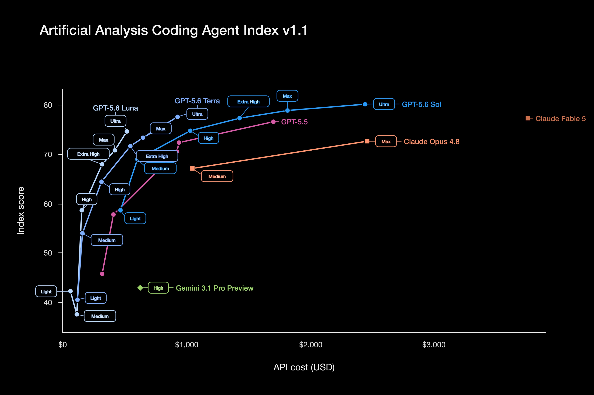

# Sebastian Raschka (@rasbt)

> Automatisch per `npm run ingest:x` erfasst. Quelle: [x.com/rasbt/status/2075573860796436626](https://x.com/rasbt/status/2075573860796436626)

## Bilder

<!-- Reihenfolge wie von der API geliefert (Cover zuerst). Die Position im Artikeltext gibt die API nicht mit. -->

**photo**

## Post-Text

For agentic coding, one can say:

- Unless you need Terra Ultra perf, it's always better to use a Luna model with higher effort setting (same or better performance but cheaper).

- Forget everything below Sol High, use Luna with higher effort settings here

- Forget Sol Extra High, use Terra Ultra here

- The extra cost of Sol Ultra is probably not worth it over Max

## Links

- [pic.x.com/Tjc9mELCer](https://x.com/rasbt/status/2075573860796436626/photo/1)
