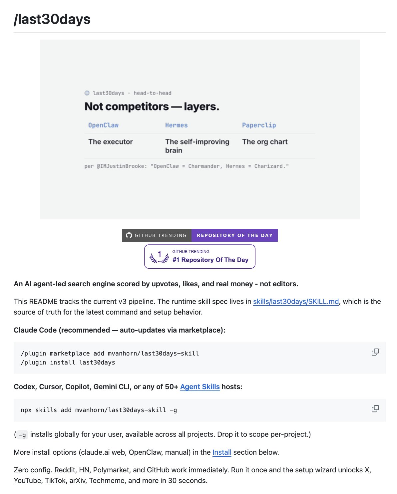

# Shubham Saboo (@Saboo_Shubham_)

> Automatisch per `npm run ingest:x` erfasst. Quelle: [x.com/Saboo_Shubham_/status/2076380344631398606](https://x.com/Saboo_Shubham_/status/2076380344631398606)

## Bilder

<!-- Reihenfolge wie von der API geliefert (Cover zuerst). Die Position im Artikeltext gibt die API nicht mit. -->

**photo**

## Post-Text

/last30days is INSANELY useful agent skill.

Your agent can now reads X, Reddit, YouTube, TikTok, Instagram, arXiv, Hacker News, and Polymarket in ONE command.

pro tip: use this open-source skill with Fable 5 and GPT-5.6 to make it your own. https://t.co/jETkbuRLEw https://t.co/fZ6p0LW5PJ

## Links

- [pic.x.com/jETkbuRLEw](https://x.com/Saboo_Shubham_/status/2076380344631398606/photo/1)
- [x.com/mvanhorn/statu…](https://twitter.com/mvanhorn/status/2063865685558903149)
