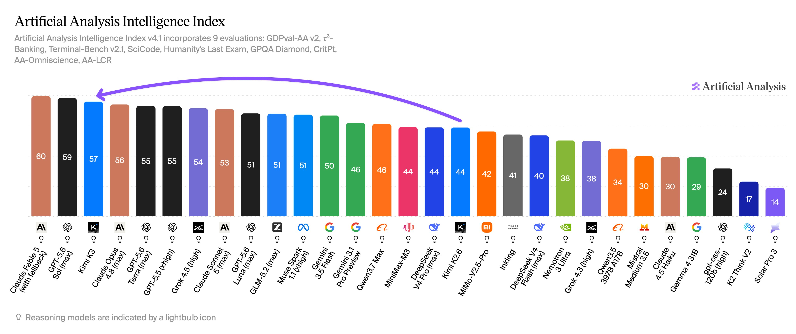

# Artificial Analysis (@ArtificialAnlys)

> Automatisch per `npm run ingest:x` erfasst. Quelle: [x.com/ArtificialAnlys/status/2077832874183860404](https://x.com/ArtificialAnlys/status/2077832874183860404)

## Bilder

<!-- Reihenfolge wie von der API geliefert (Cover zuerst). Die Position im Artikeltext gibt die API nicht mit. -->

**photo**

## Post-Text

Kimi K3 scores 57 on the Artificial Analysis Intelligence Index. Its intelligence is comparable to Opus 4.8 and GPT-5.5 but remains behind Fable 5 and GPT-5.6 Sol. Moonshot AI has expressed plans to release the 2.8T parameter model's weights, which would make it the leading open weights model

Key results:

➤ Strong agentic task performance: @Kimi_Moonshot's Kimi K3 reaches an Elo rating of 1668 on GDPval v2. This is a marked improvement over K2.6’s 1190, surpassing GLM-5.2 (1514), GPT-5.5 (1494), and Claude Opus 4.8 (1600). However, it still lags behind Claude Fable 5 (1760). Kimi K3 also scores an impressive 53% and takes the #1 position on AutomationBench-AA, our implementation of Zapier’s Agentic SaaS workflow evaluation.

➤ Second-highest performance on AA-Briefcase (agentic knowledge work): On our private long-horizon knowledge work evaluation, Kimi K3 reaches an overall Elo of 1547, +732 points from Kimi K2.6 and behind only Claude Fable 5. It is well-rounded: its rubric scoring and analytical quality almost reach Claude Fable 5’s scores, while GPT-5.6 Sol continues to outperform other leading models on presentation quality.

➤ Set to lead open weights models once weights are released: Moonshot AI has not yet released the weights but expressed plans to do so. Once available, Kimi K3 would clearly lead other open weights models including GLM-5.2 (51) and DeepSeek v4 Pro (44). However, at 2.8T parameters, it is significantly larger than its open weights peers (eg. GLM-5.2 at 753B params and DeepSeek V4 Pro at 1.6T), as well as the Kimi K2 to K2.6 models (1T params).

➤ Cost per task ($0.94) is similar to GPT-5.6 Sol ($1.04), ~1/2 the price of Opus 4.8 ($1.80) and higher than open weights peers: Moonshot AI’s pricing for K3 is significantly higher than their K2 pricing (K3’s output token price is $15/1M tokens while K2.6 was $4). This positions the model as cheaper on a cost per task basis than Opus 4.8, similar to GPT-5.6 Sol ($1.04) and more expensive than open weights peers, GLM-5.2 ($0.32) and DeepSeek V4 Pro ($0.04)

➤ Improved token efficiency alongside higher intelligence: Kimi K3’s token usage on the Artificial Analysis Intelligence Index decreased significantly, using 21% fewer output tokens than K2.6. The new model used approximately 132M output tokens to complete all nine evaluations, compared to approximately 166M for K2.6, while achieving higher scores.

➤ Native multimodal capabilities: Kimi K3, like K2.6, is released with native image and text multimodal input. If weights are released, this will position Kimi K3 as one of the leading open weights models with multimodal input capabilities

Other model details:

Context window: 1M

Size: 2.8T total parameters

Pricing: The first-party API is priced at $3.00/$15.00 per 1M input/output tokens, with cached input discounted 90% to $0.30 per 1M tokens.

Modality: Native multimodal input supports text and images, and the model remains text-only for output.

Accessibility: Accessible at launch through Moonshot’s first party API. Model weights are not yet released but Moonshot AI has expressed plans to do so.
