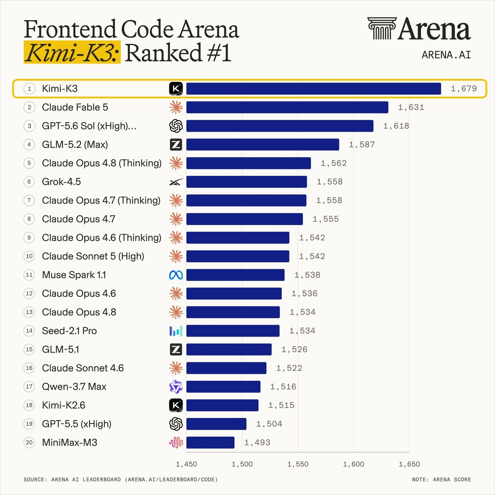

# Chubby♨️ (@kimmonismus)

> Automatisch per `npm run ingest:x` erfasst. Quelle: [x.com/kimmonismus/status/2077828228282982886](https://x.com/kimmonismus/status/2077828228282982886)

## Bilder

<!-- Reihenfolge wie von der API geliefert (Cover zuerst). Die Position im Artikeltext gibt die API nicht mit. -->

**photo**

## Post-Text

Kimi k3 has taken first place in design arena frontend. 

And it's not even close. https://t.co/WWcRWJnqgi https://t.co/dD867UmCG5

## Links

- [pic.x.com/WWcRWJnqgi](https://x.com/kimmonismus/status/2077828228282982886/photo/1)
- [x.com/arena/status/2…](https://twitter.com/arena/status/2077824029126504525)
