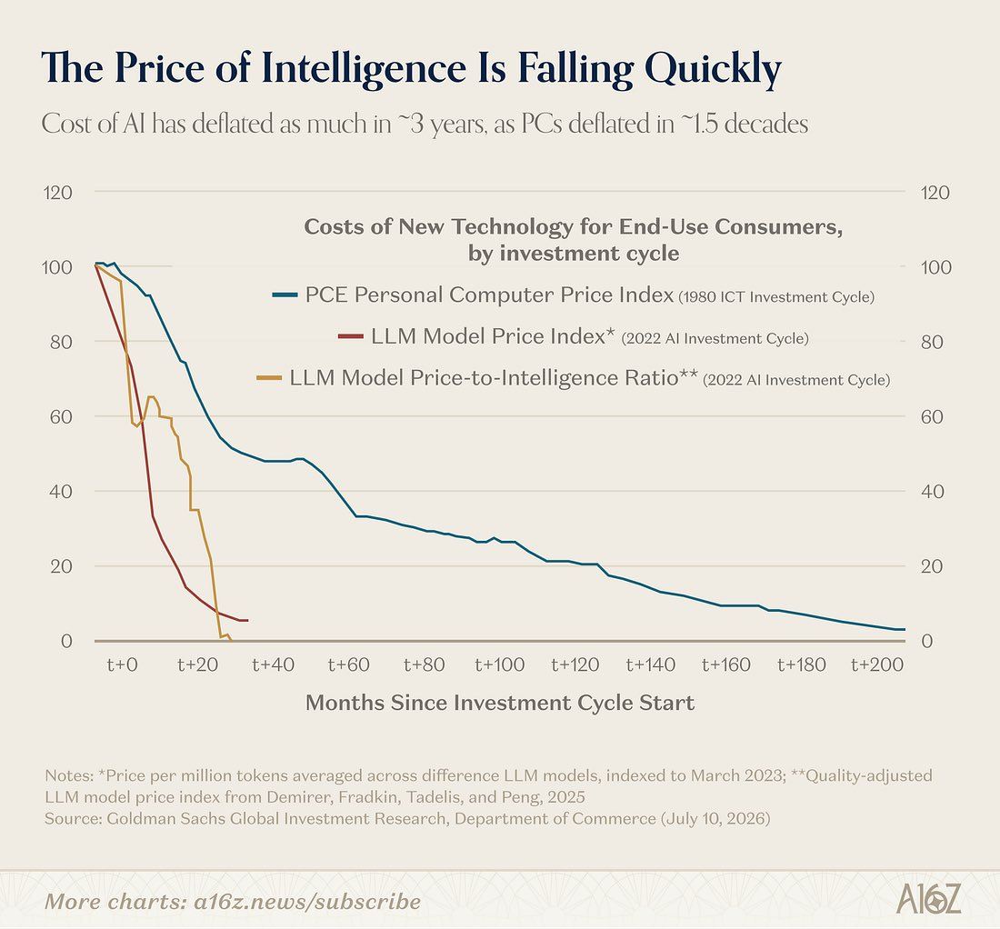

# Hedgeye (@Hedgeye)

> Automatisch per `npm run ingest:x` erfasst. Quelle: [x.com/Hedgeye/status/2078165516657549710](https://x.com/Hedgeye/status/2078165516657549710)

## Bilder

<!-- Reihenfolge wie von der API geliefert (Cover zuerst). Die Position im Artikeltext gibt die API nicht mit. -->

**photo**

## Post-Text

AI prices are collapsing five times faster than PC prices did. https://t.co/XU4Fc7hsk4

## Links

- [pic.x.com/XU4Fc7hsk4](https://x.com/Hedgeye/status/2078165516657549710/photo/1)
