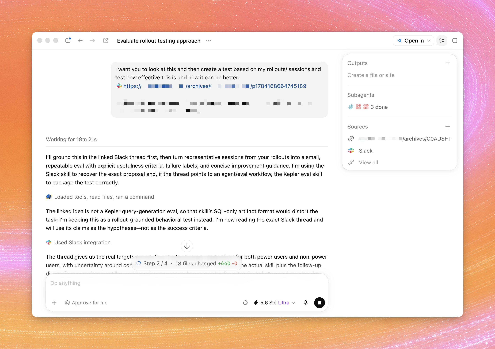

# Vaibhav (VB) Srivastav (@reach_vb)

> Automatisch per `npm run ingest:x` erfasst. Quelle: [x.com/reach_vb/status/2078108681678299194](https://x.com/reach_vb/status/2078108681678299194)

## Bilder

<!-- Reihenfolge wie von der API geliefert (Cover zuerst). Die Position im Artikeltext gibt die API nicht mit. -->

**photo**

## Post-Text

Codex tip: when building a skill to automate your workflow, ask Codex to evaluate it against your past sessions.

It can identify how you actually work, then refine the skill around those patterns, making it far more effective.

Bonus: repeat this every few weeks so your skills evolve as your day-to-day work changes.

## Links

- [pic.x.com/JLNnqIXUMe](https://x.com/reach_vb/status/2078108681678299194/photo/1)
