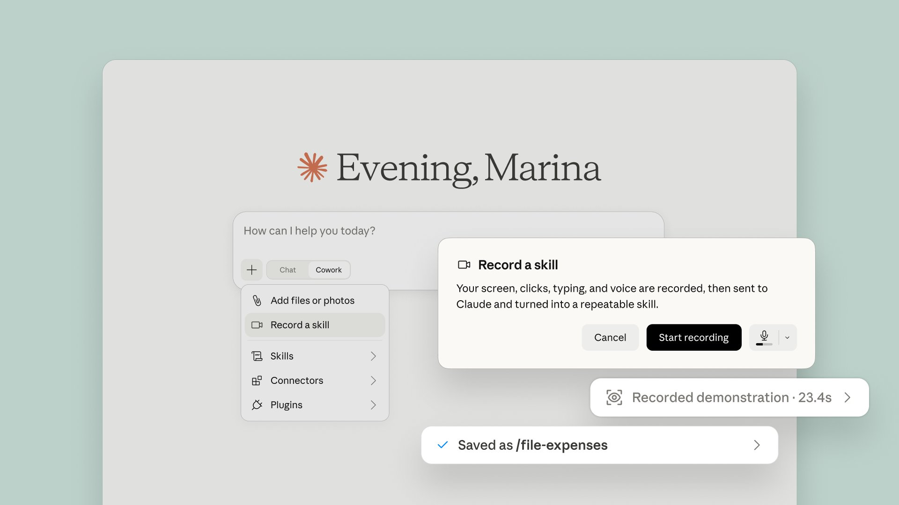

# Claude (@claudeai)

> Automatisch per `npm run ingest:x` erfasst. Quelle: [x.com/claudeai/status/2079595988998554047](https://x.com/claudeai/status/2079595988998554047)

## Bilder

<!-- Reihenfolge wie von der API geliefert (Cover zuerst). Die Position im Artikeltext gibt die API nicht mit. -->

**photo**

## Post-Text

New in Claude Cowork: teach Claude a skill.

Record your screen while you do a task, talk through it as you go, and Claude turns it into a skill it can run again. Find it under Record a skill in the + menu of the Claude desktop app. 

Available on Pro, Max, and Team plans. https://t.co/9OgJLOKWzj

## Links

- [pic.x.com/9OgJLOKWzj](https://x.com/claudeai/status/2079595988998554047/photo/1)
