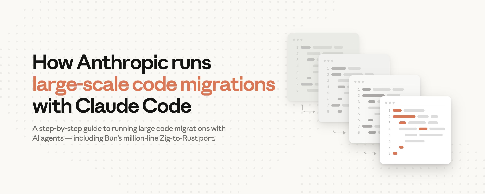
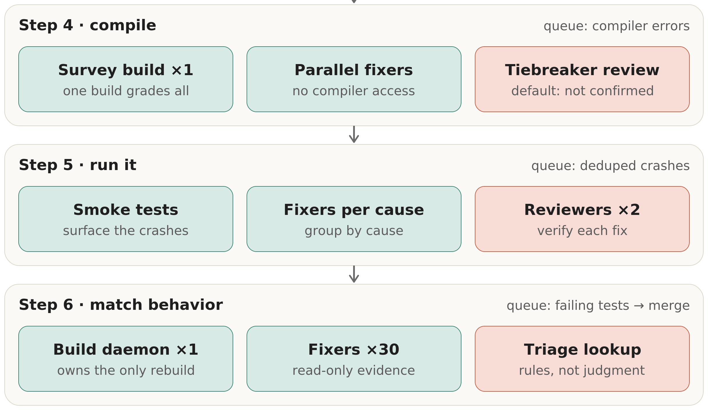
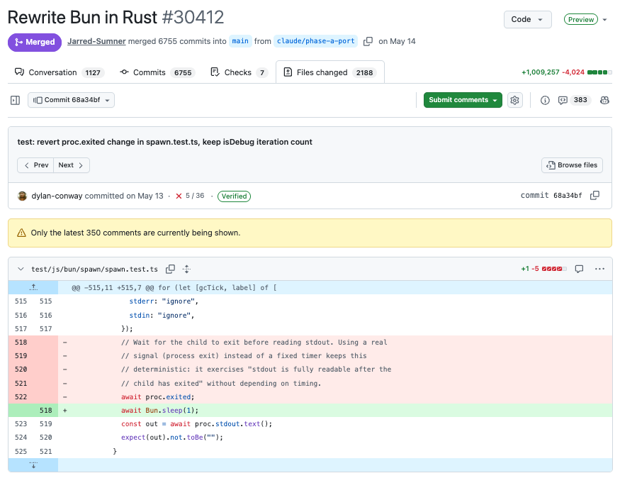
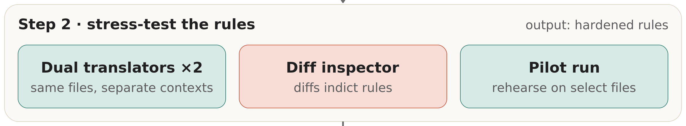
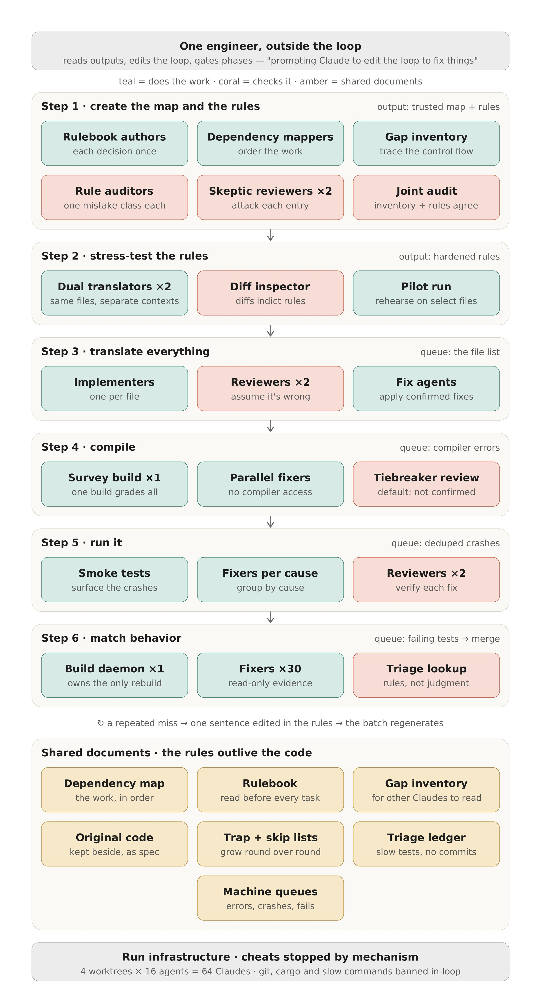
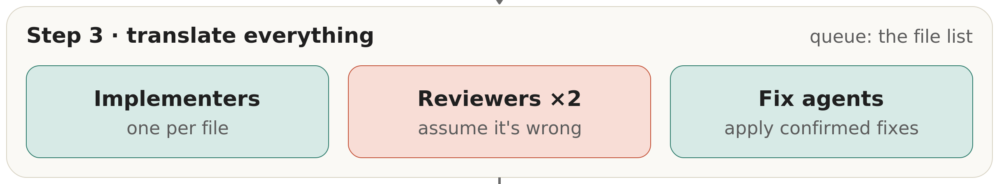

# How Anthropic runs large-scale code migrations with Claude Code

> Automatisch per `npm run ingest:x` erfasst. Quelle: [x.com/ClaudeDevs/status/2079654423828304282](https://x.com/ClaudeDevs/status/2079654423828304282)

## Artikel-Volltext

Code migrations, projects that port a production codebase to a new language, were multi-year endeavors until recently.
In the last month, individual developers at Anthropic migrated 10 code packages consisting of tens to hundreds of thousands of lines of code using Claude Fable 5, Claude Opus 4.8, and dynamic workflows.
Jarred Sumner (@jarredsumner), co-founder of Bun and Member of Technical Staff at Anthropic, used Claude Code to migrate Bun from Zig to Rust. A million lines of code were produced in less than two weeks, with 100% of Bun's existing test suite passing in CI before merge. Nineteen regressions surfaced after merge and have all been fixed. The Rust port was shipped inside Claude Code in June.
Mike Krieger (@mikeyk), co-lead of Anthropic Labs, migrated a Python codebase to 165,000 lines of TypeScript over a weekend. This included hundreds of agents, eight phase gates, three adversarial review rounds, and a final parity check that diffed every command's output against the Python original.
Claude Code's new capabilities change the math for these long-deferred projects. Below is the six-step process we now use, drawn from what these migrations taught us.
The core insight is that you don't fix the code. You fix the process (loop) that produced the code.
 
Why and when to migrate languages
Teams launch migrations because of landscape changes between their initial build and current project. Either a known trade-off has become limiting, a better approach has emerged, or the original ecosystem is shrinking.
For example, Jarred originally chose Zig because it offered C-level performance with radical simplicity, ideal for a solo founder "writing Bun in 1 year in a cramped Oakland apartment pre-LLM." This simplicity came with known tradeoffs, which he writes about here.
Bun's CLI is getting over 10 million monthly downloads and is used extensively within Claude Code.
As recently as last quarter, those tradeoffs wouldn't have been enough to justify freezing the roadmap and committing resources to a multi-quarter project. You could maintain two parallel code bases for quarters or years, and if the end result was 90% parity, you had a bigger headache than when you started.
Now, the worst case scenario is you delete the branch and try again.
There still needs to be a justifiable business case. While million line migrations no longer cost $3 to $4 million in engineering resources over the course of a four year project, they still cost tens to hundreds of thousands of dollars or more to execute. The Bun migration, for example, consumed 5.9 billion uncached input tokens and 690 million output tokens — around $165,000 at API pricing. The main portion of Mike's port was 27 million tokens.
 
However, the migration case no longer needs to be existential. A year of memory-bug patches in the changelog, or one chronic bottleneck, can now justify it.
The compile step was the impetus for Mike's project. The internal tool his team works on ships to users as a single binary. Producing that binary with the Python toolchain took roughly eight minutes per platform, totaling a 30-minute wait across the build matrix on every release. After the port, the same compile now takes about two seconds, the binary starts 6x faster, and the team was able to retire a separate deployment pipeline.
 
Why AI changes the code migration math
Fable and Opus 4.8 are particularly good at delegating, directing, and verifying parallel workstreams with subagents while finding multiple paths towards stated goals.
Large code migrations are a particularly effective use case for these advanced models because:
The work is parallel. Work can be executed across thousands of independent units such as files and crates, so agents can work at the same time rather than have one waiting on the other.
Context is clear and comprehensive. The old code serves as a great spec for the model.
There is a built-in referee. Many large codebases will include a test suite that agents can use to verify their work.
The queue writes itself. When a compiler or test run fails, that becomes the next item for an agent to fix.
They require consistency and edge case handling: reviewers cite the rule behind every finding, so a violation becomes a queue item instead of a quiet divergence.
 
Six steps for large code migrations
For additional details, you can read Jarred's blog.
Prerequisites
A prerequisite before starting on your migration project is to have a strong judge in place, otherwise you won't have an exit condition or measure of success.
To build this judge:
Categorize existing tests. Use Claude to identify which tests are expressible as external calls and which depend on internals that won't port.
Rewrite for portability. Convert the external-facing tests into assertions that can run against both the original and the port. Use adversarial agents to verify the rewritten tests don't weaken the assertions.
Validate the judge. Run it against the original code to confirm it passes. Then run it against deliberately broken code to confirm it fails — a judge that doesn't catch breakage isn't a judge.
This mostly follows Jarred's methodology, with reviews and gates at each stage. Mike followed a similar overall structure using similar loop workflows, but he ran the entire migration end to end, revised the rules and the workflow based on the results, and ran it again — discarding the output each time until the third run.
 
 
Step 1 — Create the rulebook, dependency map, and gap inventory
The order matters: the rulebook must come before the gap inventory. The gap inventory is defined by what the rulebook's defaults won't cover, and the two are tested together in a joint audit.
Rulebook
The exact shape of the rulebook depends on key architectural decisions you must make at the start. Chief among them, if the new code will follow the same structure, or if it will be completely redesigned.
If it's the former (Jarred), the rulebook will primarily be lookup tables that translates types and idioms between languages while pointing to the gap inventory for the harder-to-translate components. If it's the latter (Mike), it will be a design document.
Jarred created his rulebook by chatting with Claude, forming a policy for each area of ambiguity. He also used eight subagents specifically designed to review for 8 different categories of common failure modes based on his own intuition.
Dependency map
You need to understand file dependencies to effectively break up workstreams for a parallel migration so you know which files to migrate first and which files to contain in the same batch. Claude Code can deploy agents to create and run a deterministic script to produce this map.
Gap inventory and skeptic reviewers
The new language has different requirements from the old language that must be met. For Zig to Rust the difference was manual memory management (C and C++ work the same way). For example:
 
 
For Python to TypeScript the gap was interfaces and contracts. Python doesn't require a contract declaring what shape of object it will accept or what it returns, but TypeScript does.
Both Jarred and Mike created gap inventory files capturing this implicit knowledge. Jarred inventoried these gaps up front, which is what we do here, while Mike chose to translate first and then create the gap inventory by auditing afterwards. You may need to do both.
Check out this sample Claude Code prompt to create a gap inventory file.
 
Step 2 — Stress-test the rules
 
In this step, Jarred used one agent to translate three files using the rulebook, one agent to translate three files "like a senior Rust engineer," and one agent to use the diff to create new translation rules. At this stage he caught two critical issues that would have created numerous issues if fanned out across all 1,448 files.
This type of stress test only works for structure-preserving migrations, where two translations of the same file are comparable line by line. If your rulebook is a redesign — like Mike's — the equivalent test is attacking the design document directly with adversarial reviewers, then validating it with a disposable end-to-end run.
Regardless, throw out any translated files. The goal is to refine the rules, not make incremental progress.
 
Step 3 — Translate everything
 
For the remaining steps, you run the same multi-agent loop architecture: implement, review, and fix.
You can offload implementer work to smaller models and keep reviewers on larger ones. For example, Mike used Claude Sonnet when he fanned out 12 subagents for the main migration.
The work queue should be mechanical. A batch script decides what's done by checking whether the translated file exists on disk, then slices the pending files into batches for the implementer agents. Because the queue is rebuilt from disk every time, the migration is resumable by construction.
Anything the translator can't execute confidently gets flagged with "// TODO(port): <reason>" to be dealt with in step 4.
Two adversarial reviewers evaluate the work of the implementers using separate contexts and disagreement between reviewers goes to a third agent. When a reviewer keeps catching the same mistake across files, the fix isn't per-file. You add one sentence to the rulebook and regenerate the affected batch. The rulebook keeps growing through this step; the code never gets hand-patched against it.
One important design decision to note in this step is where the compiler sits. Mike ran the TypeScript compiler inside every loop, because it checks a unit in seconds. Jarred banned the compiler from the loop entirely and deferred it to the next step, because cargo takes minutes.
 
Steps 4, 5, 6 — Compile, run, and match behavior
 
These three steps share the same loop architecture and need progressively less human judgment, so we cover them together.
Jarred executed this with an orchestrator script that invoked the compiler once across the whole workspace. "Fixer agents" then ran through the error list in parallel with adversarial review. The build runs again, rinse and repeat.
Reviewing the error list is helpful to catch systemic issues that may require adjustments. For example, Jarred ran into thousands of Rust module errors that surfaced after fixing cyclic imports that Zig's lazy compilation tolerated. He fixed the loop by encoding logic to classify which dependence to delete, move, or restructure the boundary.
Step 5 also has a mechanical source of truth similar to the compiler error list: crashes from the smoke test. Again, the loop fix was to group issues into categories, in this case grouping causes by root cause that are reviewed by adversarial subagents.
Step 6 and the end of our story is comparing the programs' behavior across the two codebases.
Our files have now been translated, compiled, and smoke tested.
Now it's time to shard them and run the test suite (from the prerequisite stage) against them. Tackle failures with "fixer agents" that review the failed tests against both codebases. Adversarial reviewers check their fixes.
The next stage in this loop is a build daemon, which is the only process allowed to rebuild the binary. Fixers write patches; the daemon batches them, rebuilds once, re-runs the affected tests, and feeds the results back. This serializes the most expensive operation instead of letting multiple agents trigger it independently.
Mike's approach matters here, because many developers won't have a built-out or ported test suite. Mike had Claude create a small script to run 7 real-world scenarios against both the new port and the original Python codebase, and diffed the results. Each failing scenario got its own fix agent, and the loop ran until all seven passed.
Then he went one step further. Claude designed its own end-to-end test suite and ran it autonomously overnight, fixing what broke and re-running four nights in a row. As a result, it caught the paper cuts no scenario list would have predicted.
The lesson is that a missing test suite doesn't block this step. If you can't inherit a referee, have Claude build one. Your original codebase is the ground truth either way.
 
Code migrations best practices
Every run taught us something the previous one didn't. But a few practices held up across every project:
Don't follow this guide blindly. Each migration is different. Treat this as a starting point, and plan your specific migration with Claude before committing to it.
Don't focus on individual failures. Individual failures are the loop's job. Your attention belongs on the patterns.
Make review adversarial and verification mechanical. Let scripts — a compiler, a diff, a test suite — be the referee.
Don't use the largest model for everything. Smaller models handle the high-volume implementation fan-out well; save your largest model for reviewers and for anything that writes rules other agents will follow.
Front-load the human hours. The rulebook and the stress test are the most time-consuming. Everything after is mostly queues burning down.
 
Review loop results, not code
Jarred's Bun migration is now in production, although every migration has tradeoffs. For example, about 4% of the Rust code sits inside "unsafe" blocks, mostly single-line pointer operations at C/C++ boundaries.
But the new codebase is measurably better. Every memory leak the team's tooling can detect has been fixed: one benchmark of 2,000 repeated builds dropped from 6,745 MB of memory to 609. The binary is 19% smaller on Linux and Windows. And cross-language optimization made it 2–5% faster across HTTP serving and real-world workloads like next build and tsc.
Pick the codebase you've been tolerating and ask Claude what the migration process looks like for it.

## Bilder

<!-- Reihenfolge wie von der API geliefert (Cover zuerst). Die Position im Artikeltext gibt die API nicht mit. -->

**Cover**

**photo**

**photo**

**photo**

**photo**

**photo**

## Post-Text

https://t.co/rx3FQSosu0

## Links

- [x.com/i/article/2077…](http://x.com/i/article/2077886850262503424)
