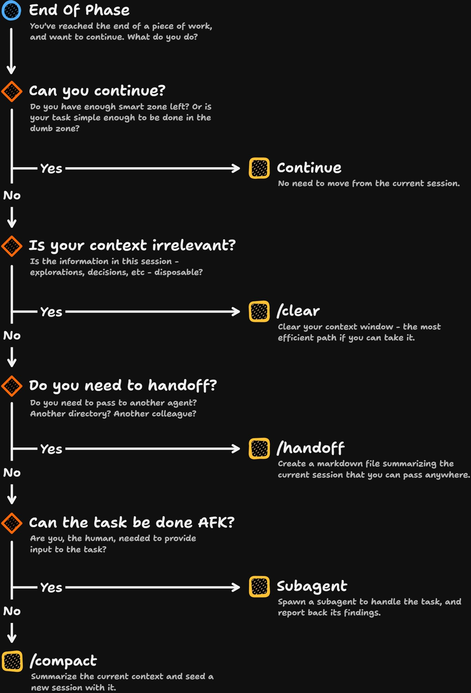

# Matt Pocock (@mattpocockuk)

> Automatisch per `npm run ingest:x` erfasst. Quelle: [x.com/mattpocockuk/status/2079879414297330146](https://x.com/mattpocockuk/status/2079879414297330146)

## Bilder

<!-- Reihenfolge wie von der API geliefert (Cover zuerst). Die Position im Artikeltext gibt die API nicht mit. -->

**photo**

## Post-Text

Here's a decision tree for when you get to the end of a piece of work, and you're not sure how to continue:

- Continue in the current session
- /clear
- /handoff
- Use a subagent
- /compact

Posting for feedback. Which parts are confusing? What questions does it raise? https://t.co/4OSexT09u4

## Links

- [pic.x.com/4OSexT09u4](https://x.com/mattpocockuk/status/2079879414297330146/photo/1)
