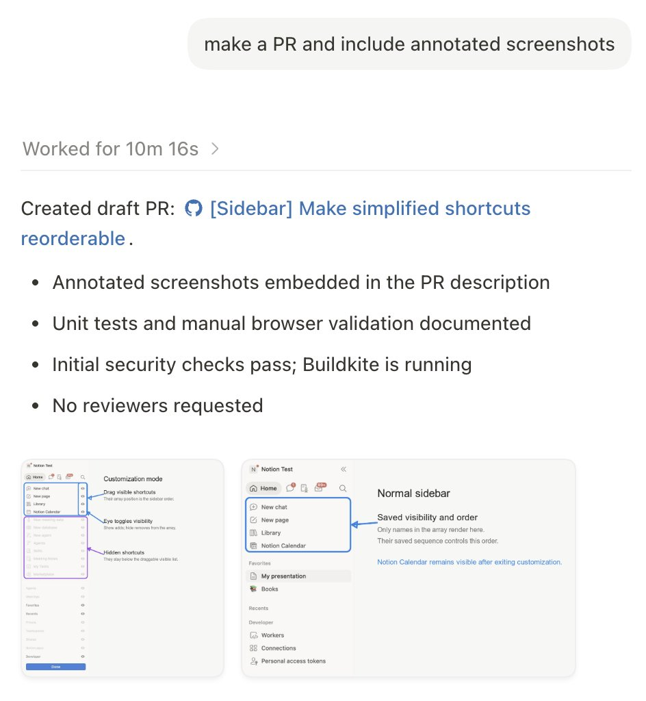

# Cole Bemis (@colebemis)

> Automatisch per `npm run ingest:x` erfasst. Quelle: [x.com/colebemis/status/2080392348836790395](https://x.com/colebemis/status/2080392348836790395)

## Bilder

<!-- Reihenfolge wie von der API geliefert (Cover zuerst). Die Position im Artikeltext gibt die API nicht mit. -->

**photo**

## Post-Text

Pro tip: ask your coding agent to attach annotated screenshots to your PRs https://t.co/CjlXmH4wBn

## Links

- [pic.x.com/CjlXmH4wBn](https://x.com/colebemis/status/2080392348836790395/photo/1)
