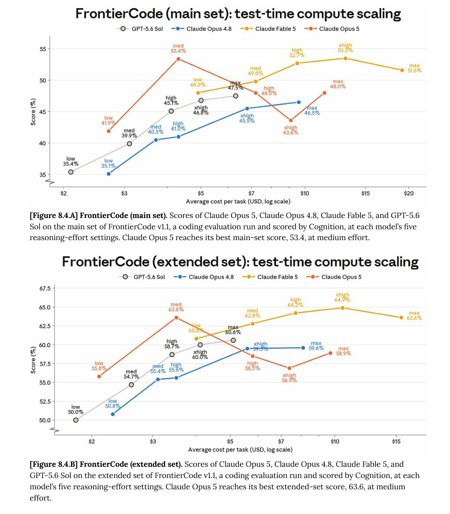

# Andrew Carr 🤸 (@andrew_n_carr)

> Automatisch per `npm run ingest:x` erfasst. Quelle: [x.com/andrew_n_carr/status/2080727000004878593](https://x.com/andrew_n_carr/status/2080727000004878593)

## Bilder

<!-- Reihenfolge wie von der API geliefert (Cover zuerst). Die Position im Artikeltext gibt die API nicht mit. -->

**photo**

## Post-Text

Opus 5 is an incredible model, just don't let it think? https://t.co/AkAoCPcRNv

## Links

- [pic.x.com/AkAoCPcRNv](https://x.com/andrew_n_carr/status/2080727000004878593/photo/1)
