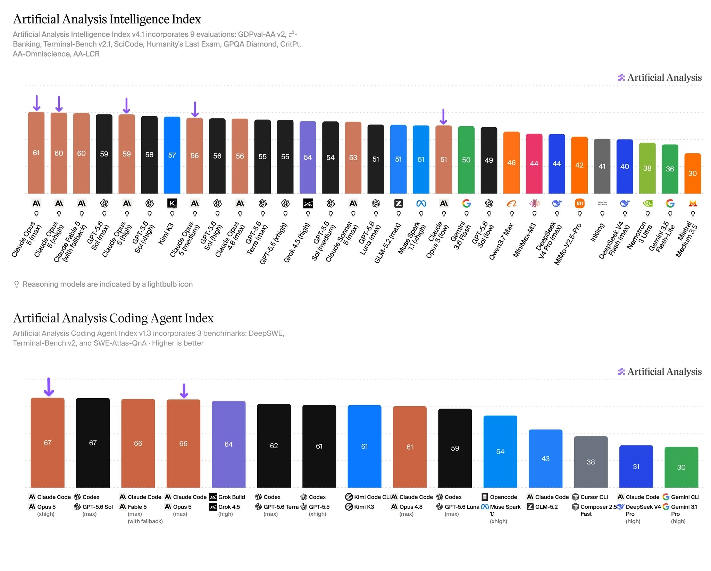

# Artificial Analysis (@ArtificialAnlys)

> Automatisch per `npm run ingest:x` erfasst. Quelle: [x.com/ArtificialAnlys/status/2080734447717298483](https://x.com/ArtificialAnlys/status/2080734447717298483)

## Bilder

<!-- Reihenfolge wie von der API geliefert (Cover zuerst). Die Position im Artikeltext gibt die API nicht mit. -->

**photo**

## Post-Text

Claude Opus 5 is narrowly the most intelligent model on the Artificial Analysis Intelligence Index, offering comparable intelligence to Fable 5 at 26% lower Cost per Task

We supported @AnthropicAI to evaluate Claude Opus 5 ahead of release: it sets the highest GDPval-AA v2 and AA-Briefcase scores so far. Opus 5 (max) scores 61 on the Artificial Analysis Intelligence Index, effectively tied with Claude Fable 5 (max, 60), and ahead of GPT-5.6 Sol (max, 59), Kimi K3 (57), and Claude Opus 4.8 (max, 56)

Key takeaways:
➤ New leader in agentic knowledge work: Claude Opus 5 (max) scores 1861 Elo on GDPval-AA v2, >100 points ahead of Claude Fable 5 and GPT-5.6 Sol (max). On AA-Briefcase, our proprietary agentic knowledge work benchmark, it scores 1720 Elo, +146 ahead of Fable 5. These benchmarks test the ability of models to produce accurate and well-presented professional outputs using our open source reference agent harness, Stirrup
➤ Joint first place on the Coding Agent Index: Claude Opus 5 (xhigh) with Claude Code leads the Artificial Analysis Coding Index, including the highest score on SWE-Atlas-QnA
➤ Frontier intelligence with reduced cost: Claude Opus 5 (max) costs $2.03 on average per Intelligence Index task, below Claude Fable 5 (with fallback) at $2.75, but still above Claude Opus 4.8 (max) at $1.80 and Claude Sonnet 5 (max) at $1.53. However, at high and xhigh reasoning efforts Opus 5 can outperform both Opus 4.8 and Claude Sonnet 5 at a lower cost per task
➤ Frontier agentic terminal use: 89% on Terminal-Bench v2.1 at max effort, roughly in line with the leader, GPT-5.6 Sol (xhigh)
➤ Outperformance on scientific reasoning: Along with leading agentic performance, Claude Opus 5 scores 53% on Humanity’s Last Exam in line with Fable 5; on CritPt, a frontier physics evaluation developed by Argonne and UIUC researchers, it also matches Fable 5 but sits behind GPT-5.6 Sol, GPT-5.5 Pro, and GPT-5.6 Terra
➤ Factual knowledge still lags Fable 5: As expected from the models’ size classes, Opus 5 still has lower factual knowledge on AA-Omniscience than Fable 5. It improves +7 points on AA-Omniscience Accuracy over Opus 4.8, but answers more often when uncertain - its hallucination rate rises +14 points to 50%
➤ Improving efficiency, but only on the Intelligence vs. Cost per Task Pareto frontier at high Intelligence levels: Opus 5 outperforms Fable 5 at lower cost, but at lower effort levels it sits just behind the GPT-5.6 family on the Intelligence vs. Cost per Task frontier

Other model details:
➤ Context window: 1 million tokens (equivalent to Opus 4.8)
➤ Pricing: As with recent Opus launches, tokens cost $5/$25 per million tokens of input/output; cache pricing remains at a 25% premium for cache writes ($6.25 per million tokens) with 5-minute time to live, and 90% discount for cache hits ($0.50 per million tokens)
➤ Five effort settings (low, medium, high, xhigh, max), and support for server-side fallback as with Fable 5. Intelligence Index evaluations were run with Opus 4.8 fallback enabled
