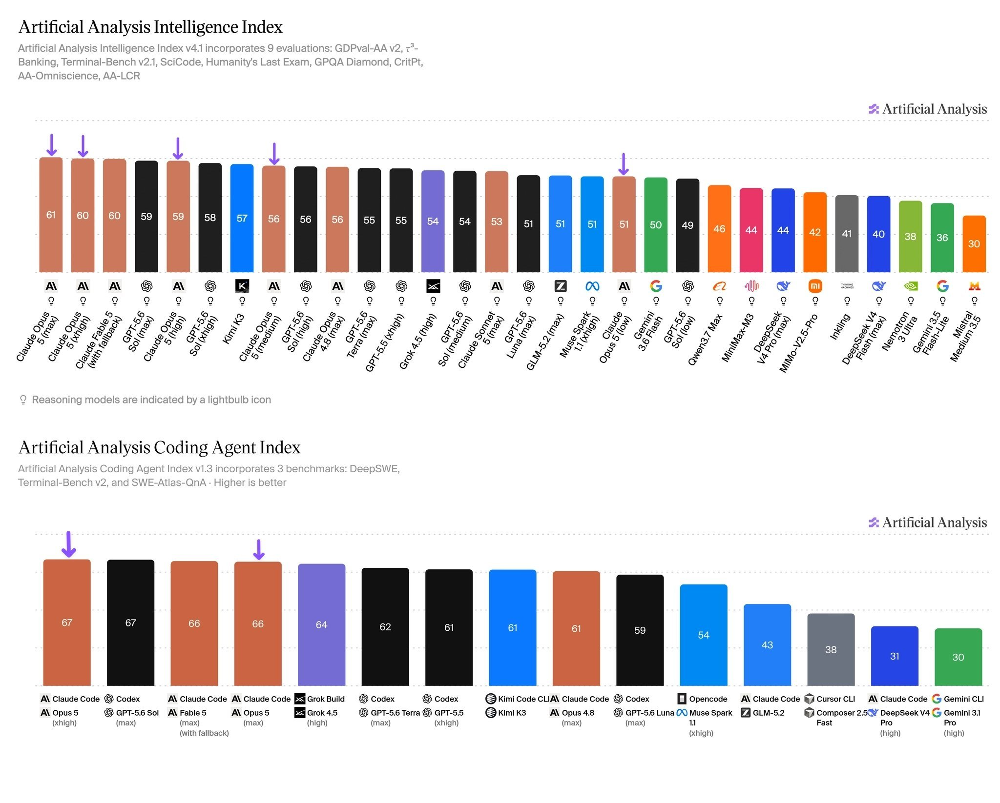
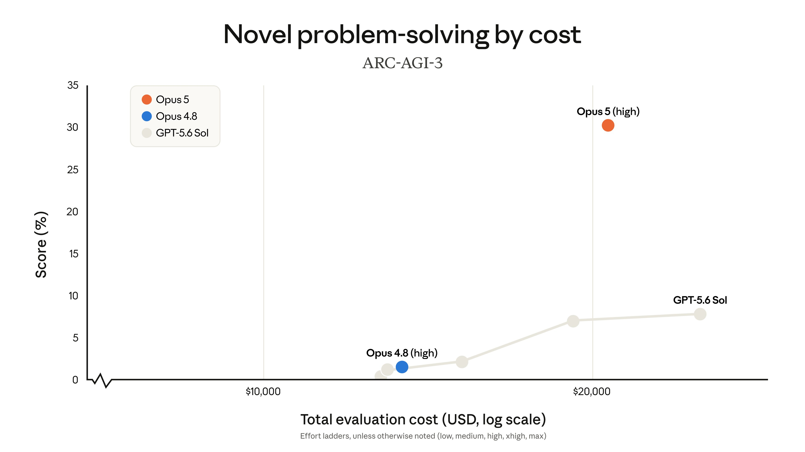

# Chubby♨️ (@kimmonismus)

> Automatisch per `npm run ingest:x` erfasst. Quelle: [x.com/kimmonismus/status/2080751641393836085](https://x.com/kimmonismus/status/2080751641393836085)

## Bilder

<!-- Reihenfolge wie von der API geliefert (Cover zuerst). Die Position im Artikeltext gibt die API nicht mit. -->

**photo**

**photo**

## Post-Text

Let’s take a quick look at these two charts about Opus 5:

1) Opus 4.8 is only two months old. In the span of just two months, its performance on the ARC-AGI 3 benchmark has improved from under 5% with Opus 4.8 to over 30% with Opus 5. Two months.

2) Over that same two month period, Opus 5 has emerged as a model that is not only better than Fable 5, but also more efficient than its predecessor, Opus 4.8. According to the Artificial @ArtificialAnlys  Benchmark, Opus 5 is “offering comparable intelligence to Fable 5 at 26% lower Cost per Task.”

Two months that have completely changed the game.

Opus 5 is the release many had been hoping for, and it proves just how quickly everything is improving. Now it’s OpenAI’s turn with GPT-6, and Fable 5.1 probably won’t be far behind. Absolutely insane!
