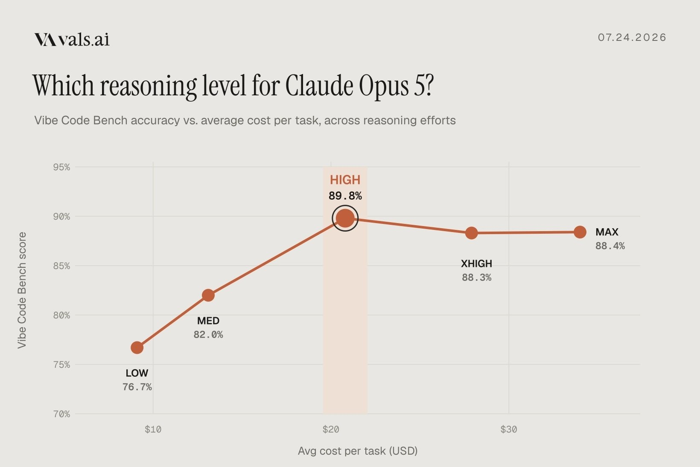

# Vals AI (@ValsAI)

> Automatisch per `npm run ingest:x` erfasst. Quelle: [x.com/ValsAI/status/2080817011157094511](https://x.com/ValsAI/status/2080817011157094511)

## Bilder

<!-- Reihenfolge wie von der API geliefert (Cover zuerst). Die Position im Artikeltext gibt die API nicht mit. -->

**photo**

## Post-Text

Which reasoning level should you use on Opus 5?

We ran it across all five levels on Vibe Code Bench. Performance increases from low, to medium, to high.   

However, the model actually performs worse at the two highest reasoning levels (albeit within error bars), and is significantly more expensive.

## Links

- [pic.x.com/FUSczwLP5M](https://x.com/ValsAI/status/2080817011157094511/photo/1)
