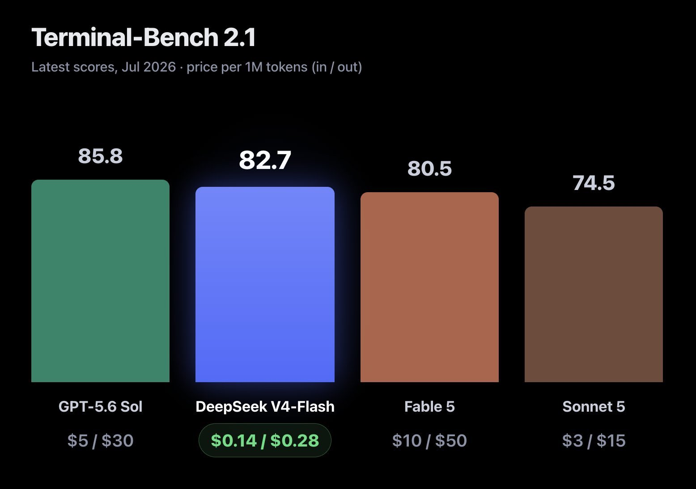

# Chubby♨️ (@kimmonismus)

> Automatisch per `npm run ingest:x` erfasst. Quelle: [x.com/kimmonismus/status/2083144340176609556](https://x.com/kimmonismus/status/2083144340176609556)

## Bilder

<!-- Reihenfolge wie von der API geliefert (Cover zuerst). Die Position im Artikeltext gibt die API nicht mit. -->

**photo**

## Post-Text

This is just insane. For me the flash release is another DeepSeek moment. Intelligence so cheap and so good that it’s literally too cheap to meter.

Many don’t get how insane this release is. https://t.co/sE9PIQYwpH https://t.co/QAhvS52HmT

## Links

- [pic.x.com/sE9PIQYwpH](https://x.com/kimmonismus/status/2083144340176609556/photo/1)
- [x.com/cline/status/2…](https://twitter.com/cline/status/2083094354030362858)
