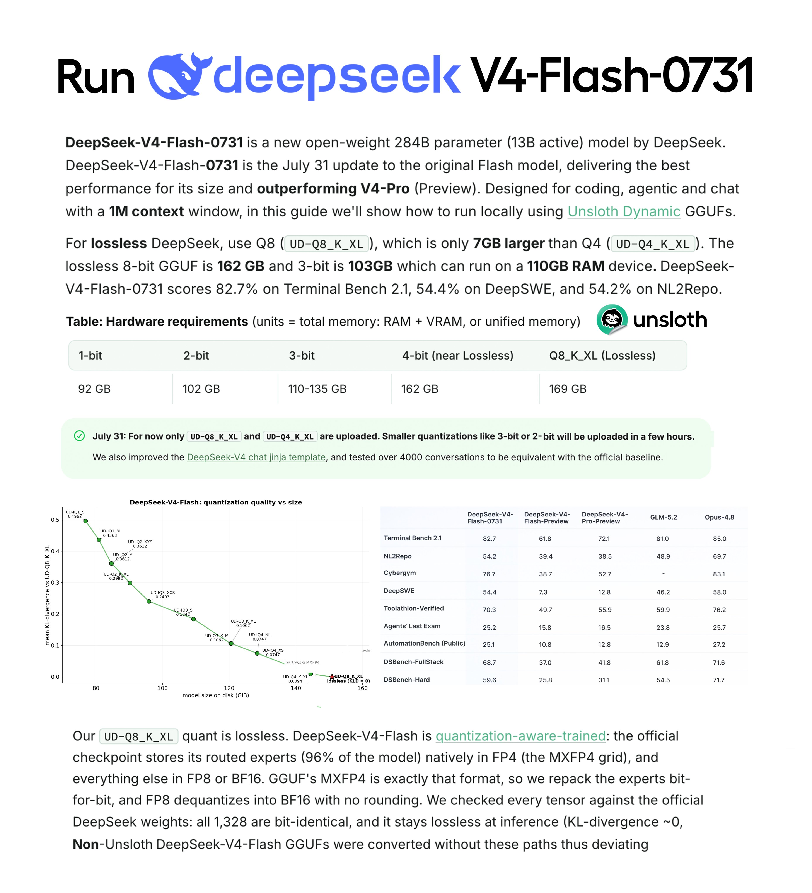

# Unsloth AI (@UnslothAI)

> Automatisch per `npm run ingest:x` erfasst. Quelle: [x.com/UnslothAI/status/2083231049434435596](https://x.com/UnslothAI/status/2083231049434435596)

## Bilder

<!-- Reihenfolge wie von der API geliefert (Cover zuerst). Die Position im Artikeltext gibt die API nicht mit. -->

**photo**

## Post-Text

DeepSeek V4 Flash 0731 can now be run locally! 🐳

Run DeepSeek V4 Flash lossless 4-bit on 168GB RAM and 3-bit on 110GB RAM.

V4 Flash 0731 outperforms V4 Pro. Run via Unsloth or llama.cpp. Smaller quants coming today.

Guide: https://t.co/mCZZkpa95X
GGUF: https://t.co/ac6uOI8mZA https://t.co/7Zl6jgfPTN https://t.co/CUeKgkdZUQ

## Links

- [unsloth.ai/docs/models/de…](https://unsloth.ai/docs/models/deepseek-v4)
- [huggingface.co/unsloth/DeepSe…](https://huggingface.co/unsloth/DeepSeek-V4-Flash-0731-GGUF)
- [pic.x.com/7Zl6jgfPTN](https://x.com/UnslothAI/status/2083231049434435596/photo/1)
- [x.com/deepseek_ai/st…](https://twitter.com/deepseek_ai/status/2083084415157022911)
