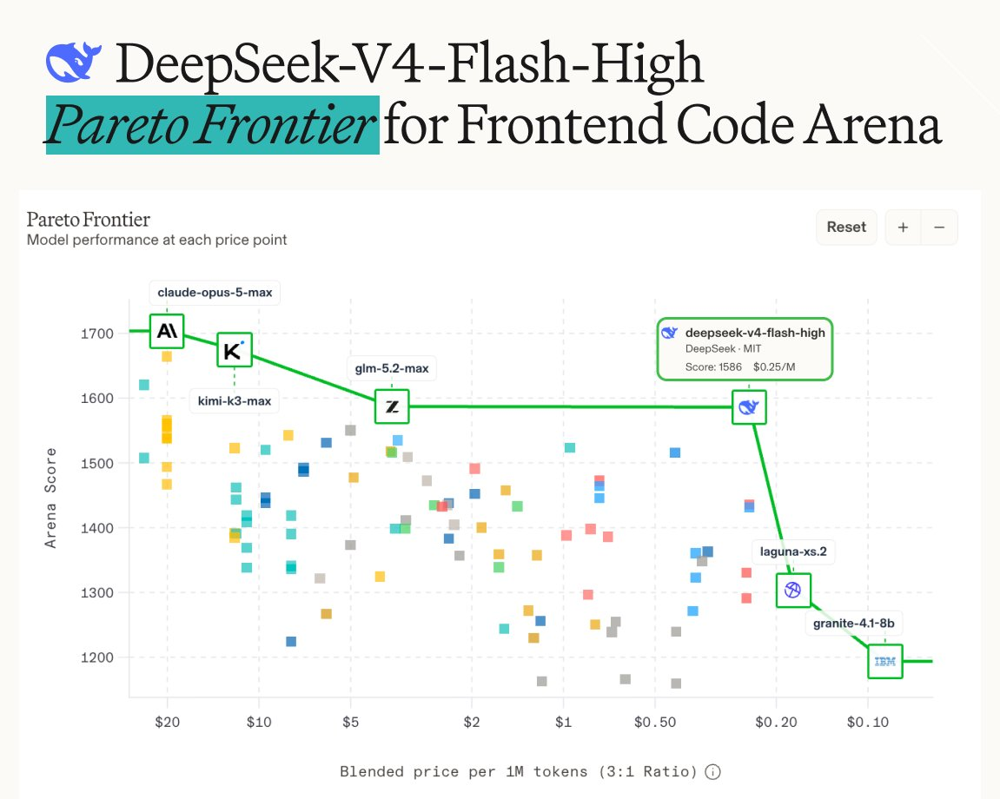

# Arena.ai (@arena)

> Automatisch per `npm run ingest:x` erfasst. Quelle: [x.com/arena/status/2083348755559207047](https://x.com/arena/status/2083348755559207047)

## Bilder

<!-- Reihenfolge wie von der API geliefert (Cover zuerst). Die Position im Artikeltext gibt die API nicht mit. -->

**photo**

## Post-Text

Exciting news: DeepSeek-V4-Flash-High by @deepseek_ai has reshaped the Pareto Frontier in the Frontend Code Arena, with a score of 1586!

Priced at $0.14/$0.28 per MToken, it’s the best performance-per-dollar of any model in its class.

Congrats to the @deepseek_ai team! https://t.co/ca5xx9hYGV https://t.co/M22NLERwPA

## Links

- [pic.x.com/ca5xx9hYGV](https://x.com/arena/status/2083348755559207047/photo/1)
- [x.com/deepseek_ai/st…](https://twitter.com/deepseek_ai/status/2083084415157022911)
