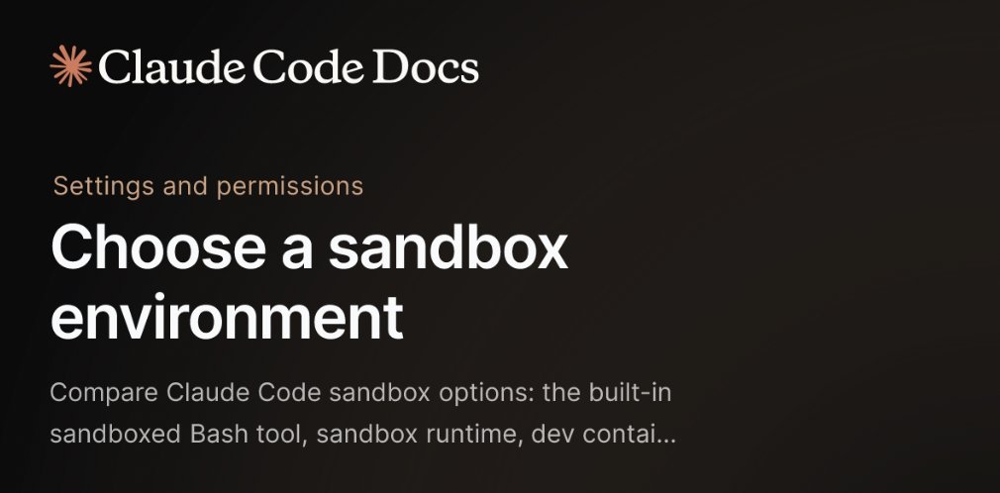

# Docker (@Docker)

> Automatisch per `npm run ingest:x` erfasst. Quelle: [x.com/Docker/status/2089789519788728379](https://x.com/Docker/status/2089789519788728379)

## Bilder

<!-- Reihenfolge wie von der API geliefert (Cover zuerst). Die Position im Artikeltext gibt die API nicht mit. -->

**photo**

## Post-Text

Docker Sandboxes is now in the official @AnthropicAI Claude Code docs as a recommended way to run Claude Code with microVM-level isolation. 

Its own kernel, its own Docker daemon, no Docker Desktop required: https://t.co/dehQVwcRSJ https://t.co/GKmaVStIbf

## Links

- [bit.ly/4hG0cmH](https://bit.ly/4hG0cmH)
- [pic.x.com/GKmaVStIbf](https://x.com/Docker/status/2089789519788728379/photo/1)

## Thread

### 1/1

Docker Sandboxes is now in the official @AnthropicAI Claude Code docs as a recommended way to run Claude Code with microVM-level isolation. 

Its own kernel, its own Docker daemon, no Docker Desktop required: https://t.co/dehQVwcRSJ https://t.co/GKmaVStIbf
