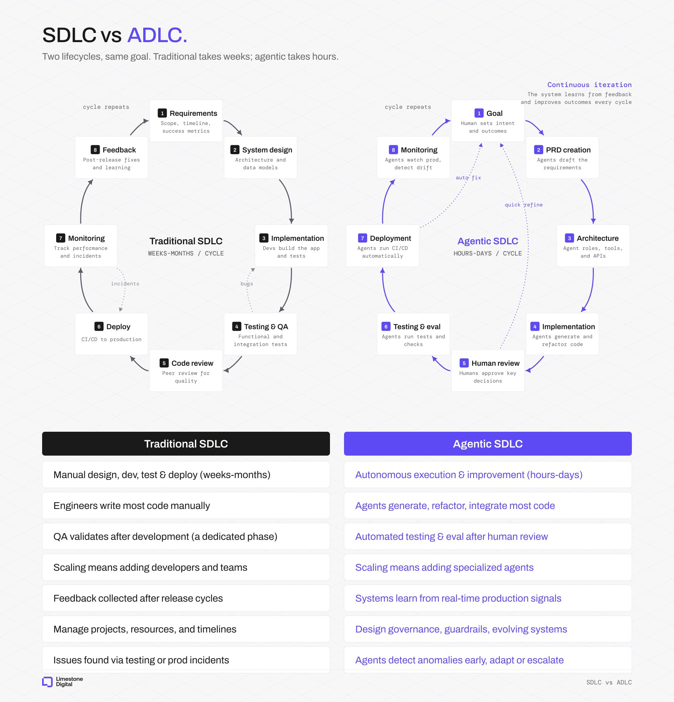

# Limestone Digital (@LimestoneHQ)

> Automatisch per `npm run ingest:x` erfasst. Quelle: [x.com/LimestoneHQ/status/2089711978914725979](https://x.com/LimestoneHQ/status/2089711978914725979)

## Bilder

<!-- Reihenfolge wie von der API geliefert (Cover zuerst). Die Position im Artikeltext gibt die API nicht mit. -->

**photo**

## Post-Text

The software development lifecycle (SDLC) is transforming into ADLC (agent development lifecycle)

Traditional SDLC: 8 steps, humans at every gate, weeks to months per cycle.

Agentic SDLC: 8 steps, humans at 2 gates, hours to days.

Agents are good at the things humans are bad at. They write code faster and catch far more edge cases reviewing it. They don't just skim a PR and stamp 'lgtm.'

So: how do you build the right factory floor for agents, instead of forcing them into factories designed for humans?

98% of code in our AI Velocity Pods is not handwritten. We had to rethink the entire pipeline.

Human sets the goal. Agents draft the PRD, architect the solution, generate the code, run tests, deploy, monitor for drift. Humans plug in where judgment matters: reviewing key decisions.

2 human touchpoints. 6 agent-driven steps. Cycle time went from weeks to days.

Most engineering orgs are still running agents through a pipeline built for a different worker.

## Links

- [pic.x.com/daUZtDN6lq](https://x.com/LimestoneHQ/status/2089711978914725979/photo/1)

## Thread

### 1/4

The software development lifecycle (SDLC) is transforming into ADLC (agent development lifecycle)

Traditional SDLC: 8 steps, humans at every gate, weeks to months per cycle.

Agentic SDLC: 8 steps, humans at 2 gates, hours to days.

Agents are good at the things humans are bad at. They write code faster and catch far more edge cases reviewing it. They don't just skim a PR and stamp 'lgtm.'

So: how do you build the right factory floor for agents, instead of forcing them into factories designed for humans?

98% of code in our AI Velocity Pods is not handwritten. We had to rethink the entire pipeline.

Human sets the goal. Agents draft the PRD, architect the solution, generate the code, run tests, deploy, monitor for drift. Humans plug in where judgment matters: reviewing key decisions.

2 human touchpoints. 6 agent-driven steps. Cycle time went from weeks to days.

Most engineering orgs are still running agents through a pipeline built for a different worker.

### 2/4

90% of AI content is written by people who've never shipped a production agent.

This newsletter is written from inside 100+ engineering teams that do it every week.

Subscribe for free 👇
https://t.co/h46msl3xMD

### 3/4

@free_ai_guides thanks

### 4/4

@alex_prompter thank you !
