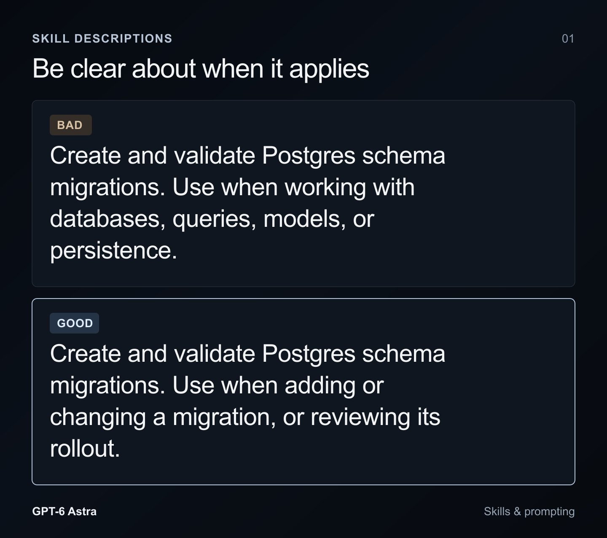
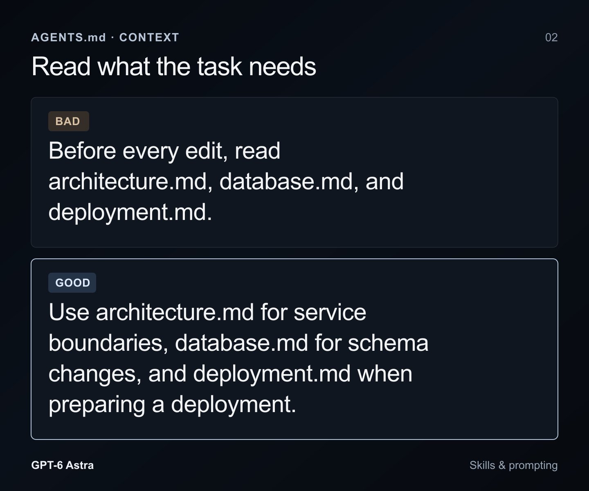

# Rethinking skills and prompts for GPT-6 Astra

> Automatisch per `npm run ingest:x` erfasst. Quelle: [x.com/pvncher/status/2095991462416490862](https://x.com/pvncher/status/2095991462416490862)

## Artikel-Volltext

Coding agents have come a long way, and best practices are changing fast. What used to require a lot of handholding and scaffolding no longer does.
If you’ve been using agents in your projects over the last year, you’ve likely accumulated a lot of bloated instructions as you worked to steer the models toward good outcomes. With each release, it’s been worth revisiting those assumptions, but with GPT-6 Astra, that’s more important than ever.
These instructions can take many forms, with Skills, AGENTS.md, and your task prompts all shaping how the model gets work done.
Skill files
One form these instructions can take, is with skill files, which are essentially prompts stored as markdown files, sometimes with bundled scripts. Generally, they are most useful for guidance around a workflow the model only needs for certain tasks, or instructions for using a plugin.
Many people default to downloading a lot of skills into their projects, but that’s a mistake. Each skill comes with a name and description that are loaded into the model’s context so it knows when to use them. Many descriptions are far too long, and when you add too many skills, Codex starts shortening their descriptions to fit. The model ends up seeing less of each description, making it harder to know which skill to pick.
Worse, descriptions can contradict each other or have too much “pick me” energy, leading the model to load instructions that don’t actually help the task.
If you’ve ever asked Codex to create a skill, it probably used the $skill-creator skill. We recently updated its guidance in a few ways to help mitigate many of the failure modes we've seen in practice.
First, skill descriptions should be as short as possible while making it clear when the model should use them.
 
Here the bad skill description can push the model to use it anytime it touches anything related to a database, vs only when it has to handle a migration.
Second, one of the key markers of a useful skill is progressive disclosure. Reading a skill takes up context, bringing you closer to compaction and introducing guidance that may not apply to the task. For skills with multiple workflows, make the root document a minimal router that points to supporting docs and scripts. Give the model enough guidance to know where to look without forcing it to read things that don’t matter in the moment.
Third, many skills were written as elaborate itineraries or recipes. Models have gotten much better at understanding nuance and ambiguity, so overly specific guidance can now hinder results where it previously helped.
Repository skills also guide other contributors’ agents, which may use different models. Guidance that helps Sol or Luna may overconstrain GPT-6 Astra, so consider which models will use the instructions you leave behind.
AGENTS.md
Because AGENTS.md applies whenever the model works in your repository, revisit each instruction and ask whether the task still needs it.
Requiring a stack of docs or a full repo map before every edit is excessive for a typo fix. GPT-6 Astra can work out what it needs to read without being pushed to review the whole project before every change.
 
Prompting the model to read files before every edit, is a great way to burn context and slow work down. Pointing to some docs can still be helpful however, so long as it is contextual. Be sure to keep your docs updated too!
Previous models needed encouragement to run tests and check their work. GPT-6 Astra does that on its own, so the same instructions can lead to unnecessary testing.
GPT-6 Astra is thorough, but it can be more tentative about how far to take a task. Sometimes it needs a little push to keep going. You can use AGENTS.md to give it permission for a specific workflow you know is safe, such as a local test suite:
The local tests use disposable fixtures and have no production access. Run them, fix failures caused by the requested change, and rerun affected tests without asking for approval at each step.
Decision boundaries
Pay careful attention to how you describe boundaries. If a previous model did things on your behalf without permission, you may have added strong language to make it ask first. That can be useful, but GPT-6 Astra has much better judgment, and you should treat it as such. It also takes your boundaries seriously and may stop work where you’d actually be happy for it to continue.
Persistence
If you’re used to GPT-5.6 Sol taking a request and continuing for long stretches, GPT-6 Astra can feel more tentative about when to stop. It may reach a first implementation and come back for your review while there’s still work to do.
This is where it helps to define completion before starting. If the task includes getting the implementation running, inspecting the result, and fixing what fails, make that part of the request. A requirement to stop for review after the first implementation will pull the model toward an earlier stopping point, so check whether that’s a decision you actually need to make.
If you want it to keep exploring beyond a first pass, say what you want explored and where it should stop.
A new model is a good opportunity to clean your house. Ask GPT-6 Astra to do an audit based on what was discussed in this article, then go build something you wouldn’t have attempted before!

## Bilder

<!-- Reihenfolge wie von der API geliefert (Cover zuerst). Die Position im Artikeltext gibt die API nicht mit. -->

**Cover**

**photo**

**photo**

## Post-Text

https://t.co/iDl6I25AQu

## Links

- [x.com/i/article/2095…](https://x.com/i/article/2095989703967125509)

## Thread

### 1/5

https://t.co/iDl6I25AQu

### 2/5

@kevintupper @thsottiaux You got a consumable reset yesterday!

### 3/5

@kwuwon I’d say agents Md to repo context that the agent should maintain

Skill files with built in docs that don’t change.

You can have skills point to repo docs but they’re no longer self contained.

### 4/5

@transitive_bs Yeah ask it to read the article

### 5/5

@CoderSteven @kevintupper @thsottiaux You got a banked reset
