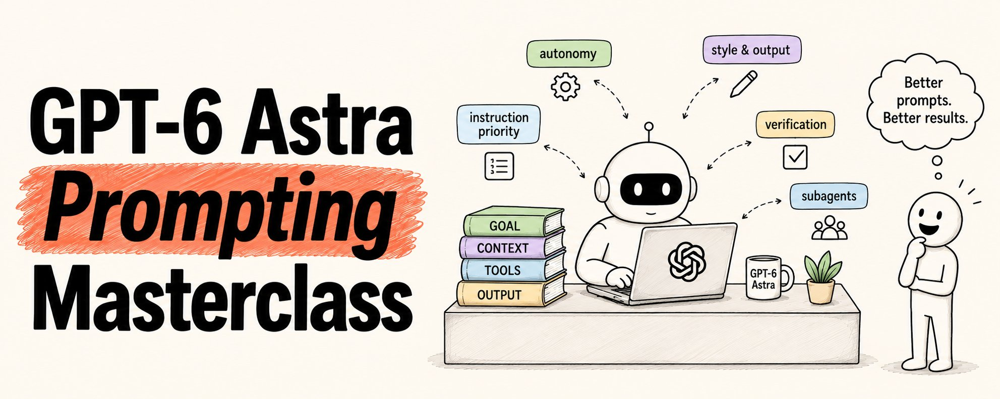
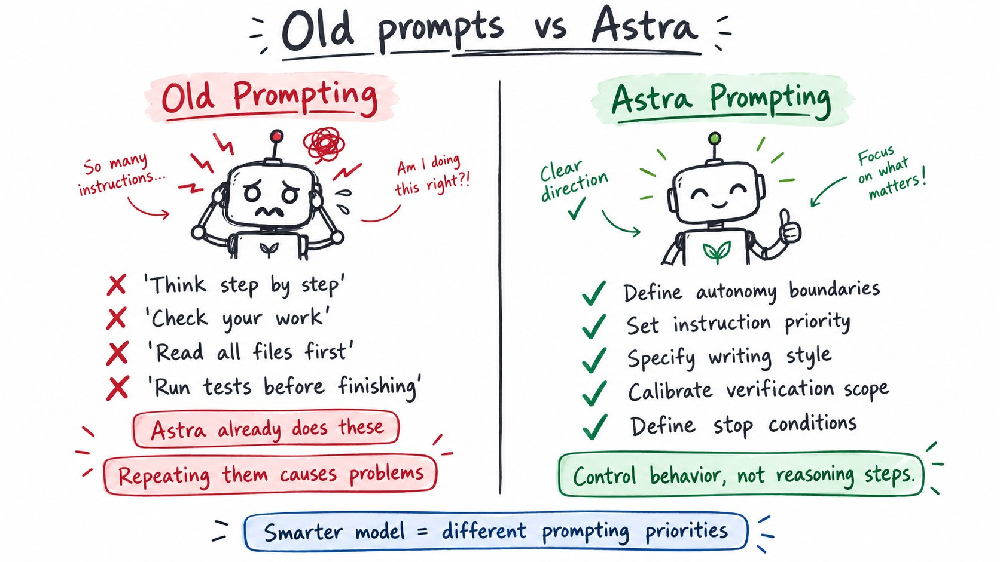
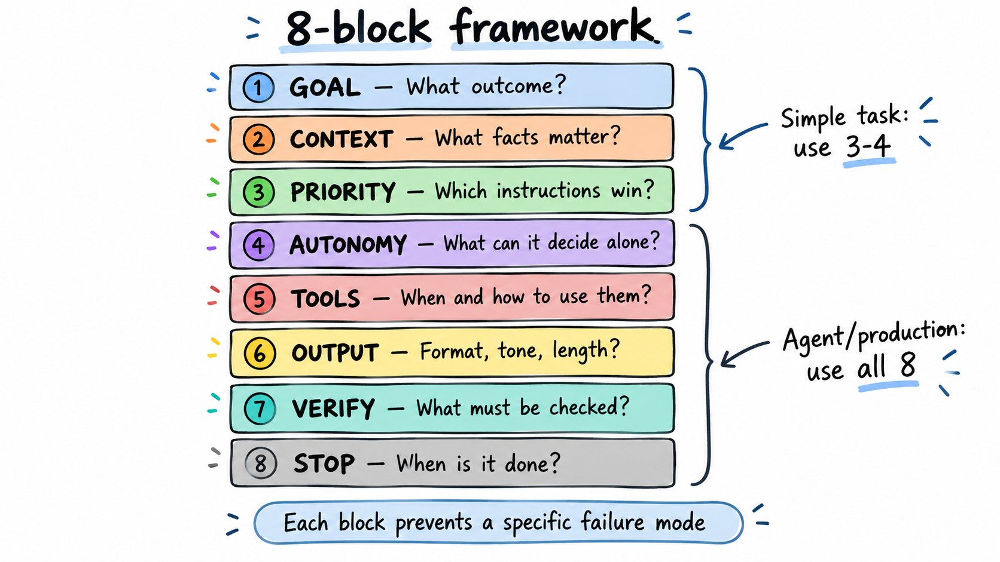
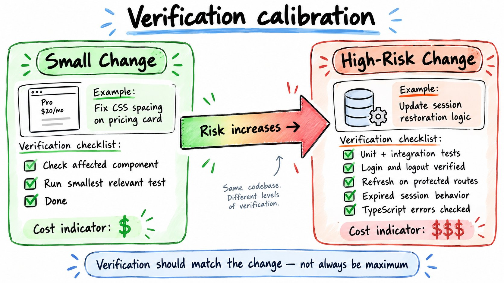

# GPT-6 Astra Prompting Masterclass

> Automatisch per `npm run ingest:x` erfasst. Quelle: [x.com/sairahul1/status/2096902575035683147](https://x.com/sairahul1/status/2096902575035683147)

## Artikel-Volltext

 
GPT-6 Astra is the most capable model OpenAI has ever shipped (for now atleast)
It also breaks in ways none of the old prompting advice prepared you for.
Your carefully crafted AGENTS.md from 6 months ago?
It might be making Astra worse.
Your elaborate skill files?
Probably slowing it down and bloating its context.
Your old habit of telling the model to "think step by step" and "check your work"?
Astra does that on its own now. Repeating it causes unnecessary extra testing and token usage.
Prompting Astra is not about writing longer prompts.
It is about knowing which behaviors to control and which to leave alone.
This is the complete guide. 
(more about this here - https://developers.openai.com/api/docs/guides/latest-model)
Copy-paste prompts included.
 
What actually changed with Astra
 
Previous models needed hand-holding.
You had to push them to run tests, check their work, read relevant files, and keep going on long tasks.
Astra does all of that on its own.
Which means the old instructions you wrote to force those behaviors now fight against the model.
Five behaviors that need explicit prompting with Astra:
 
That is the entire shift.
Astra got smarter. Your old prompts did not update to match.
Let's fix that.
 
The core framework — 8 blocks, use what you need
 
For simple tasks, you need 3-4 of these.
For agents, coding workflows, and production systems, use all 8.
 
This is not a template to copy wholesale into every prompt.
It is a menu. Each block exists because there is a realistic failure mode it prevents.
If your workflow does not have that failure mode, remove the block.
The short version for most tasks:
 
Use the full 8-block framework when you are building agents, running research workflows, or doing anything involving tools and long autonomous execution.
 
The initiative problem — it pauses when you expect it to continue
Astra is more likely than any previous model to ask a clarifying question before proceeding.
That is good when a wrong assumption would be expensive.
It is annoying when you just want it to keep moving.
The fix: define your autonomy policy explicitly.
 
For action-oriented agents:
 
For high-autonomy workflows:
 
The key is deciding upfront. Not leaving it to the model's default behavior.
 
The instruction conflict problem — your skills are fighting each other
This is the one that trips up almost every developer upgrading from an older model.
Astra is more sensitive to instructions in contextual files.
If you have conflicting guidance across AGENTS.md, skill files, and your task prompt — Astra may pause, block early, or follow a rule you did not expect.
The audit you need to do right now:
Go through every instruction file accessible to your model.
Ask: does this task still need this instruction?
 
The instruction priority prompt:
 
For skill files specifically — the three rules:
 
 
The writing style problem — too much markdown by default
Astra defaults to detailed, formatted responses.
Lists. Tables. Headers. Markdown everywhere.
If your application needs prose, an email, documentation in a specific house style, or any interface where raw markdown shows as **bold** rather than bold — you need to specify this.
The prose style prompt:
 
The slop suppression prompt (for when it keeps using the same phrases):
 
For technical communication:
 
 
The verification problem — overtesting small changes
 
Astra is thorough about testing before considering coding work complete.
For a small reversible UI fix, that thoroughness can mean:
→ Running your entire test suite for a one-line CSS change 
→ Writing new tests for a bug fix that already has coverage 
→ Repeating checks that already passed
This is not the model being wrong. It is the model applying the right instinct at the wrong scale.
The fix: define verification scope proportional to the change.
Small reversible change:
 
High-risk logic change:
 
The model gets a definition of "enough" instead of defaulting to "as thorough as possible."
 
Subagent delegation — it delegates less than you want
Astra can divide work across subagents and run things in parallel.
But it may not do this as aggressively as your multi-agent workflow expects unless you tell it when to.
The delegation prompt:
 
One extra detail for agent-to-agent messages:
 
(Astra can produce garbled inter-agent messages without this.)
 
The stop condition — define completion before starting
If you are used to GPT-5.6 Sol taking a task and running for long stretches without stopping, Astra can feel more tentative.
It may return after the first implementation while there is still work to do.
This is not a bug. It is Astra being careful about staying within the scope you gave it.
The fix: define what completion looks like before the task starts.
 
If you want Astra to keep exploring beyond a first pass:
 
Vague: "keep going until done."
Specific: "stop when all affected routes return 200 and no TypeScript errors remain."
 
The complete system prompt — copy this
This is the full production-ready system prompt combining all the behaviors above.
Use the whole thing for agents and complex workflows.
Use just the sections you need for simpler tasks.
 
 
Prompts for specific workflows
Here are copy-paste prompts for the most common Astra use cases.
Coding — bug fix
 
Research — decision-grade
 
Writing — editorial
 
Tool-using agent
 
Multi-agent research
 
 
API changes you need to make
These are not prompting changes. These are API-level changes required when migrating to Astra.
 
The one-command migration:
If you use Codex, OpenAI published an official skill that reads their migration guide and applies relevant changes to your project:
 
Skill repo: github.com/openai/skills
Tested on mid-sized repos. Works out of the box.
 
12 mistakes to avoid with Astra
These are the failure modes that cost people the most time.
1. Leaving autonomy undefined.
If you don't say when to assume vs ask, Astra defaults to asking. Define the policy.
2. Keeping old instructions that fixed GPT-5 behavior.
Astra no longer needs to be told to run tests or check its work. Those instructions now cause overtesting.
3. Loading too many skills.
Each skill's description gets shorter as you add more. Astra ends up seeing partial descriptions and picks the wrong skill.
4. Relying on long skill descriptions.
A skill description should say when to use it — not explain the entire workflow. That goes in the skill document itself.
5. Skipping the instruction priority declaration.
If you have AGENTS.md + skill files + task prompt, Astra needs to know which wins. Don't leave it to guess.
6. Treating the large context window as "send everything."
1,050,000 tokens of context can contain a lot of conflicting, stale, and irrelevant content. More context is not always better context.
7. Accepting the default writing style.
Astra defaults to heavy markdown. If your application needs prose or a specific voice, specify it.
8. Saying "use subagents" without delegation rules.
Define what is independent enough to parallelize and who reconciles the results.
9. Not defining stop conditions.
For long-running agents, Astra needs to know what "done" means. Without it, it might stop early or keep going past the goal.
10. Using prompt wording to fake API settings.
"Think with maximum intelligence" does not set reasoning effort. Configure it in the API.
11. Not testing the prompt on real tasks.
A cleaner prompt can still produce worse results. Compare versions on representative test cases before deciding a rewrite is better.
12. Mixing trusted instructions with retrieved content.
Webpages, uploaded files, and tool results can contain instruction-like text. Treat external content as data unless you explicitly designate it as trusted.
 
The quick audit prompt
Use this to have Astra clean up your own project instructions:
 
One prompt. Cleans your entire project config.
 
The prompting checklist
Before running any Astra prompt, check these:
□ Is the desired outcome explicit?
□ Is relevant context included (without everything)?
□ Are conflicting instruction files audited?
□ Is instruction priority declared?
□ Does the prompt say when to assume vs ask?
□ Is writing style specified if needed?
□ Are tool use conditions defined?
□ Is subagent delegation scoped properly?
□ Is verification proportional to the change?
□ Is there a stop condition for long tasks?
□ Are retrieved documents treated as data, not instructions?
□ Has this been tested on real tasks?
If you cannot check a box — that is where your next prompt failure will come from.
 
If this was useful:
→ Repost to share it with every developer using Astra 
→ Follow @sairahul1 for more systems like this 
→ Bookmark this — the copy-paste prompts work right now
I write about AI, building products, and systems that work while you sleep.

## Bilder

<!-- Reihenfolge wie von der API geliefert (Cover zuerst). Die Position im Artikeltext gibt die API nicht mit. -->

**Cover**

**photo**

**photo**

**photo**

**photo**

## Post-Text

GPT-6 Astra is insanely powerful.

But most people will barely use 10% of it.

The difference is knowing how to prompt it properly.

I put together the complete GPT-6 Astra Prompting Masterclass so you can get dramatically better results from day one. https://t.co/54IBpo9Ya8

## Links

- [x.com/i/article/2096…](https://x.com/i/article/2096796497862160384)

## Thread

### 1/1

GPT-6 Astra is insanely powerful.

But most people will barely use 10% of it.

The difference is knowing how to prompt it properly.

I put together the complete GPT-6 Astra Prompting Masterclass so you can get dramatically better results from day one. https://t.co/54IBpo9Ya8
