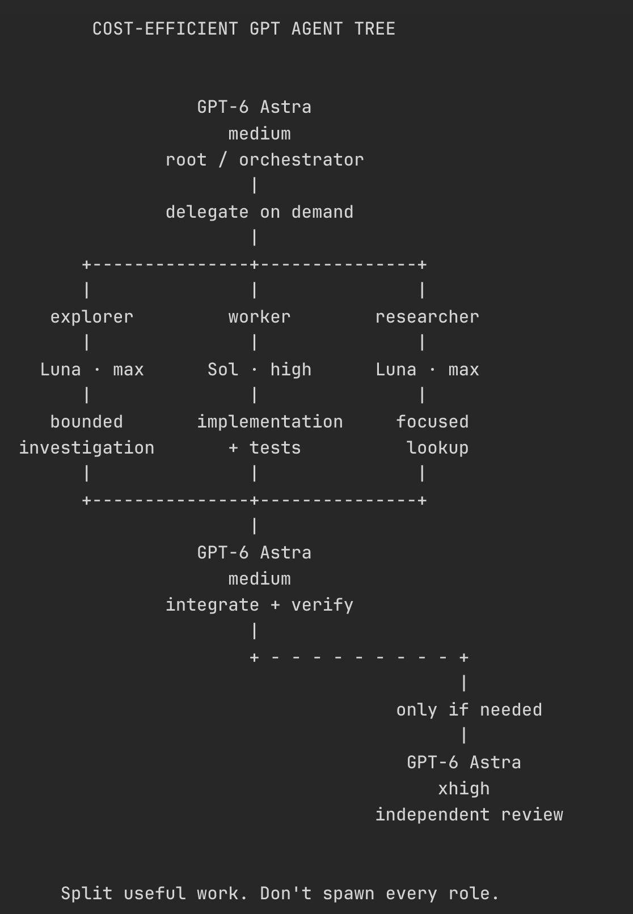

# Vox (@Voxyz_ai)

> Automatisch per `npm run ingest:x` erfasst. Quelle: [x.com/Voxyz_ai/status/2097814698204832116](https://x.com/Voxyz_ai/status/2097814698204832116)

## Bilder

<!-- Reihenfolge wie von der API geliefert (Cover zuerst). Die Position im Artikeltext gibt die API nicht mit. -->

**photo**

## Post-Text

Codex tip: A cost-efficient Luna + Sol agent tree, orchestrated by Astra.

Effort levels chosen by weighing DeepSWE’s pass rates, average cost per task, and agent steps. Hand this to Codex to set it up 👇 https://t.co/1s0YC8zkps

## Links

- [pic.x.com/1s0YC8zkps](https://x.com/Voxyz_ai/status/2097814698204832116/photo/1)

## Thread

### 1/4

Codex tip: A cost-efficient Luna + Sol agent tree, orchestrated by Astra.

Effort levels chosen by weighing DeepSWE’s pass rates, average cost per task, and agent steps. Hand this to Codex to set it up 👇 https://t.co/1s0YC8zkps

### 2/4

@zxdubx Looks great! What's the token usage like with this setup?

### 3/4

@DensedD1320 you don’t need Ultra. did you actually test it? Astra low and medium can both spawn Luna max and Sol high through custom agent configs

### 4/4

https://t.co/H34U4Auh8q

## Folge-Post (nachgetragen)

> Von Philipp aus X kopiert und beim Erfassen nachgetragen. Der Thread-Abruf über recent-search hat diesen Post des Autors nicht mitgeliefert; die URL des Einzelposts ist nicht bekannt. Wortlaut unverändert.

A lot of people have asked how to configure this cost-efficient Astra + Luna + Sol agent tree and get it working.

There are a few ways to use it, depending on how you normally use Codex.

1. Have Codex configure it

Give Codex the diagram and ask it to set up project-level custom agents. Specify the model and model_reasoning_effort for each role, and save the rules for assigning work. Once the configuration is loaded in a fresh session, Astra can call subagents using those roles.

2. Turn it into a Skill

If you use this setup often, put the role configuration templates into a Skill, along with when to use each role and how to collect its results. Set it up the first time, then use it as needed without explaining the whole tree every time.

Whichever approach you use, make sure the role configuration is active. Writing “have Luna explore and Sol implement” in chat or AGENTS.md doesn’t mean the model has switched. You can ask Codex to check the subagent session logs to confirm the model and reasoning effort.

If you just want to get started, the first option is enough. Small tasks don’t need the whole tree, either. Of course, everyone’s experience with quota usage across models is different, so you can adjust the models and effort levels to suit your own usage.
