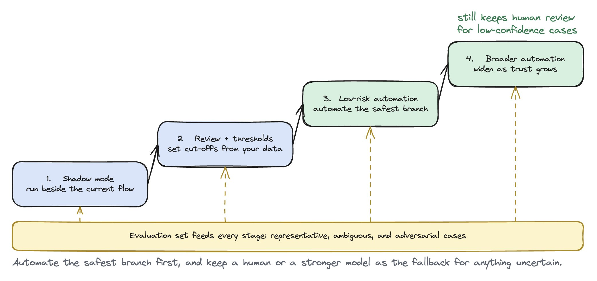
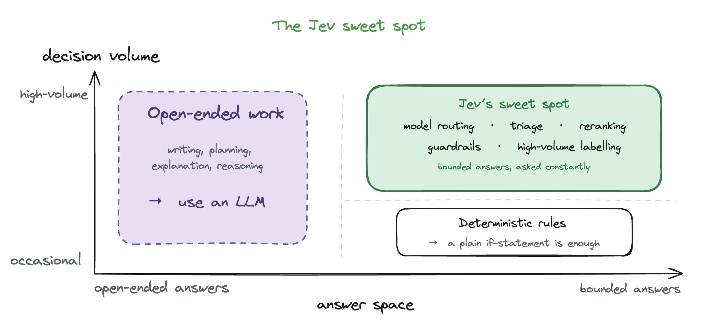
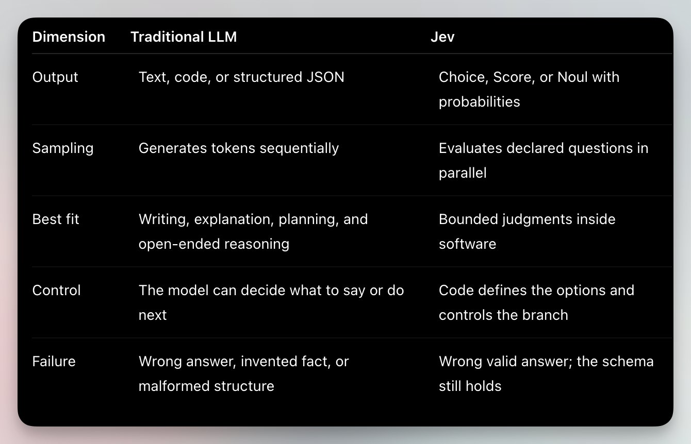
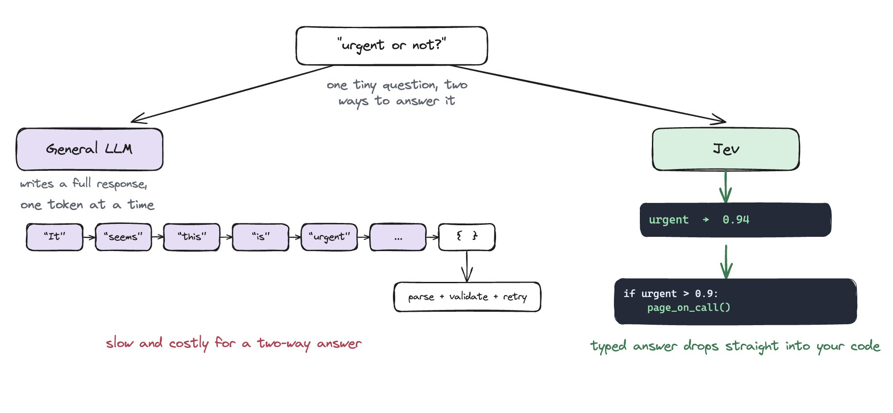
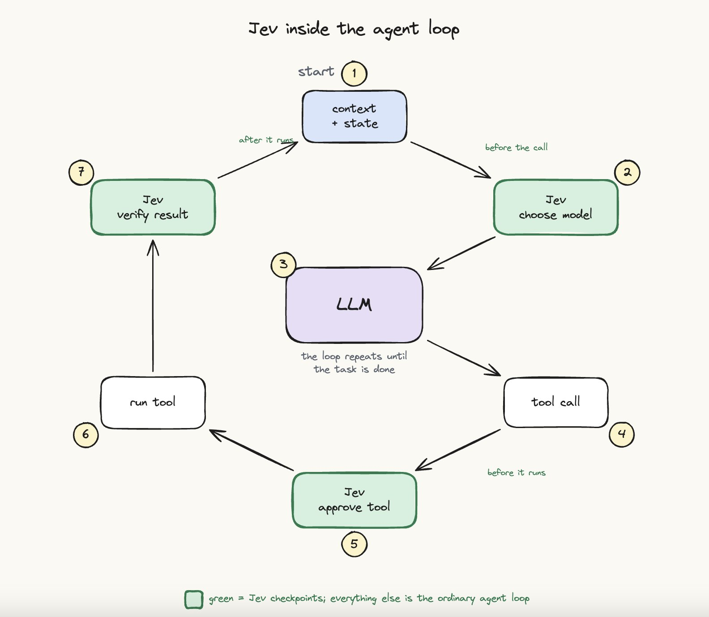
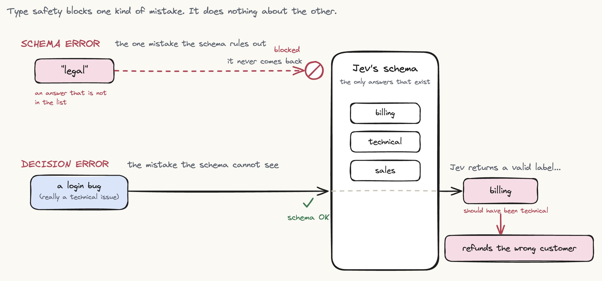
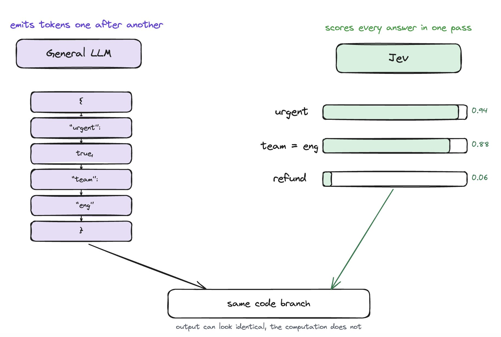
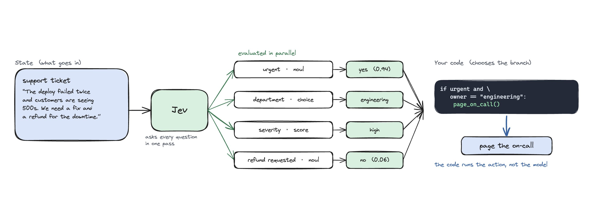

# Jev Clearly Explained

> Automatisch per `npm run ingest:x` erfasst. Quelle: [x.com/akshay_pachaar/status/2101037514945597645](https://x.com/akshay_pachaar/status/2101037514945597645)

## Artikel-Volltext

We have been using LLMs like a hammer for every AI problem, even simple decisions. Jev handles those decisions in milliseconds at a fraction of the cost. Let's understand how it works and where it fits.
 
TypeSafe AI released Jev on September 15, 2026, and the reaction was unusually strong for a model that cannot hold a conversation, write code, or generate a single useful paragraph.
Well, that limitation is the point.
Most software does not need another chatbot. It needs to make thousands of small judgments, for example: Is this ticket urgent? Which model should handle this request? Is this shell command dangerous? Does this retrieved passage answer the question?
Teams often send each judgment to a general-purpose LLM. The model generates an answer one token at a time, the application parses it, validates it, and retries when the shape is wrong. That works, but it is slow and expensive for a decision with five possible answers.
Jev is built specifically for those decisions. TypeSafe calls it a System One model: unstructured state goes in, typed answers and probabilities come out.
Let us unpack what that means, where it fits, and where the marketing needs a little restraint.
 
First the problem Jev is solving
LLMs became much easier to connect to software once tool calling and structured outputs arrived.
Tool calling lets a model request a function in a predictable shape. Structured outputs let it return JSON that follows a schema. Both removed a large amount of brittle parsing.
But the underlying model is still generative. Even when the answer is only a single word "billing", it produces tokens sequentially. You pay for the input, wait for the generation, and often pay more for the output.
Now place that inside an agent loop.
 
The model may be called again to choose a tool, judge a result, detect risk, decide whether the task is complete, and select the next model. A single agent run can contain many calls that require judgment but no generated prose.
Jev targets those calls. 
Its bet is simple: language generation is the wrong interface when code already knows the possible answers.
What Jev actually is
The shortest accurate description is a semantic decision engine.
You send Jev two things:
State: the text or JSON describing the current situation.
Questions: the decisions you want it to make about that state.
Every question declares its answer shape in advance. Jev supports three primitives:
Choice picks one option from a list you define and returns a probability for every option.
Score places the input on an ordered scale you define, such as low, medium, and high.
Noul answers a yes-or-no question by returning the probability that it is true.
Noul is TypeSafe’s name for the Boolean-style primitive. The unusual name matters less than the output (a number between 0 and 1 that your code can act on).
 
The response contains an urgency probability and a probability distribution over the three teams. There is no paragraph to interpret and no fourth team for the model to invent.
Your program keeps control:
 
This is why people keep calling Jev a smart switch statement. The phrase sounds dismissive, but it captures the useful part of the design. Ordinary code owns the branches. The model supplies the fuzzy judgment that ordinary code cannot calculate reliably.
 
The important difference from an LLM
A traditional LLM and Jev can both classify a support ticket. They reach the answer differently and are useful in different parts of a system.
 
TypeSafe says Jev evaluates every question in a request in parallel. That changes how you design the workflow. Instead of asking one question, waiting, and deciding which question comes next, you can ask every independent question about the same state in one request and let the code use the answers it needs.
The company reports end-to-end latency between 70 and 500 milliseconds and a price of $0.042 per million input tokens, with output free. Its headline claims reach roughly 200 times faster and 400 times cheaper than comparable LLM workflows.
Those large multiples come from TypeSafe’s own workflow evaluations and sit at the favorable end of the comparison. Treat them as a ceiling, not a promise for every application. The underlying advantage is still credible, which states that Jev avoids long reasoning traces and generated output because it was designed for bounded decisions.
 
Why probabilities matter
A typed answer solves only half the problem.
Suppose Jev routes a ticket to billing. The selected label tells you what won. The probability distribution tells you how close the race was.
 
Routing that ticket automatically would be reckless. Billing won, but barely. A low-confidence answer should trigger a different branch.
This gives developers a practical pattern:
High confidence: act automatically when the consequence is small.
Medium confidence: ask for confirmation or call a stronger model.
Low confidence: send the case to a person or gather more information.
The thresholds belong in code, where they can be reviewed and changed. A dashboard label may tolerate a weak prediction. A command that deletes data should require a much higher bar.
TypeSafe trains Jev using Reinforcement Learning for Calibrated Decisions, or RLCD. The goal is for confidence to reflect accuracy across many predictions. If a model gives a set of answers 90 percent probability, roughly 90 percent of those answers should be correct.
The hallucination claim needs precision
TypeSafe says Jev cannot hallucinate. That statement is true only under a narrow definition.
Jev cannot return an option outside the schema. If you define billing, technical, and sales, the response cannot invent legal. It also cannot produce malformed prose where your code expected a label.
But it can confidently choose the wrong valid option.
Type safety prevents invalid shapes. It does not guarantee correct judgment. That distinction matters because a schema-valid mistake can still refund the wrong customer, route an incident incorrectly, or approve a dangerous command.
A safer sentence is "Jev cannot break the declared output schema, but it can still be wrong".
 
Where Jev fits inside an agent
Jev works best when it is used with an LLM instead of replacing one.
The LLM handles work that needs language or deeper reasoning. It plans, writes, explains, and uses tools. Jev handles frequent decisions around that work.
Three placements are especially compelling.
Model routing
A simple lookup does not need the same model as an architecture review. Jev can score the request and choose the least expensive model likely to complete it.
 
The router does not answer the request. It decides which model should.
Tool risk gating
Before an agent runs a shell command, Jev can classify it as read-only, reversible, or destructive. Separate questions can check whether it deletes files, changes Git history, touches production, or leaves the repository.
High-confidence read-only actions can continue. Destructive or uncertain actions can pause for human approval. LangChain’s Jev integration applies this pattern through middleware that checks a tool call before execution.
Verification and supervision
An agent can claim that a task is finished while tests still fail. Jev can inspect the state and answer bounded questions: Did the tests pass? Is the agent repeating the same action? Does the output follow the policy? Should this result be reviewed?
It will not replace a hard test when one exists. It adds a semantic check where the rule depends on meaning.
 
Problems Jev can solve today
The best use cases share three properties. You can name the possible answers, a careful human could judge the input quickly, and the decision happens often enough for latency or cost to matter.
Support and operations
Classify intent, urgency, department, spam, and customer frustration.
Route refunds and policy exceptions through several small checks.
Rank logs and incidents by semantic severity before a person reads them.
A single request can ask all of these questions about the same ticket. Code then combines the answers into the company’s actual routing policy.
Search and retrieval
Rerank retrieved passages by whether they answer the query.
Check whether a citation supports a claim.
Filter irrelevant chunks before sending context to an expensive LLM.
Embeddings are excellent at finding semantically related text. Jev can make the narrower decision of whether a particular passage is useful for this question.
Quality and safety
Screen prompts for jailbreaks or prompt injection.
Check generated content against a policy or rubric.
Flag risky code changes or tool calls before they execute.
These checks should sit beside deterministic controls. A semantic classifier is useful for fuzzy risk, while permissions, sandboxes, and tests enforce rules that software can verify exactly.
High volume classification
Label documents, research papers, product listings, or customer messages.
Turn free text into features for a traditional machine-learning model.
Score every item in a large corpus against the same rubric.
This is where low per-call cost becomes more than a benchmark number. A judgment that was too expensive to run across every row can move into the normal data pipeline.
Real time interfaces
Choose the next browser action from known page elements.
Score tone or clarity while a person writes.
Select an action from structured game or simulator state.
Jev is text-only today, so these systems must convert the environment into text or JSON first. It is not looking at the screen or playing from pixels.
 
Where Jev is the wrong choice
Jev becomes less useful as soon as the answer space stops being known.
It cannot write a response, summarize a document, generate code, or explain its reasoning.
It is unreliable for arithmetic, counting, date comparison, or exact string manipulation. Keep those operations in code.
It struggles when a decision requires several hidden reasoning steps. Split the judgment into smaller questions or use a reasoning model.
It cannot extract an unknown value directly. Find candidate values first, then let Jev choose among them.
Irrelevant context can reduce accuracy. Send only the state required for the decision.
Closed weights, early access, text-only input, and limited independent calibration data make it too early for blind trust.
There is also a simpler rule: if deterministic code already solves the problem correctly, keep the code. A normal if statement is faster, cheaper, and easier to test than any model.
How to use Jev without creating a new failure mode
A cheap model can still be expensive if its mistakes create retries, manual review, or production incidents. Measure the whole workflow, not the token price.
A sensible rollout looks like this:
Choose one bounded, low-risk decision with clear possible answers.
Write the rubric before calling the model. Define what belongs in every option.
Collect representative examples with expected answers, including ambiguous and adversarial cases.
Run Jev in shadow mode beside the current workflow without letting it change behavior.
Plot accuracy against confidence and set thresholds from your data.
Automate the safest branch first and keep a human or stronger model for uncertain cases.
Pin or log the model version, questions, criteria, and thresholds so changes can be replayed against the same evaluation set.
The questions are part of the program. Treat them like code: version them, review them, and test them whenever the model or rubric changes.
 
The actual shift
Jev is not interesting because it beats an LLM at writing. It refuses to write.
Its contribution is a model interface shaped like software: fixed answer types, explicit uncertainty, parallel questions, and code-controlled branching.
That makes it a useful companion to generative models. The LLM produces the plan, explanation, or code. Jev routes the request, gates the risky action, checks the result, and decides when uncertainty is high enough to escalate.
The broader idea matters even if another model eventually replaces Jev. We have spent years asking generative models to perform every kind of intelligence through text. Many production systems do not need more words. They need a small, fast judgment that ordinary software can use safely.
That is the category Jev is trying to build.
Where to start
Do not begin by rebuilding your agent around Jev. Find one decision that currently requires a slow LLM call or a regex that keeps breaking.
Give Jev the minimum state, define the possible answers, and log its probabilities beside the current result. Let it prove that it deserves one branch before you hand it the whole workflow.
The most useful mental model remains the simplest one → Jev adds judgment where an ordinary if statement understands the values but not their meaning.
Sources and further reading
TypeSafe AI: Introducing System One Models and Jev
LangChain: Building a Harness with Jev
Flavio Copes: A deep dive into Jev
 
I hope you enjoyed reading.
I'll see you in the next one. 
Cheers! :)

## Bilder

<!-- Reihenfolge wie von der API geliefert (Cover zuerst). Die Position im Artikeltext gibt die API nicht mit. -->

**Cover**

**photo**

**photo**

**photo**

**photo**

**photo**

**photo**

**photo**

**photo**

## Post-Text

https://t.co/haL8IGhx3h

## Links

- [x.com/i/article/2100…](https://x.com/i/article/2100940576741093376)
