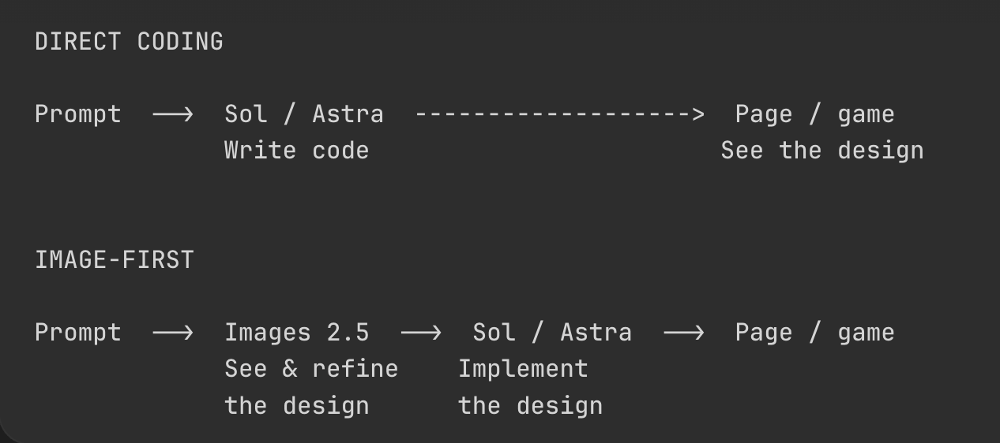

# Vox (@Voxyz_ai)

> Automatisch per `npm run ingest:x` erfasst. Quelle: [x.com/Voxyz_ai/status/2101295246659182978](https://x.com/Voxyz_ai/status/2101295246659182978)

## Bilder

<!-- Reihenfolge wie von der API geliefert (Cover zuerst). Die Position im Artikeltext gibt die API nicht mit. -->

**photo**

## Post-Text

If you still think Sol and Astra suck at design, try this:

“Use imagegen to reimagine this page, then implement it.”

Codex now has 𝗜𝗺𝗮𝗴𝗲𝘀 𝟮.𝟱 built in, the strongest image model available today. Let it create the visuals first, then have Sol or Astra implement them.

Many of the 3D game scenes, characters, and animations shared in posts are built around this same approach.

## Links

- [pic.x.com/6AlUXRC5pP](https://x.com/Voxyz_ai/status/2101295246659182978/photo/1)
