# Build your own Jev (100% local)

> Automatisch per `npm run ingest:x` erfasst. Quelle: [x.com/_avichawla/status/2101563610644496464](https://x.com/_avichawla/status/2101563610644496464)

## Artikel-Volltext

Everything you need to turn an open-source LLM into a fast, local decision engine without retraining it. It covers next-token scoring, fixed choices with probability distributions, SGLang, and a hands-on benchmark against standard text generation on the same model.
 
Many LLM calls do not need newly written text. The application already knows the possible answers, and it only needs the model to choose one.
Suppose a support ticket says, "I was charged twice for the same subscription."
The application needs to send it to one of three teams: billing, technical support, or account access.
A normal LLM call asks the model to write an answer. It might return a sentence, a label, or a JSON object. The application waits for that text, parses it, and extracts the selected team.
 
That is unnecessary if every valid answer is already known.
In fact, a better and more efficient way to do this is to treat the same request as a decision (what Jev does). The application provides the ticket/query and the three allowed answers to Jev. The model then returns a score for each answer in one go (we'll discuss shortly how exactly you can do that):
 
Billing is selected with the highest probability here, and the application code can actually see how strongly it won.
This is the behavior Jev possesses that we will reproduce locally.
We will provide the input query and allowed answers. In one scoring request, the model will return a decision and a probability distribution without generating a sentence or JSON object.
While Jev is closed-source, this inference pattern is already available in several open language models.
More specifically, we will implement it using SGLang (through /v1/score), test it with Qwen and DeepSeek models, and compare it against structured output and ordinary text generation.
 
To set expectations upfront, this article recreates the inference path, not the complete Jev system. Jev also includes training and calibration work that a scoring endpoint does not provide.
 
Fixed-answer scoring is different from structured output
It is easy to confuse Jev's mechanism with structured output since both approaches restrict what the application receives, but they do different work inside the inference server.
For the same support ticket discussed above, a structured output might get the following output from the model:
 
The specified schema prevents an invalid object, so it does not select the team on its own.
However, this can be further improved since, under the hood, the model still generates the opening brace, the field name, the value, and the closing brace one token at a time. Once generation finishes, the application reads the team field. This video depicts this process:
 
With scoring (which Jev does), the application can supply the three teams as the complete list of valid outcomes. The server can read one model score for each outcome and return the distribution shown earlier in this article. It does not generate a JSON object.
 
We can then return all three values instead of billing so that the application code can treat these two results differently:
 
For instance, in the above situation, both will select billing.
But the first has a clear preference, while the second one is almost tied. The application can route the first ticket automatically and send the second one for review if needed.
Also, the model will only supply these scores, and the application code will set the rule for its downstream use.
For example, one might require the top answer to exceed 0.80 and lead the second answer by at least 0.20. Those thresholds live in code, where they can be tested and changed.
 
A value of 0.91 means billing received 91 percent of the probability mass to these three choices. It does not prove that the model is correct 91 percent of the time. We need labeled examples to measure that. This is the calibration problem I will discuss later.
But in the meantime, remember that structured output generates a valid object. Fixed-answer scoring returns a distribution over answers the application already knows.
 
How an LLM generates the first output token
Before we discuss how a causal LLM can be turned into a Jev-style model, it would be better to first understand a regular generation step in LLMs.
 
A tokenizer first converts the prompt into token IDs.
The model processes that sequence and produces a vector for the next position.
The vector has one number for every token in the model's vocabulary. For instance, Qwen's vocabulary contains tens of thousands of tokens, so the vector contains tens of thousands of numbers.
Those raw numbers are logits. A larger logit means the model prefers that token as the next continuation. The values are not probabilities yet.
During normal generation, the server applies the model's decoding rules (temperature, etc.) to this vector, selects one token, and appends it to the prompt.
The model then produces a new vocabulary-sized vector for the next position. Generation/decoding repeats this process until it reaches a stop token or the output limit.
 
But when we want to make a bounded decision, we care about the first vector only.
Recall the support router example discussed above. The application accepts three answers:
 
In the prompt, we can assign a short label to each answer:
 
The prompt ends by asking for one label. 
 
"Label:" is the final text in the prompt.
So the next position is therefore where the model would normally generate either A, B, or C. 
After processing this prompt, the model will produce its usual vocabulary-sized vector for that position. That vector will contain the logit for token A, the logits for B and C, and logits for every other token in the vocabulary.
The scoring path can then perform four operations:
 
Find the token IDs for A, B, and C.
Read the three logits at those positions in the vocabulary vector.
Ignore every other logit.
Apply softmax across the three selected values.
If the selected logits are 8.2, 5.5, and 4.8, the restricted softmax produces approximately 0.91, 0.06, and 0.03. We can map those positions back to billing, technical support, and account access.
The normalization is restricted to the declared choices. We are not asking whether A has 91 percent probability across the entire vocabulary.
Instead, we are asking how the model divides its preference among A, B, and C after the application has ruled out every other response.
 
This is an operation that SGLang already implements in /v1/score.
It runs the prompt through the model, reads the requested token positions, and returns their scores. It saves us from modifying the Qwen implementation and extracting the final tensor ourselves.
Btw, the reason why the answers use A, B, and C and not score the words "billing", "technical support", and "account access" directly is because a visible word is not necessarily one token.
For instance:
"billing" might be one token for one tokenizer and several tokens for another.
"technical support" will definitely span multiple positions.
Comparing those phrases requires sequence scoring. The model must score the first token, append it, score the next token, and combine the values for the complete phrase. Length also becomes part of the comparison.
But single-token labels avoid that problem. Every option is represented by one vocabulary entry at the same output position while the semantic meaning still appears in the prompt:
 
The model reads those descriptions when it processes the prompt. The label is only the token whose logit we inspect afterward.
We still have to verify that each label is one token.
For instance, tokenizers often encode a leading space as part of the token. The strings "A" and " A" can therefore have different token IDs.
 
A chat template may also place whitespace or control tokens immediately before the answer position.
To avoid this, render the complete prompt using the model's chat template. Determine the exact continuation expected at the answer position. Send that continuation to /tokenize. Reject the label if it produces anything other than one token.
This label mapping stays inside the scoring client. The application sends semantic choices such as billing and technical_support. It never sends token IDs and never receives A, B, or C. That is what it means for the public API to remain independent of the model labels.
Lastly, the answer list also needs an escape route when the listed choices are not exhaustive.
For instance, if a security incident reaches a router that offers only billing, technical support, and account access, restricted softmax still assigns all probability mass to those three wrong choices.
To avoid this, add OTHER or ESCALATE when none of the named options may be correct.
 
Implementing a local scoring endpoint using SGLang
We only need one inference server for the local example. SGLang loads Qwen into GPU memory and exposes its native HTTP endpoints. Our Python script sends requests straight to that server.
This is the complete process:
Start SGLang with a Qwen model.
Write the decision as a prompt with letter labels.
Ask SGLang to tokenize those labels.
Send one request to /v1/score.
Map the returned probabilities back to the choices.
 
Step 1: Start Qwen with SGLang
Create a Python environment and install the two packages used here:
 
Then start the model server:
 
The first launch downloads the model from Hugging Face. Later launches reuse the local cache. Once loading finishes, Qwen remains in memory and SGLang listens on port 30000.
This SGLang process is the inference service. Keep it running while executing the client below.
Step 2: Define the choices and build the prompt
Create decide(.)py with the following code:
 
The dictionary records both representations of each answer.
A is the token we score.
And "billing" is the meaning returned to the application.
Their order must remain unchanged through tokenization, scoring, and result mapping.
This is the exact prompt produced here:
 
The prompt ends at "Label:". 
We want the model's scores for the token that would appear next. We do not ask SGLang to generate that token.
Step 3: Resolve the label token IDs
Add this code below the prompt:
 
SGLang's /tokenize endpoint returns the integer IDs produced by Qwen's tokenizer. We reject any label that becomes several tokens. The scoring request needs one vocabulary position for each answer.
For Qwen/Qwen2.5-0.5B-Instruct, this prints:
 
Each list contains one integer. We therefore know that every label occupies one token. The later scoring request will read vocabulary positions 32, 33, and 34.
This check also prevents us from assuming that tokenization is identical across models. A label that works with Qwen may split under another tokenizer.
Step 4: Ask SGLang for the three probabilities
Add the scoring request next:
 
query contains the complete prompt.
The empty "items" means we score the position immediately after it. 
"label_token_ids" tells SGLang which three entries to read from Qwen's vocabulary-sized output. 
"apply_softmax" normalizes those entries into probabilities.
The response has one score list because items contains one entry. We ran this exact prompt against the same Qwen checkpoint and obtained:
 
The three positions correspond to A, B, and C. The selected logits were 25.277620, 24.498226, and 21.188837 before softmax. Small numeric differences may appear across hardware and precision settings.
The official endpoint reference states that each returned list follows the order of label_token_ids. Our first score therefore belongs to A, the second to B, and the third to C.
Step 5: Convert model labels back into decisions
Finish the script with the mapping code:
 
Now run the script in a second terminal:
 
SGLang performs that calculation behind /v1/score. One SGLang process tokenizes the labels, runs Qwen once, and returns the selected probabilities.
In this case, billing wins, but only with 0.678 probability. A policy requiring 0.70 would send this ticket for review instead of automating the route. That threshold should come from evaluation on labeled examples.
 
Measuring scoring latency against autoregressive generation
The single-request example above shows the mechanism. I also built a small application to test how that mechanism behaves across many decisions.
 
The deployed demo supports several open models, like Qwen 3 4B, Qwen 2.5 0.5B and 1.5B, SmolLM2 1.7B, TinyLlama 1.1B, and DeepSeek-R1-Distill-Qwen 1.5B.
 
The Jev-style lane calls the decision method:
 
Inside the decide() method, SGLang receives the prompt through /v1/score. The request includes the token IDs for A, B, and C.
SGLang runs the prompt, reads those three next-token scores, normalizes them, and stops. The response contains no generated tokens.
The standard lane calls the generation method on that same engine:
 
This method sends the same state, question, and choices to /v1/chat/completions.
Qwen generates an answer and short explanation, up to 32 tokens. The application searches the first 100 characters for one allowed choice name. It marks the case correct when that parsed choice matches the stored label.
The video compares our 100% local Jev with a 100% local LLM generator, across some examples:
 
The speed is immediately evident for the reasons we have already discussed above.
Along with this, I also built a simulation of 100 cases from a fixed local dataset. 
 
The current datasets cover support routing, candidate screening, and expense review. Their expected labels let the interface display both speed and correctness.
The remote SGLang path starts two workers behind one barrier:
 
The barrier releases both workers together. Each lane processes its own cases in order. The Jev-style worker sends the next scoring request as soon as its previous request finishes. The standard worker does the same with generation requests.
 
The two lanes therefore remain active at the same time, but we do not send all 200 requests at once. SGLang receives concurrent work from both lanes and schedules it through continuous batching. Both request types share the same GPU, memory bandwidth, and scheduler.
The video below depicts a side-by-side comparison of Jev and an LLM:
 
Both lanes started together and used Qwen/Qwen3-4B-Instruct-2507 on the same SGLang server.
 
How to choose the right approach
Scoring is not a replacement for generation, so Jev's approach only applies when the application defines the output space before inference.
A compatible workload ideally should have a finite set of meaningful labels. Each label should map to a distinct downstream action.
And the caller must only need a label and its probability distribution, not new text.
Structured output is different since it defines the syntax of a response, and the decoder still generates field names and values token by token. 
Use structured generation when those values cannot be enumerated beforehand, since scoring removes decoding only when the candidate values are already known.
This graphic compares regular LLM decoding, structured output decoding, and Jev-style scoring:
 
One good way to proceed is to choose the inference path from the required output:
Generate when the output content is unknown before inference.
Score when the output set is known, and selection is sufficient. In that case, the first next-token vector already contains the ranking. Returning that ranking avoids an autoregressive loop the caller does not need.
To reiterate, this article project reproduces the Jev-style inference mechanism, but it does not reproduce Jev's weights, RLCD process, or evaluation stack.
I intend to cover the processes behind those pretty soon.
Stay tuned!
 
That's a wrap!
If you enjoyed this tutorial:
Find me →  @_avichawla
Every day, I share tutorials and insights on DS, ML, LLMs, and RAGs.

## Bilder

<!-- Reihenfolge wie von der API geliefert (Cover zuerst). Die Position im Artikeltext gibt die API nicht mit. -->

**Cover**

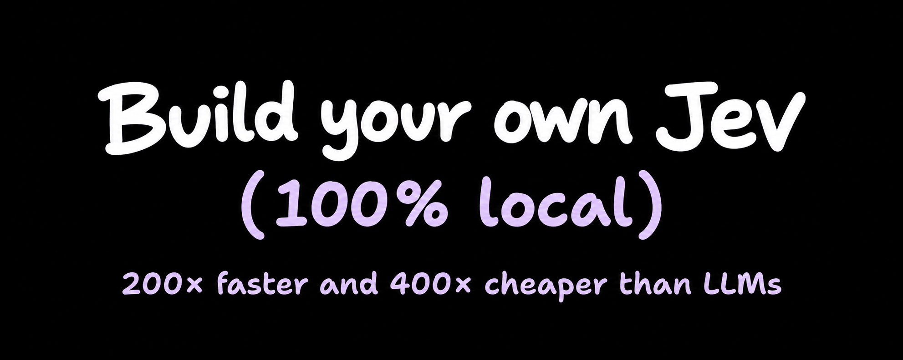

**photo**

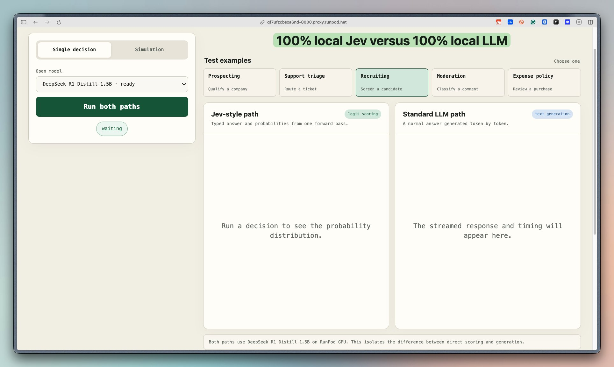

**photo**

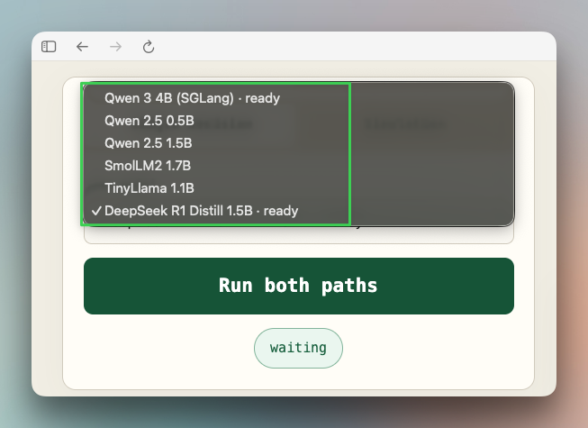

**photo**

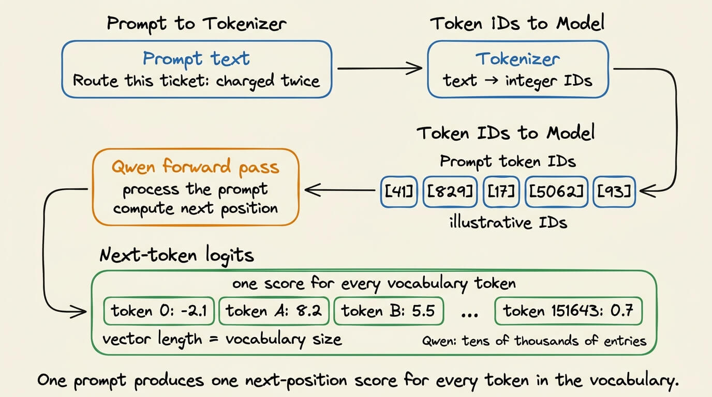

**photo**

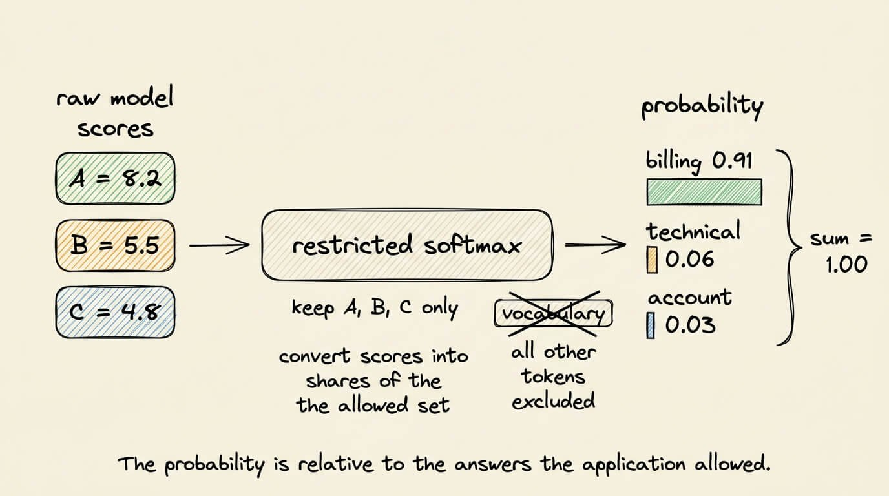

**photo**

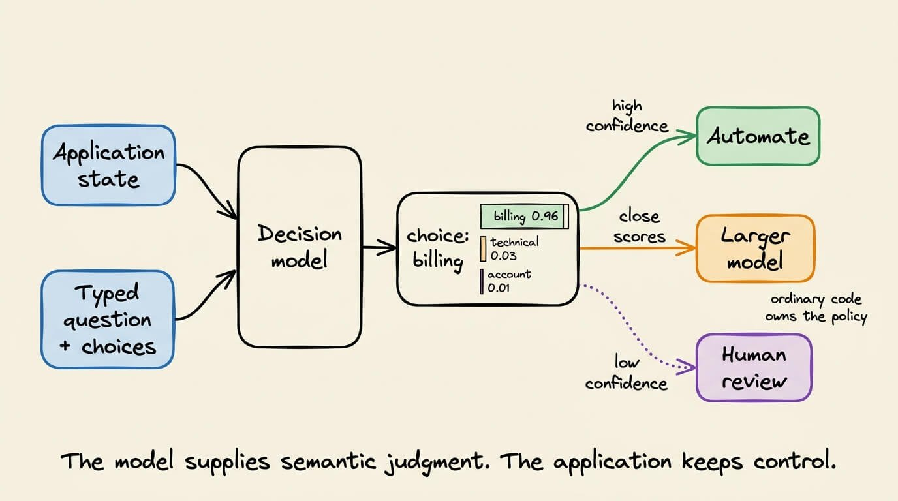

**photo**

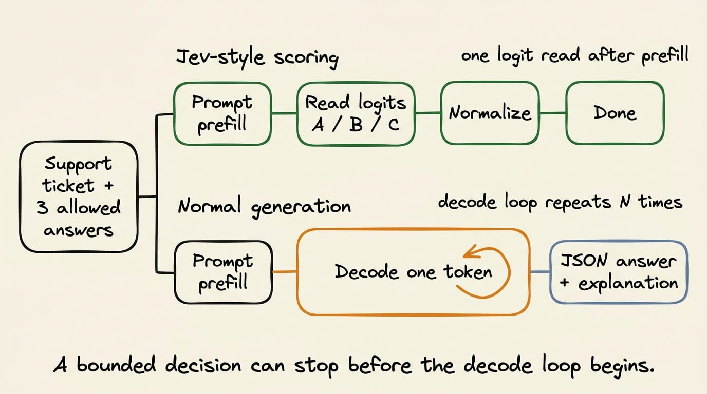

**photo**

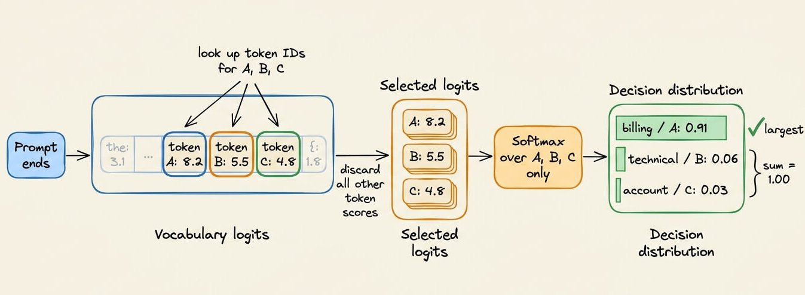

**photo**

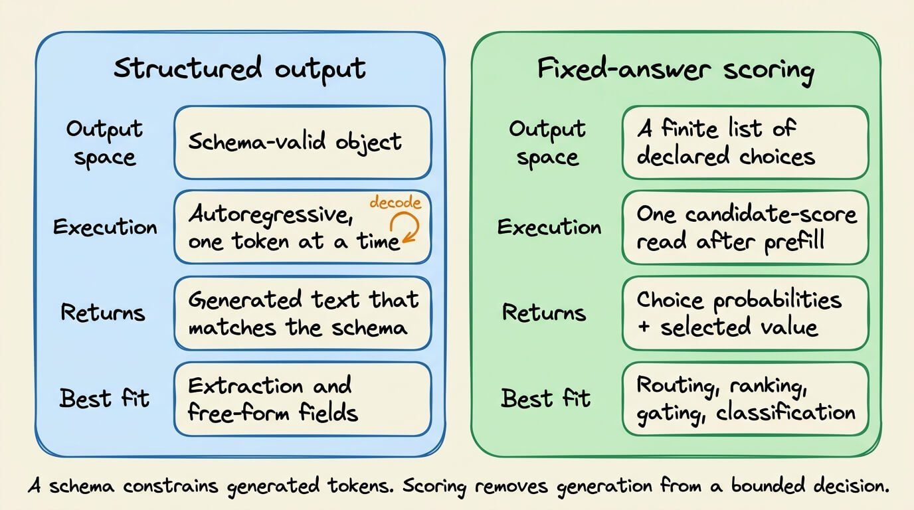

**photo**

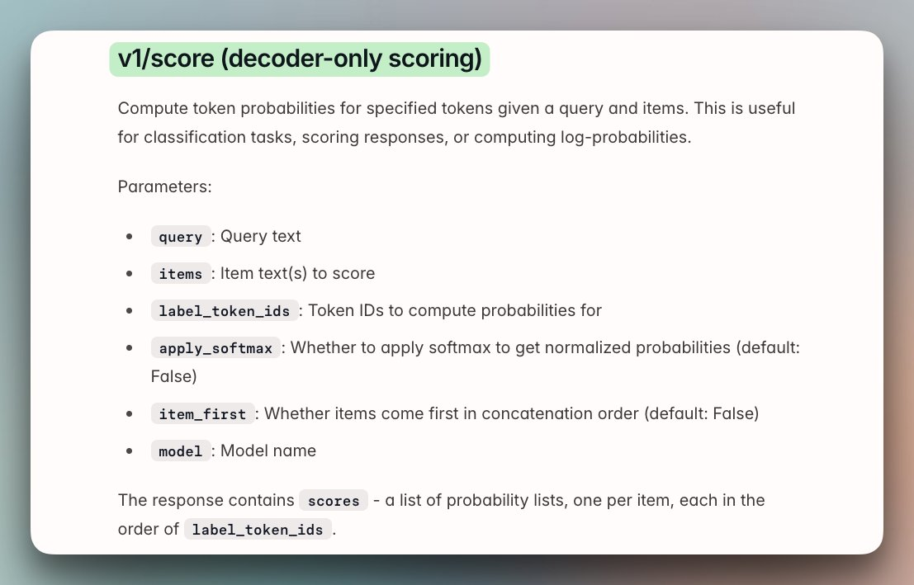

**photo**

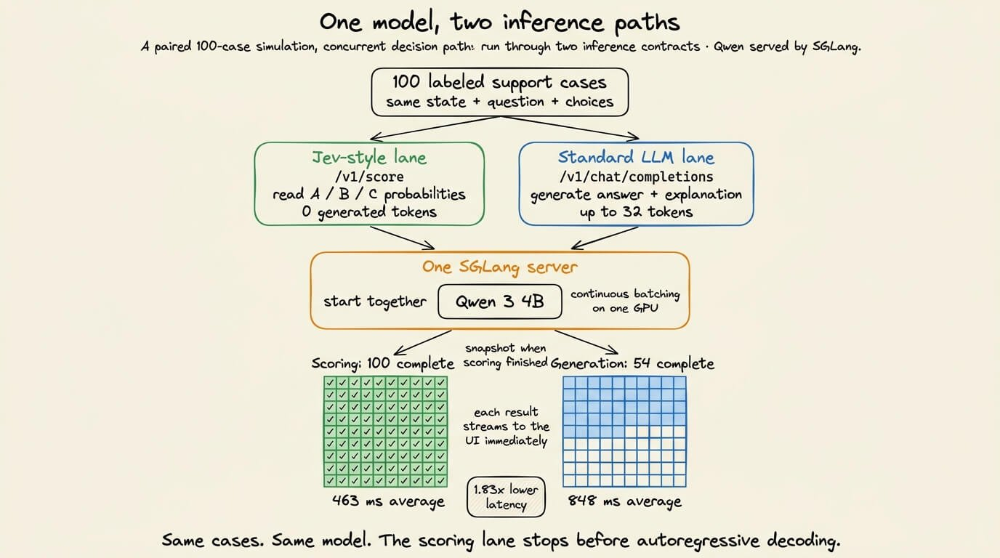

**photo**

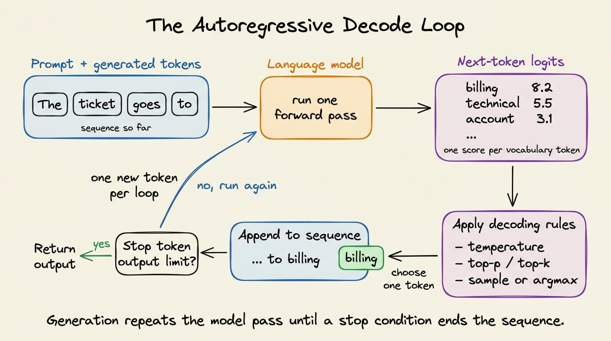

**video**

**video**

**photo**

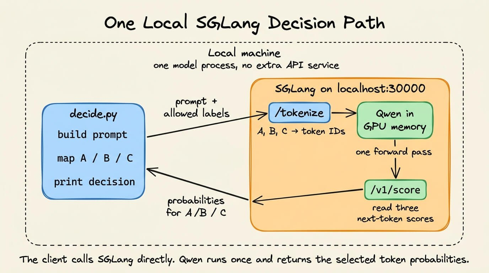

**photo**

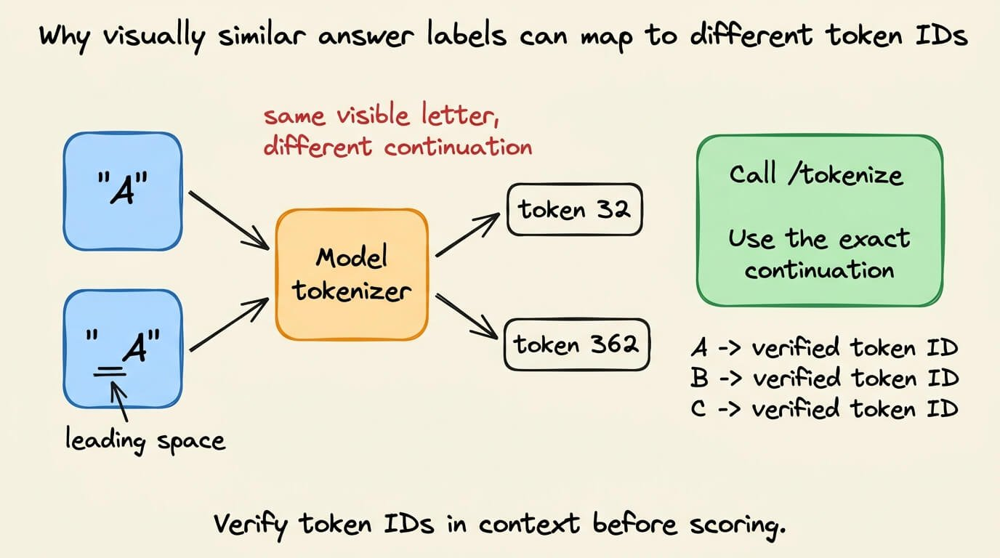

**video**

**photo**

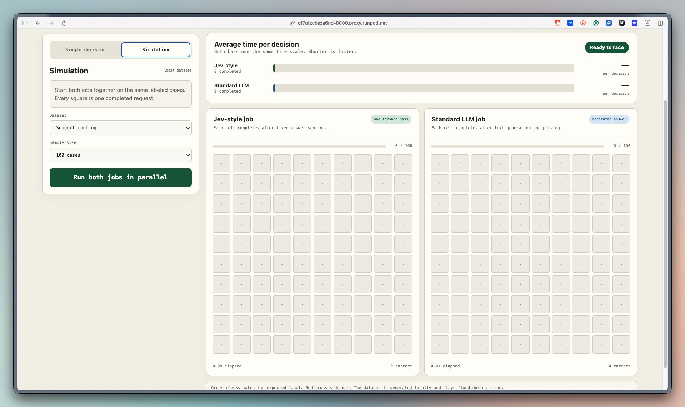

**video**

## Post-Text

https://t.co/kowTjDTq00

## Links

- [x.com/i/article/2101…](https://x.com/i/article/2101408350391136256)

## Thread

### 1/3

https://t.co/kowTjDTq00

### 2/3

@johnroodepic Yes. These probabilities are conditional on the candidate set, so adding one label changes every other probability even when the model and prompt stay fixed. The actual deployable unit is the model, prompt, tokenizer, label set, and thresholds together.

### 3/3

@teale_ai We did not test cross-backend calibration here. The comparison held the model and serving path fixed. A real router needs calibration per model, quantization, and label-set version. I am working on it, will share soon.
