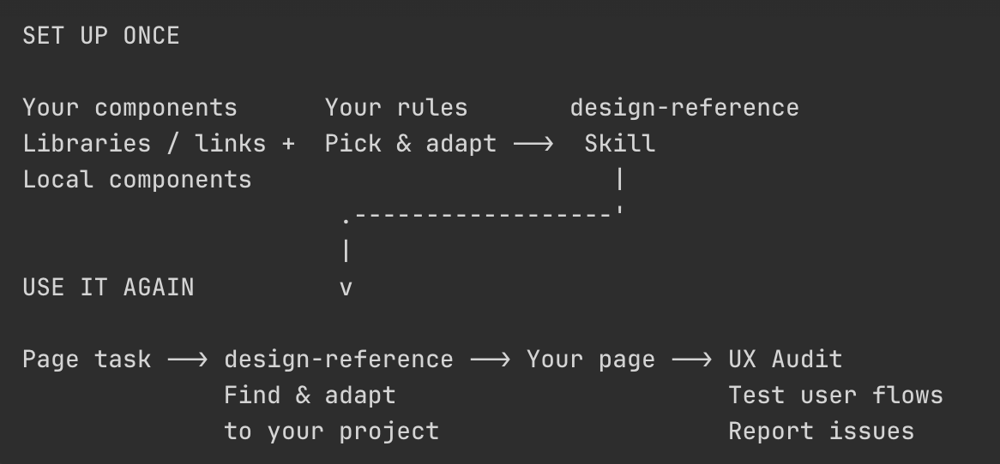

# Vox (@Voxyz_ai)

> Automatisch per `npm run ingest:x` erfasst. Quelle: [x.com/Voxyz_ai/status/2102050225443766571](https://x.com/Voxyz_ai/status/2102050225443766571)

## Bilder

<!-- Reihenfolge wie von der API geliefert (Cover zuerst). Die Position im Artikeltext gibt die API nicht mit. -->

**photo**

## Post-Text

Those good-looking components you’ve saved can become references Codex knows to look for when building your pages. No need to keep pasting links and explaining how to use them.

21st Design, which I mentioned yesterday, is the Skill I made for this. Here’s how to create your own, plus the UX Audit repo 👇

𝟭. 𝗧𝘂𝗿𝗻 𝘆𝗼𝘂𝗿 𝗴𝗼-𝘁𝗼 𝗰𝗼𝗺𝗽𝗼𝗻𝗲𝗻𝘁 𝗹𝗶𝗯𝗿𝗮𝗿𝘆 𝗶𝗻𝘁𝗼 𝗮 𝗦𝗸𝗶𝗹𝗹

The key is to spell out three things: where to look, what to pick, and how to use it in your project.

I use https://t.co/SUeM4MLFl7, but copying and installing components comes with a free usage limit. If you’d rather avoid that limit, you can use an open-source component library you like, or a local component directory in your project.

Replace the source below with your own, then send this to Codex:

“Create a design Skill for me called design-reference. Use [COMPONENT LIBRARY URL, OPEN-SOURCE REPO, OR LOCAL DIRECTORY] as the component source.

When a page needs design references, first understand the project’s tech stack, existing components, and design guidelines. Reuse suitable existing implementations first. When outside references are needed, focus on the one or two main sections that carry the page. Choose components based on their function, layout, interactions, and compatibility with the project. Keep the overall style consistent.

Keep the useful parts of each reference, and adapt the colors, fonts, spacing, content, and interactions to the current project. Once finished, check the page in the browser on desktop and mobile, and try the main interactions.

In the Skill, explain when to use it, how to access the component source, and how to check the result. If you can’t access a required tool or source code, tell me. Don’t pretend you’ve retrieved it. Once the Skill is created, tell me how to invoke it.”

Next time you’re building a page, you can say:

“Use design-reference to build a pricing page for my product. Focus on references for pricing cards and a monthly/yearly billing toggle. Keep the style consistent with the existing site.”

𝟮. 𝗛𝗲𝗿𝗲’𝘀 𝘁𝗵𝗲 𝗨𝗫 𝗔𝘂𝗱𝗶𝘁 𝗿𝗲𝗽𝗼

https://t.co/sDpjnAVm8m

The original is built for Claude Code. The version I use in Codex has an adjusted browser setup and audit scope.

Send the link to your coding agent and ask it to install ux-audit. If you use Codex, have it adapt the Skill to the browser tools currently available, and limit the audit to the pages and flows you want checked.

Once it’s set up, give it a specific user task:

“Use UX Audit to check [TEST PAGE URL]. As a first-time user, go from choosing a plan to completing registration. Actually click, fill out forms, and check the results. Find places where users might hesitate, actions fail, or the next step is unclear. Give me reproduction steps, screenshots, and specific fixes.”

## Links

- [21st.dev](http://21st.dev)
- [github.com/jezweb/claude-…](https://github.com/jezweb/claude-skills/tree/main/plugins/dev-tools/skills/ux-audit)
