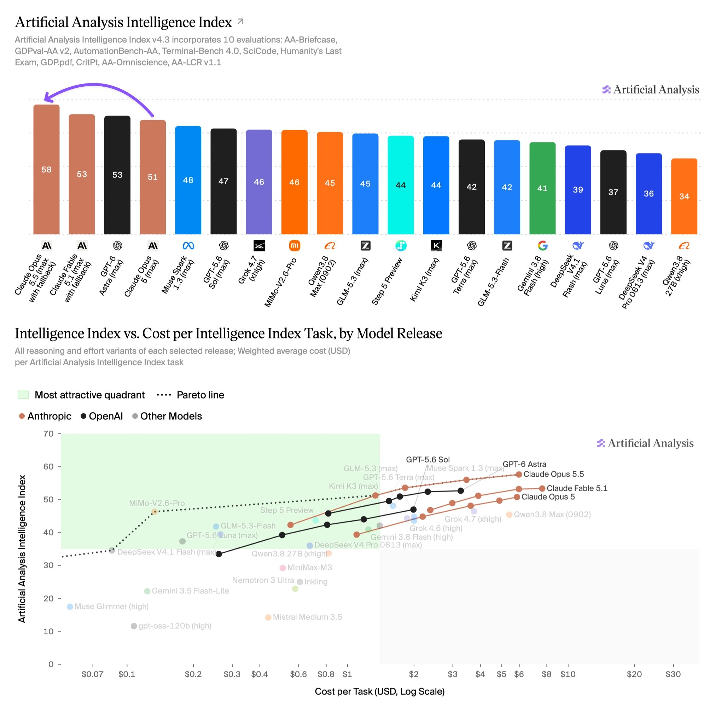

# Artificial Analysis (@ArtificialAnlys)

> Automatisch per `npm run ingest:x` erfasst. Quelle: [x.com/ArtificialAnlys/status/2102438210798514391](https://x.com/ArtificialAnlys/status/2102438210798514391)

## Bilder

<!-- Reihenfolge wie von der API geliefert (Cover zuerst). Die Position im Artikeltext gibt die API nicht mit. -->

**photo**

## Post-Text

Claude Opus 5.5 takes the top spot on the Artificial Analysis Intelligence Index, along with a 20% price cut and larger cache hit discount

Claude Opus 5.5 brings Anthropic to parity with GPT-6 Astra on evaluations like Terminal-Bench 4.0 and AutomationBench-AA, while extending Anthropic’s lead in agentic knowledge work.

At max effort it scores 58 on the Artificial Analysis Intelligence Index, the highest score we have measured by several points. Anthropic has cut Opus pricing to $4/$20 per 1M input/output tokens (Opus 5: $5/$25) and cache reads from $0.50 to $0.20.

Key takeaways:

➤ Consistent strong performance, with leading scores on six of the ten Intelligence Index evaluations: Humanity's Last Exam 61.4% (previous best 59.1%, Claude Fable 5.1), SciCode 66.9% (63.1%, Fable 5.1), GDPval-AA v2.1, AA-Briefcase v1.1, AA-Omniscience and AutomationBench-AA. On Terminal-Bench 4.0 it scores 59.6%, level with the leader GPT-6 Astra (xhigh) and +11 points over Opus 5. It remains slightly behind on CritPt, AA-LCR, and GDP.pdf

➤ Leads in agentic knowledge work: On AA-Briefcase, our private frontier knowledge work evaluation, it reaches an Elo of 1822. This is +143 over Fable 5.1, ahead on both analytical quality and presentation, and is the first time Anthropic has reached presentation quality surpassing GPT-5.6 Sol. This evaluation tests whether models can produce accurate and well-presented professional outputs using our open source reference agent harness, Stirrup

➤ Level with Opus 5 on cost per task despite 1.6x the output tokens: Opus 5.5 (max) uses ~119k output tokens per Intelligence Index task, against ~73k for Opus 5 (max), ~78k for Fable 5.1 (max) and ~27k for GPT-6 Astra (max)

➤ Four of five effort levels sit on the Intelligence vs Cost per Task frontier: Opus 5.5 max, xhigh, high, and medium all sit on the Pareto frontier, costing less or outperforming other models scoring 50+ (GPT-6 Astra, Claude Fable 5.1, and Claude Opus 5)

Other model details:

➤ Context window: 1 million token context with image and text input support, unchanged from Opus 5

➤ Pricing: $4/$20 per 1M input/output tokens, down 20% from $5/$25 for Opus 5. Cache writes $5 per 1M tokens for the 5 minute TTL, down from $6.25. Cache reads have been further discounted to $0.20 per 1M tokens, down 60% from Opus 5’s $0.50. This is a 95% discount compared to uncached input pricing, up from 90% on previous Opus models

➤ Effort settings: Five effort settings (low, medium, high, xhigh, and max). Intelligence Index evaluations were run at all five with Anthropic's default fallback enabled

## Links

- [pic.x.com/Hgir4ao3pc](https://x.com/ArtificialAnlys/status/2102438210798514391/photo/1)
