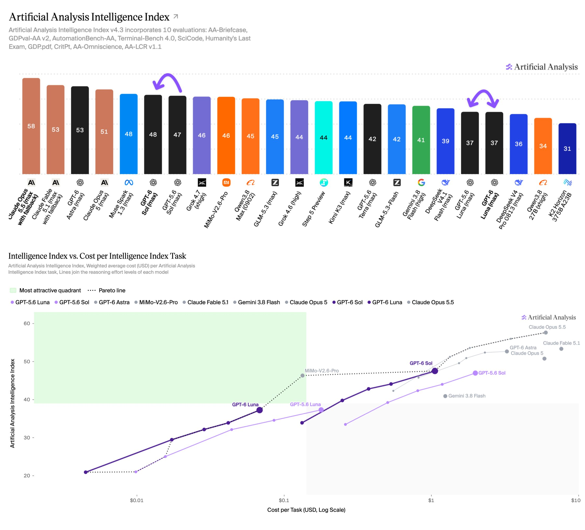

# Artificial Analysis (@ArtificialAnlys)

> Automatisch per `npm run ingest:x` erfasst. Quelle: [x.com/ArtificialAnlys/status/2102462962758033624](https://x.com/ArtificialAnlys/status/2102462962758033624)

## Bilder

<!-- Reihenfolge wie von der API geliefert (Cover zuerst). Die Position im Artikeltext gibt die API nicht mit. -->

**photo**

## Post-Text

GPT-6 Sol and Luna push the cost efficiency frontier by halving cost relative to GPT-5.6 Sol and Luna. Intelligence Index and Coding Agent Index scores remain level with GPT-5.6, with progress in some evaluations and regressions in others

Pricing is approximately half that of GPT-5.6: Sol drops from $4/$20 to $2/$10 per million input/output tokens, and Luna from $0.20/$1.20 to $0.10/$0.50, with the same 90% discount for cache reads and 25% premium for cache writes.

Key takeaways:

➤ Halves Cost per Task: GPT-6 Sol (max) costs $1.06 per task to run the Artificial Analysis Intelligence Index, ~50% less than GPT-5.6 Sol (max) at $1.99. GPT-6 Luna (max) costs $0.07 per task, ~60% less than GPT-5.6 Luna (max) at $0.18. This is driven by the price cut, as both models use slightly more output tokens per task (31k vs 29k for Sol, and 51k vs 41k for Luna). These two releases allow OpenAI to capture a significant portion of the cost efficiency Pareto frontier.

➤ In the Coding Agent Index, Sol improves but Luna regresses: In OpenAI's Codex harness, GPT-6 Sol (max) scores 57 in the Artificial Analysis Coding Agent Index, up 2 points from GPT-5.6 Sol (max), with gains in Terminal-Bench 4.0 (43% vs 37%) and SWE-Atlas-QnA (58% vs 54%). At $2.99 per task it costs ~50% less than GPT-5.6 Sol (max) and sits on the Pareto frontier of Coding Agent Index vs Cost per Task. GPT-6 Luna (max) scores 41, down 2 points from GPT-5.6 Luna (max), with lower scores in SWE-Atlas-QnA (44% vs 49%) and DeepSWE v1.1 (64% vs 66%), at ~60% lower cost per task.

➤ Significant reduction in hallucination: Both models hallucinate less in AA-Omniscience, our knowledge and hallucination benchmark. GPT-6 Sol (max) cuts its hallucination rate from 92% to 60% and GPT-6 Luna (max) from 93% to 77%. Sol achieves this by declining to answer more often: it attempts 83% of questions vs 99% for GPT-5.6 Sol (max), which cuts wrong answers by about a quarter but also lowers accuracy 5 points from 59% to 54%. Luna's accuracy is broadly unchanged at 44% vs 43% while it answers fewer questions. On the AA-Omniscience Index, Sol improves from 22 to 27 and Luna from -10 to 1.

➤ Mix of improvement and regression across evals: Beyond AA-Omniscience, both models improve in AutomationBench-AA (Sol 62% vs 60%, Luna 53% vs 50%) and Terminal-Bench 4.0 (Sol 44% vs 40%, Luna 13% vs 12%). However, we observe regressions in two key knowledge work evaluations. In GDPval-AA v2.1, our benchmark adapted from OpenAI's dataset of economically valuable tasks across 44 occupations, Sol drops ~100 Elo points and Luna ~75. Luna also drops ~45 Elo points in AA-Briefcase v1.1, while Sol is level. AA-Briefcase v1.1 is a private evaluation across multi-week knowledge work projects, with thousands of input files. Our team has manually inspected hundreds of model outputs: the regressions tend to be driven by reduced presentation quality and deliverables that omit rubric elements.

Congratulations @OpenAI and @sama on the launch!
