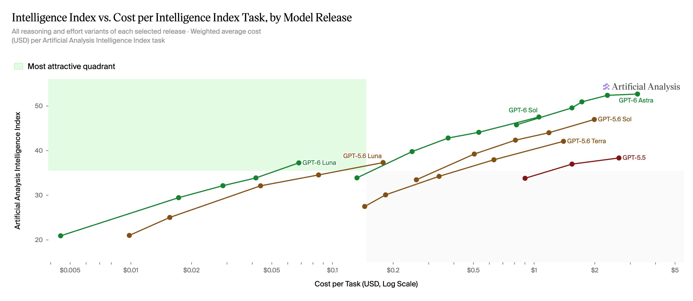

# Artificial Analysis (@ArtificialAnlys)

> Automatisch per `npm run ingest:x` erfasst. Quelle: [x.com/ArtificialAnlys/status/2102527962201624915](https://x.com/ArtificialAnlys/status/2102527962201624915)

## Bilder

<!-- Reihenfolge wie von der API geliefert (Cover zuerst). Die Position im Artikeltext gibt die API nicht mit. -->

**photo**

## Post-Text

GPT-6 Sol and Luna continue to push the cost efficiency frontier for OpenAI. The two new models halve the cost of their predecessors with similar scores in the Intelligence Index

Charting the Artificial Analysis Intelligence Index shows the trade-off between Intelligence and Cost per Intelligence Index Task. Cost improvements in GPT-6 Sol and Luna are driven by a ~50% reduction in token pricing

## Links

- [pic.x.com/76AkwmkefI](https://x.com/ArtificialAnlys/status/2102527962201624915/photo/1)
