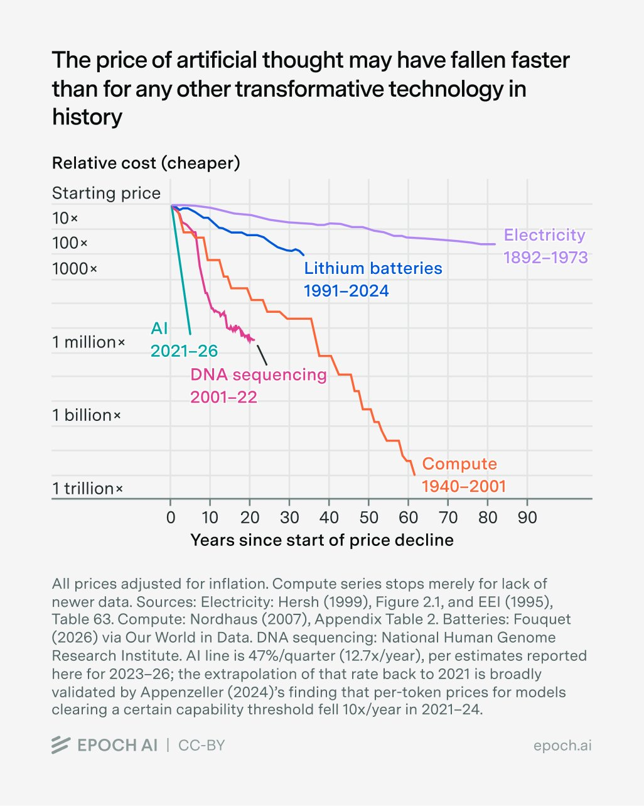

# Epoch AI (@EpochAIResearch)

> Automatisch per `npm run ingest:x` erfasst. Quelle: [x.com/EpochAIResearch/status/2102510281176023529](https://x.com/EpochAIResearch/status/2102510281176023529)

## Bilder

<!-- Reihenfolge wie von der API geliefert (Cover zuerst). Die Position im Artikeltext gibt die API nicht mit. -->

**photo**

## Post-Text

AI is getting cheaper more quickly than any other transformative tech in history. At a given level of performance, cost has fallen ~47%/quarter since 2023.

That’s 4× faster than DNA sequencing, 6× faster than compute, 18× faster than lithium batteries, and (up to 1973) 54× faster than electricity.

## Links

- [pic.x.com/DG5Fe4XmQI](https://x.com/EpochAIResearch/status/2102510281176023529/photo/1)

## Thread

### 1/6

AI is getting cheaper more quickly than any other transformative tech in history. At a given level of performance, cost has fallen ~47%/quarter since 2023.

That’s 4× faster than DNA sequencing, 6× faster than compute, 18× faster than lithium batteries, and (up to 1973) 54× faster than electricity.

### 2/6

For one example of the plunging “cost of thought,” take OpenAI’s o3 model. Released in January 2025, it was the first LLM to score >25% on FrontierMath Tiers 1-3. The bill for achieving this mark: $0.55.

This summer, GPT-5.6 Luna did the same for $0.0015. A 377-fold drop in 18 months.

### 3/6

Our estimates come from an expanded Epoch dataset on the performance of 222 AI models across up to 11 benchmarks. The dataset is built using a method borrowed from CAISI, which lets us estimate how the same model would perform under various budget constraints.

### 4/6

The speed of price drop varies by domain: slower on game-based puzzles, at 39–43% per quarter, faster on math problems, at 50–52% per quarter.

### 5/6

Costs for a given level of performance often fall the fastest when that level is state-of-the-art. Averaging across five benchmarks, cost falls 66% per quarter for SOTA performance. Two years later, the price drop slows to 32% per quarter.

### 6/6

The trillion-dollar question: If AI companies collectively slow the development of AI, will prices also fall more slowly?

Read the full report: https://t.co/0DndJ9fAhX
