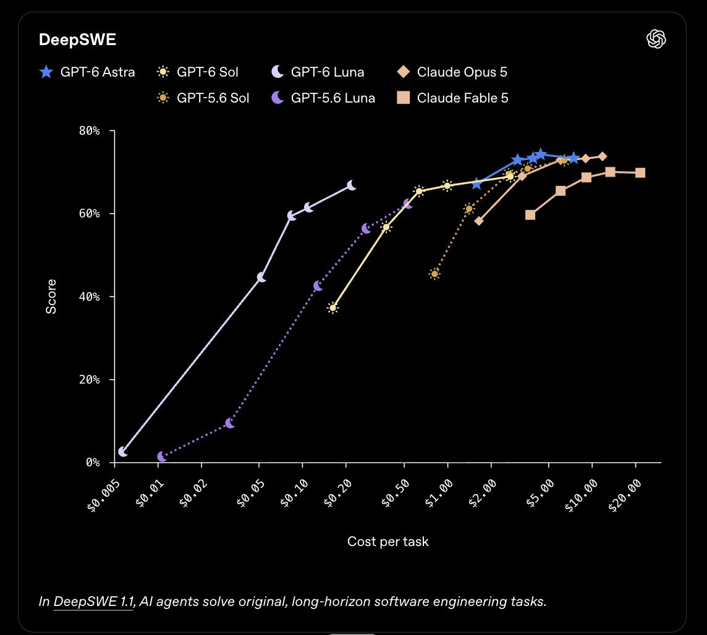
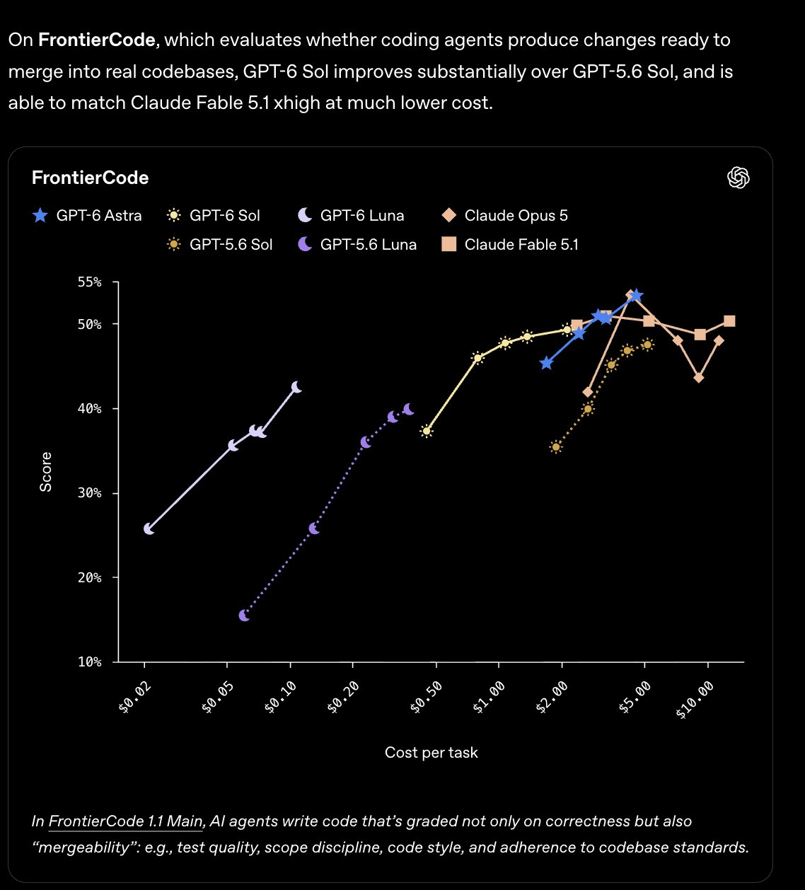

# Chubby♨️ (@kimmonismus)

> Automatisch per `npm run ingest:x` erfasst. Quelle: [x.com/kimmonismus/status/2102462091299098640](https://x.com/kimmonismus/status/2102462091299098640)

## Bilder

<!-- Reihenfolge wie von der API geliefert (Cover zuerst). Die Position im Artikeltext gibt die API nicht mit. -->

**photo**

**photo**

## Post-Text

Benchmarks GPT-6 Sol & Luna:

• FrontierCode: 48.4% vs. Fable 5.1’s 48.7%, both at xhigh. $1.37 vs. $9.27 per task, roughly 85% cheaper.

• DeepSWE: 68.8% at max vs. Fable 5’s best result of 69.9% at xhigh. $2.74 vs. $13.41 per task, roughly 80% cheaper.

• AutomationBench: 33.2% at xhigh vs. Fable 5.1 with Opus 5 fallback at 31.4% on max. $0.27 vs. at least $2.45 per task.

GPT-6 Luna:
• DeepSWE: 66.6% at max vs. Fable 5’s 65.4% at medium. $0.22 vs. $6.09 per task, roughly 96% cheaper.

API pricing per million input/output tokens:
• Sol: $2 / $10
• Luna: $0.10 / $0.50

## Links

- [pic.x.com/rh5PPDnmQq](https://x.com/kimmonismus/status/2102462091299098640/photo/1)
- [x.com/kimmonismus/st…](https://twitter.com/kimmonismus/status/2102460819380564279)

## Thread

### 1/5

Benchmarks GPT-6 Sol & Luna:

• FrontierCode: 48.4% vs. Fable 5.1’s 48.7%, both at xhigh. $1.37 vs. $9.27 per task, roughly 85% cheaper.

• DeepSWE: 68.8% at max vs. Fable 5’s best result of 69.9% at xhigh. $2.74 vs. $13.41 per task, roughly 80% cheaper.

• AutomationBench: 33.2% at xhigh vs. Fable 5.1 with Opus 5 fallback at 31.4% on max. $0.27 vs. at least $2.45 per task.

GPT-6 Luna:
• DeepSWE: 66.6% at max vs. Fable 5’s 65.4% at medium. $0.22 vs. $6.09 per task, roughly 96% cheaper.

API pricing per million input/output tokens:
• Sol: $2 / $10
• Luna: $0.10 / $0.50

### 2/5

https://t.co/KYqWeaPrU7

### 3/5

i mean, thats pretty sick, ngl https://t.co/47Ok2UIrhv

### 4/5

@rand_longevity yeah, both releases are freaking amauzing. Opus 5.5 is more intelligent, but Sol and Luna are super duper price-performance models

### 5/5

@Bangbanglevert yes, both releases are amazing!
