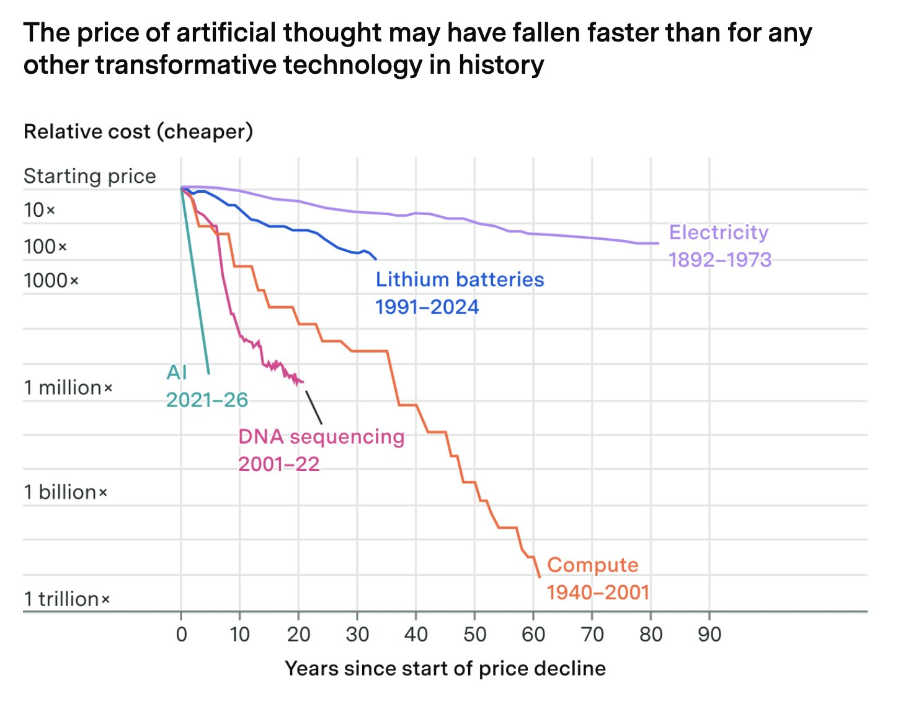
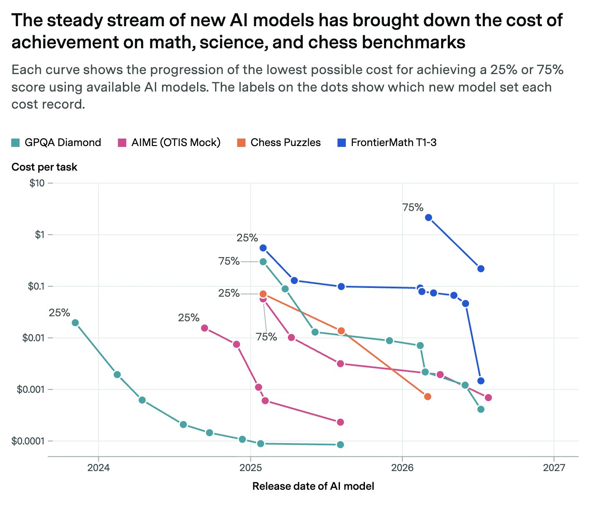

# Chubby♨️ (@kimmonismus)

> Automatisch per `npm run ingest:x` erfasst. Quelle: [x.com/kimmonismus/status/2102748118400004100](https://x.com/kimmonismus/status/2102748118400004100)

## Bilder

<!-- Reihenfolge wie von der API geliefert (Cover zuerst). Die Position im Artikeltext gibt die API nicht mit. -->

**photo**

**photo**

## Post-Text

Another example of how impressive this technology really is: The cost of achieving a given level of AI performance is falling roughly 13-fold per year, according to Epoch AI.

Its analysis estimates a 47% quarterly decline since 2023,  faster than any other transformative technology in history.

One example: OpenAI’s o3 exceeded 25% on FrontierMath Tiers 1–3 at a reported cost of about $0.55. Around 18 months later, GPT-5.6 Luna reached the same threshold for roughly $0.0015.

The fastest price declines tend to come immediately after a new capability appears. Across five benchmarks, Epoch estimates a 66% quarterly decline for newly achieved frontier performance, slowing to 32% two years later.

The consequence? In just a few more months, every person on this planet will have access to Fable 5-level entertainment at a fraction of today's cost. And this trend will probably continue indefinitely. Super exciting!

## Links

- [pic.x.com/nxU2pTaXAi](https://x.com/kimmonismus/status/2102748118400004100/photo/1)
- [x.com/EpochAIResearc…](https://twitter.com/EpochAIResearch/status/2102510340013699523)

## Thread

### 1/5

Another example of how impressive this technology really is: The cost of achieving a given level of AI performance is falling roughly 13-fold per year, according to Epoch AI.

Its analysis estimates a 47% quarterly decline since 2023,  faster than any other transformative technology in history.

One example: OpenAI’s o3 exceeded 25% on FrontierMath Tiers 1–3 at a reported cost of about $0.55. Around 18 months later, GPT-5.6 Luna reached the same threshold for roughly $0.0015.

The fastest price declines tend to come immediately after a new capability appears. Across five benchmarks, Epoch estimates a 66% quarterly decline for newly achieved frontier performance, slowing to 32% two years later.

The consequence? In just a few more months, every person on this planet will have access to Fable 5-level entertainment at a fraction of today's cost. And this trend will probably continue indefinitely. Super exciting!

### 2/5

@aiprepper wdym?

### 3/5

@AiMachete yes! exactly. you can make your dreams reality

### 4/5

and btw. this aligns with what we saw with GPT-6 sol and Luna. The most important aspect is how much they dropped in pricing.

### 5/5

@Argona0x good question! Havent found a graph tho
