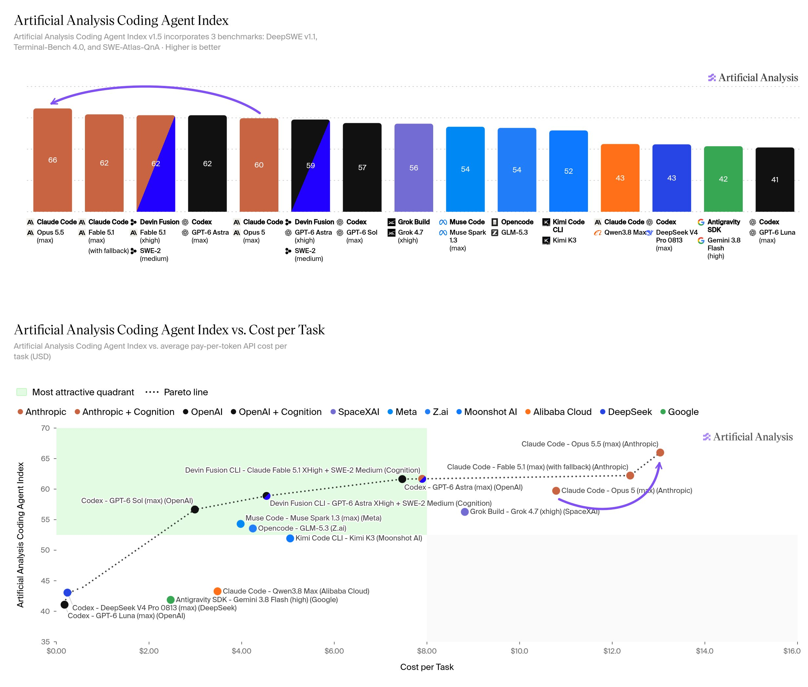

# Artificial Analysis (@ArtificialAnlys)

> Automatisch per `npm run ingest:x` erfasst. Quelle: [x.com/ArtificialAnlys/status/2102932119995756613](https://x.com/ArtificialAnlys/status/2102932119995756613)

## Bilder

<!-- Reihenfolge wie von der API geliefert (Cover zuerst). Die Position im Artikeltext gibt die API nicht mit. -->

**photo**

## Post-Text

Claude Opus 5.5 is the new #1 in the Artificial Analysis Coding Agent Index, with gains across all three evaluations, though at a higher Cost per Task

At max effort in Claude Code, Opus 5.5 scores 66 on the Coding Agent Index, the highest score we have measured. It is up 6 points against Opus 5 (60) and 4 points against Claude Fable 5.1 (62).

Anthropic has cut Opus pricing to $4/$20 per million input/output tokens, from $5/$25 for Opus 5, and cache reads to $0.20 from $0.50. Even with those reductions, Opus 5.5’s Cost per Task is $13.04, above Opus 5’s $10.79, because it uses substantially more tokens.

Key takeaways:

➤ Improves across all three Coding Agent Index evaluations: Terminal-Bench 4.0 rises to 63.1% from 54.5% for Opus 5, DeepSWE v1.1 to 68.4% from 62.5%, and SWE-Atlas-QnA to 66.4% from 62.1%. The largest gain is on Terminal-Bench, at +8.6 percentage points.

➤ The top score comes at the highest Cost per Task: Opus 5.5’s Cost per Task is $13.04, up 21% from Opus 5 at $10.79. It uses about 15.6 million tokens per task against 11.4 million for Opus 5, including about 2.4× as many output tokens.

➤ Extends the Coding Agent Index vs Cost per Task Pareto frontier: No lower-cost model in our comparison matches Opus 5.5's score. It moves the frontier upward at its high-cost end.

Other model details:

➤ Pricing: $4/$20 per million input/output tokens, down 20% from Opus 5. Cache reads cost $0.20 per million, down 60% from $0.50.

➤ Evaluation setup: Claude Code at max effort, measured on DeepSWE v1.1, Terminal-Bench 4.0 and SWE-Atlas-QnA. The Coding Agent Index gives each evaluation equal weight.

## Links

- [pic.x.com/xvM2NyEBEO](https://x.com/ArtificialAnlys/status/2102932119995756613/photo/1)
