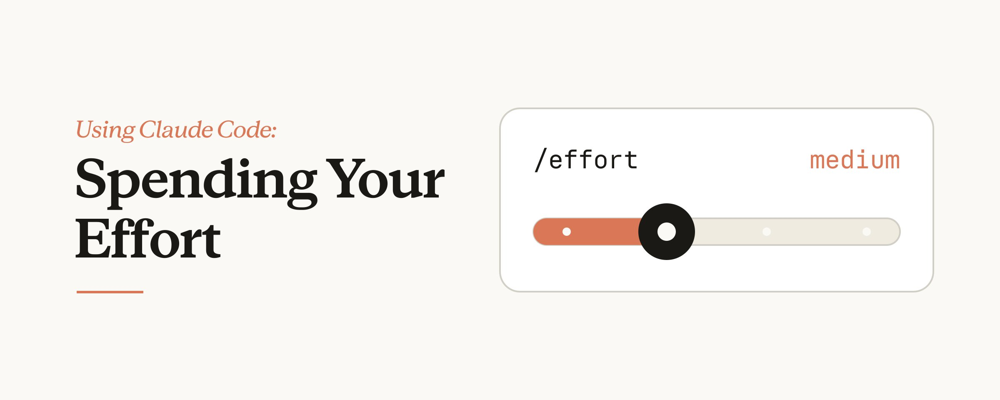
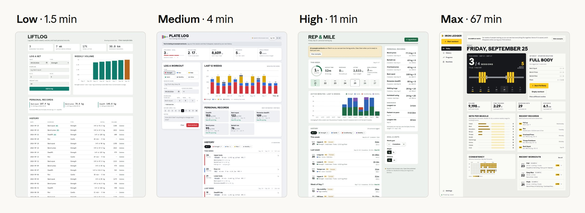
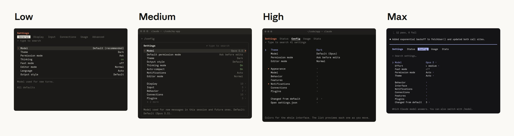
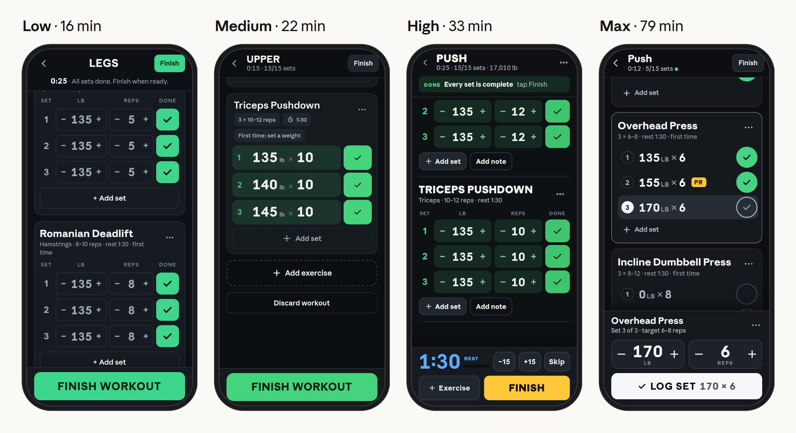
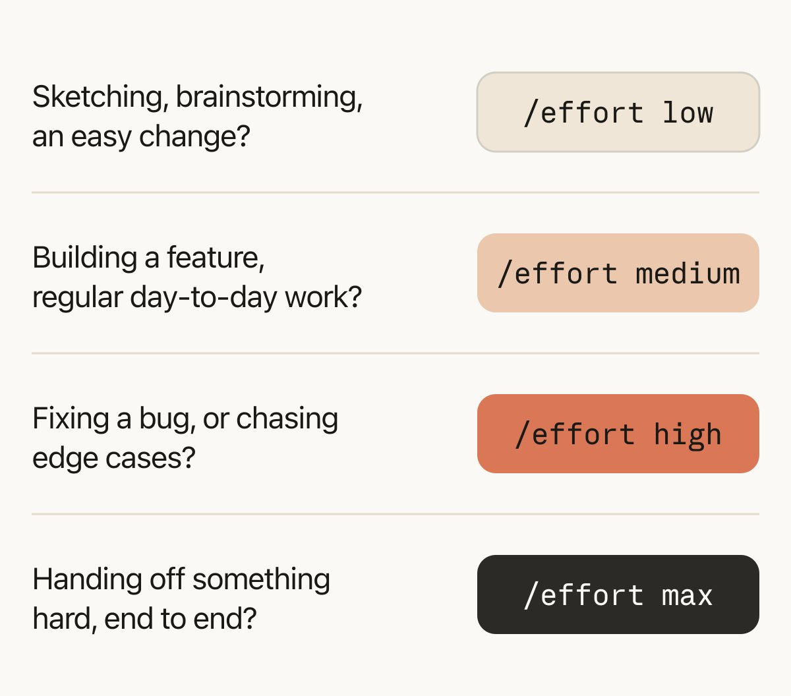

# Using Claude Code: Spending your effort 

> Automatisch per `npm run ingest:x` erfasst. Quelle: [x.com/trq212/status/2103576349499855160](https://x.com/trq212/status/2103576349499855160)

## Artikel-Volltext

One of the best parts of our newest Claude models is how they respond to effort without breaking the prompt cache in Claude Code, but I’ve received a lot of questions on this from users. What is effort really and when do you use which effort level? Why do we need effort at all?
To answer this, I decided to do a deep dive into the evals and do my own tests of effort across normal work.
note: you can see more interactive diagrams and explainers for this post on https://claude.dev/blog/spending-your-effort/  
At a high level, I found that effort was a great way of changing how much verification and edgecase testing Claude did and how much of its own judgement it used. 
Extra effort gave better results in areas where verification and edgecase testing was more useful like hardware, code review, and security.
But low and medium effort was perfect for getting things done quickly and staying in the loop with Claude.
For normal software engineering, I’m now running a loop of getting the model to interview me then implementing on low/medium effort, reviewing what it built, and then running verification on high effort.
What is effort?
At a high level, effort gives the model an approximation of how much compute you want it to spend on the task. It’s somewhat related to your modeling of the difficulty of the task.
Think of it this way, if someone asked you to do something in 12 hours straight, you might assume they just want you to do it and try very hard. If someone asked you to do the same task in 1 hour, you’d try to get them the best version that meets their task and then expect to iterate from there.
Or, you might push back and say the task requires at least 3 hours and then work for 3 hours to deliver it.
You should think of effort in the same way. Claude will always try and do your task reasonably, but higher effort will involve Claude taking more independent action for judgement and verification.
Effort curves
Fable 5.1 and Opus 5.5’s effort curves are our best yet, at each level if there is an uptick in benchmark scores and tokens consumed. Below is a graph of Terminal Bench 3.0 scores by effort, measured during my eval runs for this post.
 
But what does this mean in practice? To evaluate this, I tried several tasks at different effort levels and poured over the benchmarks. 
Building with effort
The best way to understand how models work is to run experiments. I tried doing the same tasks at several different effort levels on Opus 5.5 understand the work it would do. I did this on a wide variety of work, but am illustrating this with a few toy examples.
Underspecified build task
If I ask Claude to “build a personal fitness and workout tracker app,” effort changes dramatically how fleshed out the app is, but also results in Claude making more choices along the way. At low effort, the fitness app is just a log and a simple graph. At higher effort levels the app is more complex with additional detail. At max effort there’s a heat chart.
 
If I wanted a simple base to iterate from, low effort would get it done. Max effort would be if I wanted Claude’s best one shot.
Lightly specified design task
What if I have a task that is fairly specified already but I want some exploration with Claude? As an example I tried to ask it to redesign the /config menu in Claude Code. Every pass had roughly the same idea, to use submenus and better search.
At low effort (which took 1 minute), I got an interactive sketch that conveyed the idea but didn't look very much like Claude Code.
At max effort (which took 28 minutes), I got a mockup that looked very much like Claude Code, along with a bunch of walkthroughs for different flows.
If my goal was to iterate and give feedback, low effort would get there much faster. But max effort gives me something much more polished right off the bat. For this particular task, I think I prefer using low effort to understand Claude’s vision.
 
Highly specified build task
What if I gave Claude lots of details? I tried asking Claude to interview me in-depth about the fitness app and then gave that spec to be implemented by different models at different effort levels.
I found that given this spec, the models behaved much more similarly. I got designs that looked fairly similar and had similar implementations but with different details, at max effort Claude took some time to simplify a few of the details. 
 
Takeaways
For regular software engineering, particularly new feature work, the effort level depends a lot on how in the loop I want to be. Low effort allows Claude to respond quickly with a starting point, higher effort levels will get more work done but Claude will also make more assumptions on my behalf.
A particularly fruitful loop for feature development I’ve been using is:
Give Claude a spec and ask it to interview me about any details I’m missing
Implement it on low effort
Review to make sure it got the gist of it correct, iterate on low effort as needed
Verify and test on high effort
How effort levels impact output on difficult tasks
But these are obviously toy examples, where Claude is well able to complete them. What about when the difference is between Claude completing the task or not completing the task?
To find these difficult problems, you have to go to the benchmarks so I dove into one I like: Terminal Bench 3, a community sourced benchmark.
Terminal-Bench 3.0 problems can broadly be separated into categories like security, hardware, ML,  science, software, operations and media.  You can see all of the problems here: https://github.com/harbor-framework/terminal-bench/releases/tag/v3.0.0, they’re sourced from the community so anyone can contribute.
It’s worth reading to get a sense of the type of problems these models face. I found I was surprised by the scope and ambition of a lot of these tasks. The are much more complicated than the average task I’d face.
For example, some of the tasks included:
Hardware (retro-console-soc): build an 8-bit game console in Verilog that fits a small FPGA and renders a test ROM.
Science (takens-embedding-lean): formally prove Takens’ embedding theorem in Lean 4.
ML (mp-checkpoint-consolidation): merge 16 shards of a mixture-of-experts checkpoint into one file that reproduces the reference logits.
Operations (intrastat-meldung): run a company’s month-end EU trade-statistics filing end to end.
Media (layout-config-recreation): rebuild a poster image as an editable layout file.
Higher effort levels help when there are many edge cases
My main takeaway from reading the Terminal Bench 3 results was that higher effort is best for tasks with lots of hidden edge cases.
A clean example is html-js-filter, a Terminal-Bench 3.0 task that asks for an HTML sanitizer that strips every way of smuggling JavaScript into a page. Fable 5.1 went from 1/5 at low to 5/5 at xhigh.
A typical attempt at low effort takes about 2 minutes. Each of these attempts wrote a filter in roughly one pass, then tested it against a single hand-written page.
A high effort run finishes in about 33 minutes. In the run I traced, it adversarially reviewed its first draft, then read the installed parser’s source to check for bugs, ran many clean test cases until they gave the same output as the input, ran a standard XSS test suite, and finally, wrote a random-document fuzzer.
For something as edge-cased as a HTML sanitizer, this extra effort is well worth it. Spending more tokens for thoroughness also makes sense for complex tasks with high production requirements such as performance optimization or security review.
But you don’t need this level of effort for every task.
The diagram below shows every Terminal-Bench 3.0 result and how it failed, across different models and effort levels. Overall, increasing effort tends to reduce failures due to missing edgecases (purple blocks), but does not fix when the model has the wrong approach (blue blocks).
 
Problem areas where effort helps
One of the most interesting takeaways for me from evaluating these models on TerminalBench was that there were some problem areas that benefited from effort more than others. You can see a breakdown in the following diagram:
 
To illustrate this, I chose a few problems from different areas from Terminal Bench 3.0 where Opus 5.5 failed at low effort but succeeded at high effort–mostly because it tested and accounted for edge cases:
mvcc-lsm-compaction: a Terminal-Bench 3.0 task that asks for a fix to a storage-engine bug from its crash report, without breaking compaction. Opus 5.5 went from 0/5 at low to 4/5 at xhigh.
At low (about a minute per attempt), Claude would edit the code before building it or running the reproducer, and did not check that its new test would have caught the original bug.
At xhigh (about 11 minutes), Claude reproduced the crash first, wrote a randomized test against a reference that never compacts, and checked that its tests failed on half-finished fixes.
cli-2ph-simple: is a Terminal-Bench 3.0 task that asks for a CLI linear-program solver written in Python. Opus 5.5 went from 0/5 at low to 5/5 at high.
The low attempts wrote a solver in one pass, checked it with a few small problems and stopped around 10k tokens. In the final message, Claude warned it might be slow on big problems, but did not check.
During the high attempts Claude tested its solver on random problems against a separate brute-force solver, then timed bigger ones, hit cases that ran far too long or crashed, and reworked its search.
gsea-proteomics: a Terminal-Bench 3.0 task that asks for a gene set enrichment analysis (GSEA) on proteomics data to find which of eight treatments resemble a target tissue. Opus 5.5 went from 0/5 at low to 4/5 at high.
At low effort, Claude picked a reasonable-sounding way to prep the data, ran the analysis that one way, and reported the result.
At high Claude tried two ways of prepping the data, it noticed that the list of significant treatments changed, and dug into why before choosing the correct one.
If a user were in the loop, Claude may have asked the user about the way to setup the problem, but without a user in the loop high effort does better.
When to use different effort levels in Claude Code
Here’s my rule of thumb on when to use which effort level:
Low: for when I want quick responses that are in the loop, e.g. brainstorming, sketching, easy changes
Medium: for most of my regular software engineering work, e.g. new feature implementation.
High: for work where verification is important or there are edge cases, e.g. fixing a bug in a brownfield codebase.
Max: When I want Claude to operate fully autonomously to solve difficult problems, e.g. end to end building and verification of an app, finding security vulnerabilities in critical software.
 
Try varying effort for Opus 5.5 and Fable 5.1 based on your task or even mid-conversation by using /effort in Claude Code and let me know if this matches your intuition.

## Bilder

<!-- Reihenfolge wie von der API geliefert (Cover zuerst). Die Position im Artikeltext gibt die API nicht mit. -->

**Cover**

**photo**

**photo**

**photo**

**photo**

**photo**

**photo**

**photo**

## Post-Text

What is effort really? When do you change it it and why not just use max effort for everything?

I dove deep into this problem, looking into evals and doing my own tests and I was quite surprised by the results. https://t.co/KO2D51j34H

## Links

- [x.com/i/article/2103…](https://x.com/i/article/2103535187426709504)
