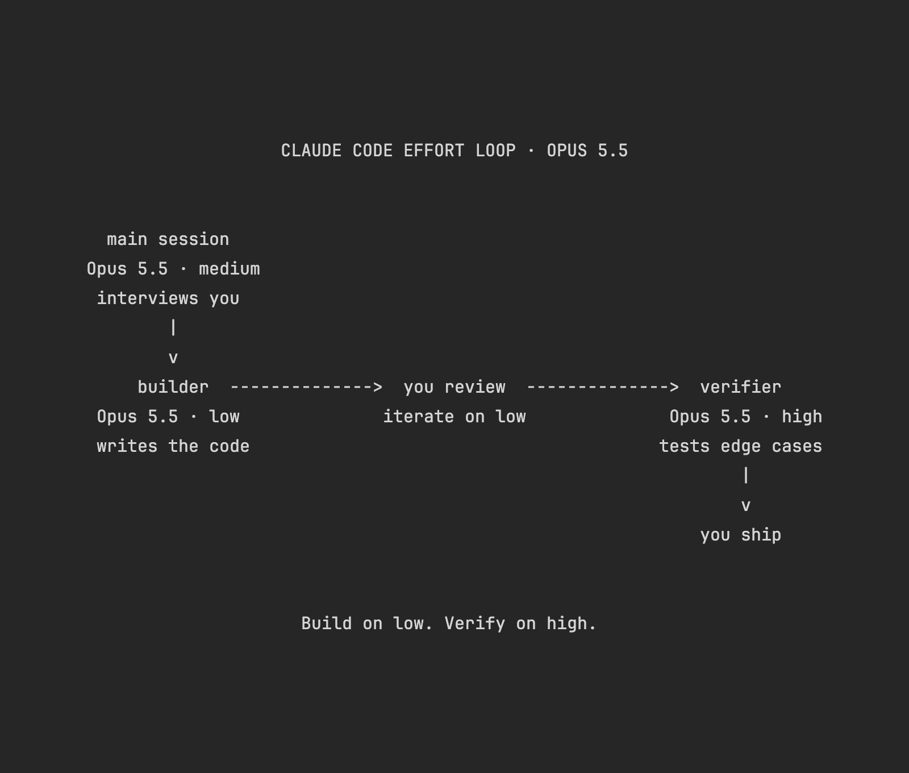

# Vox (@Voxyz_ai)

> Automatisch per `npm run ingest:x` erfasst. Quelle: [x.com/Voxyz_ai/status/2103586663393853636](https://x.com/Voxyz_ai/status/2103586663393853636)

## Bilder

<!-- Reihenfolge wie von der API geliefert (Cover zuerst). Die Position im Artikeltext gibt die API nicht mit. -->

**photo**

## Post-Text

Thariq from Anthropic's Claude Code team just published his tests on effort: turning effort up mostly buys 𝗺𝗼𝗿𝗲 𝘃𝗲𝗿𝗶𝗳𝗶𝗰𝗮𝘁𝗶𝗼𝗻 𝗮𝗻𝗱 𝗲𝗱𝗴𝗲-𝗰𝗮𝘀𝗲 𝘁𝗲𝘀𝘁𝗶𝗻𝗴. You can turn his approach into 𝘁𝘄𝗼 𝘀𝘂𝗯𝗮𝗴𝗲𝗻𝘁𝘀 and have Claude Code follow it.

For new features, he works in four steps:
→ Have Claude ask you questions first and fill in what the spec is missing
→ Build it on low. It's fast, and you can step in anytime
→ Look it over, and if it needs changes, stay on low
→ Switch to high at the end to verify and test

If you want to try it, send this image and the prompt below to Claude Code 👇

"Set up the workflow in this image in my Claude Code:

1. Create two subagents in ~/.claude/agents:
- builder: writes the code. model: opus, effort: low. It implements the spec I've approved and stops when it's done.
- verifier: checks the work. model: opus, effort: high. It runs the feature first to see what it actually does, then adds tests, focusing on edge cases. It reports problems to me and doesn't change the code itself.

2. Add a rule to ~/.claude/CLAUDE.md: when I ask for a new feature, first ask me what the spec is missing; after I confirm, hand it to builder; after I've reviewed the result, hand it to verifier.

3. Check whether the environment variable CLAUDE_CODE_EFFORT_LEVEL is set. If it is, the effort settings on both subagents won't take effect. Just tell me; don't change it.

Show me the contents of the files you'll create or change, then explain the whole workflow in words a 10-year-old could follow. Don't write anything until I confirm."

## Links

- [pic.x.com/qJ2GR5SfPm](https://x.com/Voxyz_ai/status/2103586663393853636/photo/1)
- [x.com/trq212/status/…](https://twitter.com/trq212/status/2103576349499855160)

## Thread

### 1/1

Thariq from Anthropic's Claude Code team just published his tests on effort: turning effort up mostly buys 𝗺𝗼𝗿𝗲 𝘃𝗲𝗿𝗶𝗳𝗶𝗰𝗮𝘁𝗶𝗼𝗻 𝗮𝗻𝗱 𝗲𝗱𝗴𝗲-𝗰𝗮𝘀𝗲 𝘁𝗲𝘀𝘁𝗶𝗻𝗴. You can turn his approach into 𝘁𝘄𝗼 𝘀𝘂𝗯𝗮𝗴𝗲𝗻𝘁𝘀 and have Claude Code follow it.

For new features, he works in four steps:
→ Have Claude ask you questions first and fill in what the spec is missing
→ Build it on low. It's fast, and you can step in anytime
→ Look it over, and if it needs changes, stay on low
→ Switch to high at the end to verify and test

If you want to try it, send this image and the prompt below to Claude Code 👇

"Set up the workflow in this image in my Claude Code:

1. Create two subagents in ~/.claude/agents:
- builder: writes the code. model: opus, effort: low. It implements the spec I've approved and stops when it's done.
- verifier: checks the work. model: opus, effort: high. It runs the feature first to see what it actually does, then adds tests, focusing on edge cases. It reports problems to me and doesn't change the code itself.

2. Add a rule to ~/.claude/CLAUDE.md: when I ask for a new feature, first ask me what the spec is missing; after I confirm, hand it to builder; after I've reviewed the result, hand it to verifier.

3. Check whether the environment variable CLAUDE_CODE_EFFORT_LEVEL is set. If it is, the effort settings on both subagents won't take effect. Just tell me; don't change it.

Show me the contents of the files you'll create or change, then explain the whole workflow in words a 10-year-old could follow. Don't write anything until I confirm."
