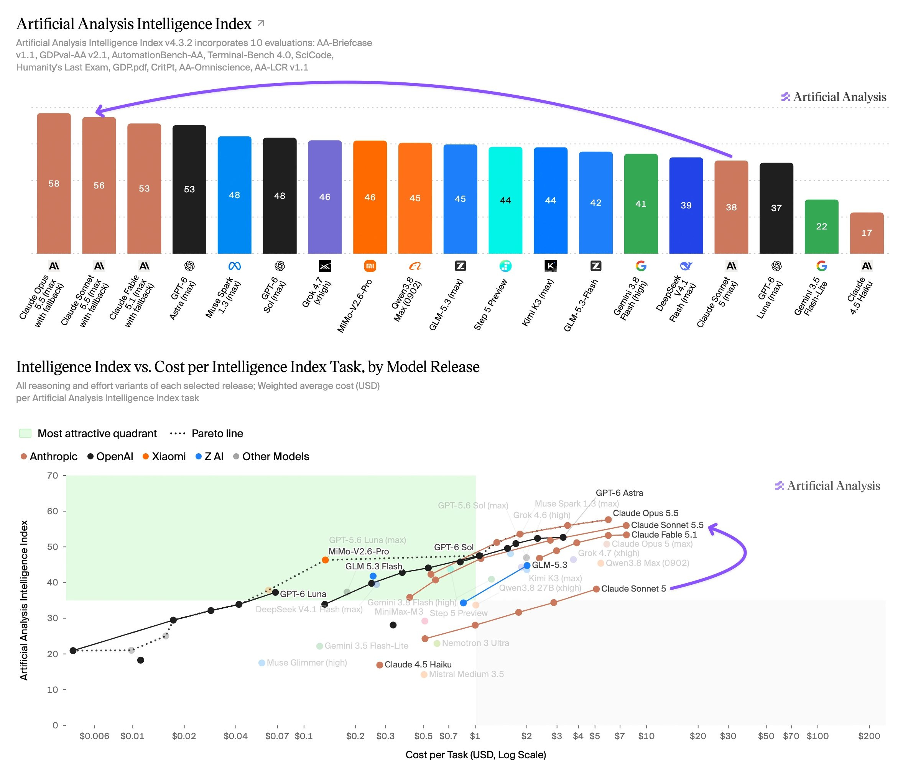

# Artificial Analysis (@ArtificialAnlys)

> Automatisch per `npm run ingest:x` erfasst. Quelle: [x.com/ArtificialAnlys/status/2104640155843989864](https://x.com/ArtificialAnlys/status/2104640155843989864)

## Bilder

<!-- Reihenfolge wie von der API geliefert (Cover zuerst). Die Position im Artikeltext gibt die API nicht mit. -->

**photo**

## Post-Text

Anthropic has launched Claude Sonnet 5.5: it scores 56 on the Artificial Analysis Intelligence Index, just 2 points behind Opus 5.5 (max), but at the highest Output Tokens per Task we’ve seen

With max effort, Sonnet 5.5 gains 18 points over Sonnet 5 and to #2 on the Intelligence Index behind only Opus 5.5 (max). Anthropic has priced Sonnet 5.5 identically to Sonnet 5 at $0.2/$2/$10 per 1M cache input/input/output tokens, however it outputs a higher number of Output Tokens per Task and costs $7.60 per task (~50% higher than Sonnet 5’s Cost per Task)

Key takeaways:

➤ Meets leading models on agentic terminal use and knowledge work: in Terminal-Bench 4.0, Claude Sonnet 5.5 reaches 64% against 60% for Opus 5.5 and GPT-6 Astra. On AA-Briefcase (1811 vs 1822 Elo), GDPval-AA (1844 vs 1846 Elo), and AutomationBench-AA (71% vs 70% headline score), Sonnet 5.5 reaches parity with Opus 5.5, albeit with significantly higher token usage to achieve it

➤ Heaviest token use we have measured: at max effort, where it reaches performance nearing that of Opus 5.5, Claude Sonnet 5.5 used ~193k Output Tokens per Intelligence Index Task. This is the highest token use we have measured on around 60% higher than Opus 5.5 (max) or Sonnet 5 (max) and ~7x GPT-6 Astra (max)

➤ Pricing remains at $2/$10 per million tokens of input/output, matching GPT-6 Sol. At this pricing Claude Sonnet 5.5 sits off the Intelligence vs. Cost per Task Pareto Frontier. At high effort levels it sits behind Opus 5.5, while lower efforts have GPT-6 Astra or Sol configurations delivering equivalent performance for lower cost. The high effort setting is the most competitive on this basis, sitting very narrowly behind GPT-6 Sol on Intelligence at effectively the same Cost per Task

➤ Behind Opus 5.5 on factual knowledge and scientific reasoning: as a smaller class model, Sonnet 5.5 still lags on factual knowledge in AA-Omniscience compared to Opus 5.5. It scores 54% against 66% for factual accuracy, though with a lower hallucination rate (47% against 59%). It also sits ~6 points lower on Humanity's Last Exam and SciCode compared to Opus

These evaluations were conducted on a pre-release deployment of Claude Sonnet 5.5, which Anthropic found to have a bug that can degrade responses to requests that use structured outputs. This is fixed for the public release and Anthropic expects minimal change or slightly understated performance, but we will be re-running relevant evaluations soon.

Other model details:

➤ Context window: 1 million tokens with image and text input, unchanged from Sonnet 5

➤ Pricing: unchanged from Sonnet 5’s latest $2/$10 per 1M input/output tokens; cache writes at $2.5, cache reads $0.2

➤ Effort settings: five (low, medium, high, xhigh, max). Intelligence Index evaluations were run at all five with Anthropic's default fallback enabled. We see Sonnet 5.5 fall back in ~0.1% of tasks across the Intelligence Index, primarily in TerminalBench 4.0, falling back to Sonnet 5 in all cases.

## Links

- [pic.x.com/aunF6RTycN](https://x.com/ArtificialAnlys/status/2104640155843989864/photo/1)

## Thread

### 1/5

Anthropic has launched Claude Sonnet 5.5: it scores 56 on the Artificial Analysis Intelligence Index, just 2 points behind Opus 5.5 (max), but at the highest Output Tokens per Task we’ve seen

With max effort, Sonnet 5.5 gains 18 points over Sonnet 5 and to #2 on the Intelligence Index behind only Opus 5.5 (max). Anthropic has priced Sonnet 5.5 identically to Sonnet 5 at $0.2/$2/$10 per 1M cache input/input/output tokens, however it outputs a higher number of Output Tokens per Task and costs $7.60 per task (~50% higher than Sonnet 5’s Cost per Task)

Key takeaways:

➤ Meets leading models on agentic terminal use and knowledge work: in Terminal-Bench 4.0, Claude Sonnet 5.5 reaches 64% against 60% for Opus 5.5 and GPT-6 Astra. On AA-Briefcase (1811 vs 1822 Elo), GDPval-AA (1844 vs 1846 Elo), and AutomationBench-AA (71% vs 70% headline score), Sonnet 5.5 reaches parity with Opus 5.5, albeit with significantly higher token usage to achieve it

➤ Heaviest token use we have measured: at max effort, where it reaches performance nearing that of Opus 5.5, Claude Sonnet 5.5 used ~193k Output Tokens per Intelligence Index Task. This is the highest token use we have measured on around 60% higher than Opus 5.5 (max) or Sonnet 5 (max) and ~7x GPT-6 Astra (max)

➤ Pricing remains at $2/$10 per million tokens of input/output, matching GPT-6 Sol. At this pricing Claude Sonnet 5.5 sits off the Intelligence vs. Cost per Task Pareto Frontier. At high effort levels it sits behind Opus 5.5, while lower efforts have GPT-6 Astra or Sol configurations delivering equivalent performance for lower cost. The high effort setting is the most competitive on this basis, sitting very narrowly behind GPT-6 Sol on Intelligence at effectively the same Cost per Task

➤ Behind Opus 5.5 on factual knowledge and scientific reasoning: as a smaller class model, Sonnet 5.5 still lags on factual knowledge in AA-Omniscience compared to Opus 5.5. It scores 54% against 66% for factual accuracy, though with a lower hallucination rate (47% against 59%). It also sits ~6 points lower on Humanity's Last Exam and SciCode compared to Opus

These evaluations were conducted on a pre-release deployment of Claude Sonnet 5.5, which Anthropic found to have a bug that can degrade responses to requests that use structured outputs. This is fixed for the public release and Anthropic expects minimal change or slightly understated performance, but we will be re-running relevant evaluations soon.

Other model details:

➤ Context window: 1 million tokens with image and text input, unchanged from Sonnet 5

➤ Pricing: unchanged from Sonnet 5’s latest $2/$10 per 1M input/output tokens; cache writes at $2.5, cache reads $0.2

➤ Effort settings: five (low, medium, high, xhigh, max). Intelligence Index evaluations were run at all five with Anthropic's default fallback enabled. We see Sonnet 5.5 fall back in ~0.1% of tasks across the Intelligence Index, primarily in TerminalBench 4.0, falling back to Sonnet 5 in all cases.

### 2/5

Claude Sonnet 5.5 (max) makes large strides on Terminal-Bench, sitting among the top models for both Terminal-Bench 4.0 and Terminal-Bench-Science. In Terminal-Bench 4.0 it scores 64%, a 50 point increase over Claude Sonnet 5 (max), and slightly above 60% for Opus 5.5 and GPT-6 Astra (xhigh).

On our leaderboard for Terminal-Bench-Science - a benchmark of agentic terminal use to complete realistic scientific research workflows across domains - it scores 53% and sits behind only GPT-6 Astra and Opus 5.5. Terminal-Bench-Science is not currently included in the Artificial Analysis Intelligence Index.

### 3/5

To achieve its outsized performance, Claude Sonnet 5.5 (max) uses ~193k output tokens per Intelligence Index task, the most we have measured and ~7x that of GPT-6 Astra (max).

However, its lower effort settings span a broader area of Intelligence versus Output Tokens per Task tradeoffs, with low, medium, and high effort settings sitting behind GPT-6 Sol high, xhigh, and max efforts - in this area Sol provides higher performance with fewer output tokens.

### 4/5

Full breakdown of the individual evaluations in the Artificial Analysis Intelligence Index for Claude Sonnet 5.5 across all reasoning efforts https://t.co/sahinfVhxX

### 5/5

Compare Claude Sonnet 5.5 with other leading models at: https://t.co/W6ZPe8ST7k
