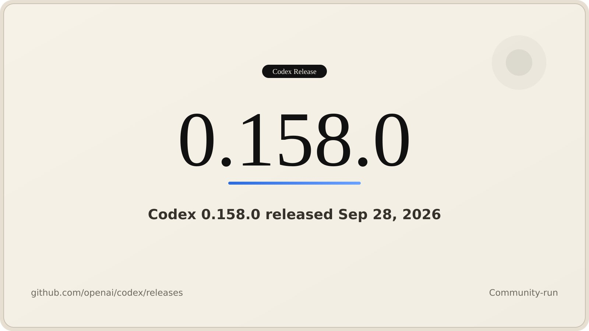

# Codex Releases (@CodexReleases)

> Automatisch per `npm run ingest:x` erfasst. Quelle: [x.com/CodexReleases/status/2104438417220149728](https://x.com/CodexReleases/status/2104438417220149728)

## Bilder

<!-- Reihenfolge wie von der API geliefert (Cover zuerst). Die Position im Artikeltext gibt die API nicht mit. -->

**photo**

## Post-Text

Codex CLI 0.158.0 is out!

Highlights:
- Enable tui.prompt_suggestions to get suggested follow-ups after successful turns; press Tab to edit one before sending
- Connect to MCP servers that require pre-registered OAuth client secrets, including via codex mcp add --oauth-client-secret
- Secure exec-server WebSocket connections with bearer tokens, including through app-server
- Terminal input approval is now enabled by default for commands running with elevated permissions

Complete details in thread ↓

## Links

- [pic.x.com/YIfHw02Ma0](https://x.com/CodexReleases/status/2104438417220149728/photo/1)

## Thread

### 1/6

Codex CLI 0.158.0 is out!

Highlights:
- Enable tui.prompt_suggestions to get suggested follow-ups after successful turns; press Tab to edit one before sending
- Connect to MCP servers that require pre-registered OAuth client secrets, including via codex mcp add --oauth-client-secret
- Secure exec-server WebSocket connections with bearer tokens, including through app-server
- Terminal input approval is now enabled by default for commands running with elevated permissions

Complete details in thread ↓

### 2/6

TUI:
- tui.prompt_suggestions generates suggested follow-ups after successful turns; press Tab to edit one before sending
- Copy-on-select and right-click paste are now configurable in the fullscreen TUI; copied transcript selections preserve Markdown formatting

### 3/6

MCP &amp; auth:
- MCP servers requiring pre-registered OAuth client secrets are now supported, including via codex mcp add --oauth-client-secret
- Direct exec-server WebSocket connections can be secured with bearer tokens, including connections configured through app-server

### 4/6

Added:
- Image generation and editing can explicitly request transparent backgrounds; image edits now accept file-backed conversation images
- Terminal input approval is enabled by default for commands running with elevated permissions; runtime-only grants no longer cause unnecessary reviews

### 5/6

Fixed:
- Windows sandbox failures on ordinary Windows 10 paths, rejected stored credentials, and large permission policies; Linux sandbox startup with nested writable roots; Git metadata protections preserved across writable roots on Linux and macOS
- macOS patch operations recognize system path aliases covered by existing permissions; approval reviews retry when new user input arrives; Mermaid flowcharts render quoted labels and ampersands

### 6/6

Release notes:
- https://t.co/1jerEYWcqh
