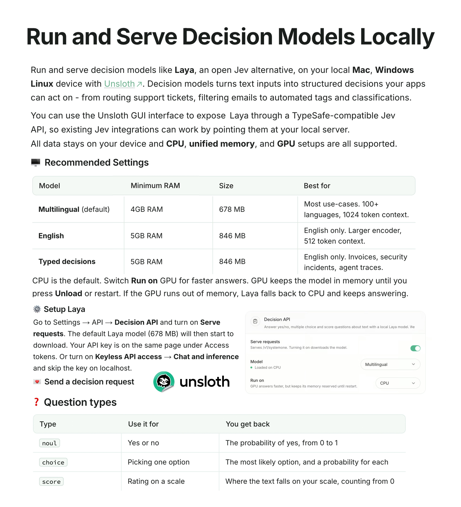

# Unsloth AI (@UnslothAI)

> Automatisch per `npm run ingest:x` erfasst. Quelle: [x.com/UnslothAI/status/2104592692072304916](https://x.com/UnslothAI/status/2104592692072304916)

## Bilder

<!-- Reihenfolge wie von der API geliefert (Cover zuerst). Die Position im Artikeltext gibt die API nicht mit. -->

**photo**

## Post-Text

You can now run Laya Decision models locally on just 4GB RAM! 🔥

Works on CPU, Mac, Windows, Linux and GPU setups.

Serve Laya through a Jev-compatible API via Unsloth Desktop.

GitHub: https://t.co/aZWYAtakBP
Guide: https://t.co/2xm5JIvSwT https://t.co/Aux9BPVqvi

## Links

- [github.com/unslothai/unsl…](https://github.com/unslothai/unsloth)
- [unsloth.ai/docs/models/de…](https://unsloth.ai/docs/models/decision-laya)
- [pic.x.com/Aux9BPVqvi](https://x.com/UnslothAI/status/2104592692072304916/photo/1)

## Thread

### 1/1

You can now run Laya Decision models locally on just 4GB RAM! 🔥

Works on CPU, Mac, Windows, Linux and GPU setups.

Serve Laya through a Jev-compatible API via Unsloth Desktop.

GitHub: https://t.co/aZWYAtakBP
Guide: https://t.co/2xm5JIvSwT https://t.co/Aux9BPVqvi
