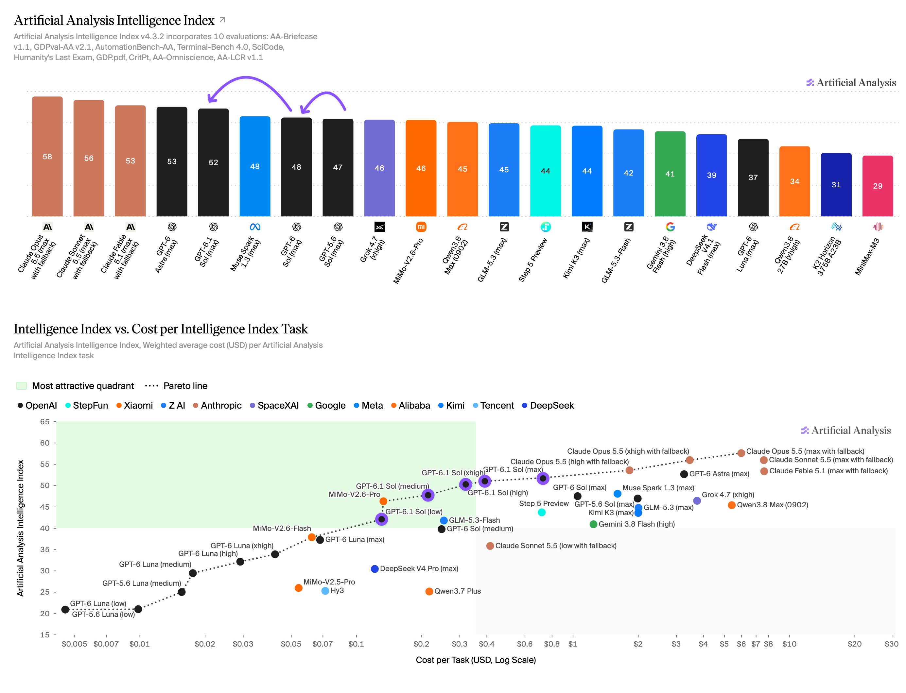

# Artificial Analysis (@ArtificialAnlys)

> Automatisch per `npm run ingest:x` erfasst. Quelle: [x.com/ArtificialAnlys/status/2105025585332605357](https://x.com/ArtificialAnlys/status/2105025585332605357)

## Bilder

<!-- Reihenfolge wie von der API geliefert (Cover zuerst). Die Position im Artikeltext gibt die API nicht mit. -->

**photo**

## Post-Text

GPT-6.1 Sol replaces GPT-6 Sol after just 7 days. It scores 1 point below GPT-6 Astra in the Intelligence Index at less than one quarter of the Cost per Task

Pricing matches GPT-6 Sol at $2/$10 per million input/output tokens, except that the cache read discount rises from 90% to 95%. GPT-6.1 Sol’s overall blended price for agentic workloads is therefore slightly lower than GPT-6 Sol. This represents an additional price cut, following GPT-6 Sol’s original 50% discount from GPT-5.6 Sol.

Key takeaways:

➤ Achieves near-Astra Intelligence: GPT-6.1 Sol gains 4 points in the Intelligence Index vs GPT-6 Sol, and 5 points vs GPT-5.6 Sol - landing 1 point below GPT-6 Astra. It makes significant gains in agentic knowledge work, improving 4 points and 5 points in AA-Briefcase v1.1 and GDPval-AA v2.1 respectively. Other notable gains include a 12 point jump in Terminal-Bench 4.0, a 5 point jump in Humanity’s Last Exam, a 6 point jump in GDP.pdf, and an 8 point jump in AA-Omniscience Accuracy coupled with hallucination rate falling from 60% to 54%.

➤ Pushes cost efficiency frontier: At max effort, GPT-6.1 Sol costs less than a quarter of GPT-6 Astra per Intelligence Index task ($0.72 vs $3.26). It also costs 31% less per task than GPT-6 Sol ($1.05) and 64% less than GPT-5.6 Sol ($1.99). All effort levels of GPT-6.1 Sol push out the cost efficiency Pareto frontier: for a given level of intelligence, there is no cheaper model.

➤ Pushes token efficiency frontier, but uses slightly more output tokens than GPT-6 Sol: GPT-6.1 Sol uses ~10-30% more output tokens than GPT-6 Sol across effort levels. However, due to the increase in Intelligence Index score, its low and medium effort levels are Pareto optimal for token efficiency.

➤ Gains in Coding Agent Index: GPT-6.1 Sol gains 3 points on GPT-6 Sol at max effort in the Artificial Analysis Coding Agent Index, and sits 2 points below GPT-6 Astra.

Congratulations @OpenAI and @sama on the launch!

## Thread

### 1/7

GPT-6.1 Sol replaces GPT-6 Sol after just 7 days. It scores 1 point below GPT-6 Astra in the Intelligence Index at less than one quarter of the Cost per Task

Pricing matches GPT-6 Sol at $2/$10 per million input/output tokens, except that the cache read discount rises from 90% to 95%. GPT-6.1 Sol’s overall blended price for agentic workloads is therefore slightly lower than GPT-6 Sol. This represents an additional price cut, following GPT-6 Sol’s original 50% discount from GPT-5.6 Sol.

Key takeaways:

➤ Achieves near-Astra Intelligence: GPT-6.1 Sol gains 4 points in the Intelligence Index vs GPT-6 Sol, and 5 points vs GPT-5.6 Sol - landing 1 point below GPT-6 Astra. It makes significant gains in agentic knowledge work, improving 4 points and 5 points in AA-Briefcase v1.1 and GDPval-AA v2.1 respectively. Other notable gains include a 12 point jump in Terminal-Bench 4.0, a 5 point jump in Humanity’s Last Exam, a 6 point jump in GDP.pdf, and an 8 point jump in AA-Omniscience Accuracy coupled with hallucination rate falling from 60% to 54%.

➤ Pushes cost efficiency frontier: At max effort, GPT-6.1 Sol costs less than a quarter of GPT-6 Astra per Intelligence Index task ($0.72 vs $3.26). It also costs 31% less per task than GPT-6 Sol ($1.05) and 64% less than GPT-5.6 Sol ($1.99). All effort levels of GPT-6.1 Sol push out the cost efficiency Pareto frontier: for a given level of intelligence, there is no cheaper model.

➤ Pushes token efficiency frontier, but uses slightly more output tokens than GPT-6 Sol: GPT-6.1 Sol uses ~10-30% more output tokens than GPT-6 Sol across effort levels. However, due to the increase in Intelligence Index score, its low and medium effort levels are Pareto optimal for token efficiency.

➤ Gains in Coding Agent Index: GPT-6.1 Sol gains 3 points on GPT-6 Sol at max effort in the Artificial Analysis Coding Agent Index, and sits 2 points below GPT-6 Astra.

Congratulations @OpenAI and @sama on the launch!

### 2/7

Additional analysis for GPT-6.1 Sol below

GPT-6.1 Sol dominates the lower-price range of the Pareto frontier for Artificial Analysis Coding Agent Index vs Cost per Task. GPT-6.1 Sol (xhigh) scores 1 point above GPT-6 Astra for less than 15% of the Cost per Task. This represents a 6 point gain from GPT-6 Sol (max). We observed the xhigh effort setting to outperform the max effort setting by 3 points.

### 3/7

GPT-6.1 Sol uses 10-30% more output tokens than GPT-6 Sol across effort settings in the Intelligence Index. However, due to increases in intelligence, its low and medium effort settings are Pareto optimal for token efficiency https://t.co/gjAF0Ez0MC

### 4/7

At max effort, GPT-6.1 Sol jumps 8 points in AA-Omniscience Accuracy coupled with a 6 point reduction in hallucination rate https://t.co/ui9thMOiao

### 5/7

GPT-6.1 Sol improves by ~80 Elo in AA-Briefcase. This is driven by increases in its rubric score and Analytical Quality Elo, while Presentation Elo falls slightly https://t.co/f6LidmHn2C

### 6/7

Breakdown of the individual evaluations in the Artificial Analysis Intelligence Index v4.3.2 https://t.co/QzNLfipA0L

### 7/7

Compare GPT-6.1 Sol with other leading models at: https://t.co/g4bCnDEUx1
