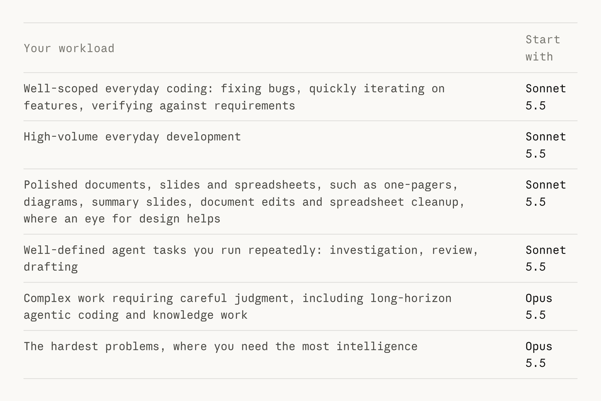

# Vox (@Voxyz_ai)

> Automatisch per `npm run ingest:x` erfasst. Quelle: [x.com/Voxyz_ai/status/2104919123918479521](https://x.com/Voxyz_ai/status/2104919123918479521)

## Bilder

<!-- Reihenfolge wie von der API geliefert (Cover zuerst). Die Position im Artikeltext gibt die API nicht mit. -->

**photo**

## Post-Text

Anthropic just published its official guide to Sonnet 5.5. You can ask Claude Code to use it to check which of your work to hand to Sonnet 5.5, which is faster and 𝗵𝗮𝗹𝗳 𝘁𝗵𝗲 𝗽𝗿𝗶𝗰𝗲, and which to keep on Opus 5.5.

Once you're on Claude Code 2.1.284, any subagent with model: sonnet is 𝗮𝗹𝗿𝗲𝗮𝗱𝘆 𝗿𝘂𝗻𝗻𝗶𝗻𝗴 𝗼𝗻 𝗦𝗼𝗻𝗻𝗲𝘁 𝟱.𝟱 (on the Claude API).

Its effort levels were also recalibrated, so the same level doesn't mean the same amount of thinking as on Sonnet 5. So don't carry over your Sonnet 5 effort settings. For everyday use, start at medium and go to high for harder or longer work. At xhigh or max it thinks longer and costs more, and for that kind of work the guide suggests considering Opus 5.5.

Send this prompt to Claude Code 👇

"Read this guide: https://t.co/PU3Ug5CzMJ

Then review my Claude Code setup against it: my user and project settings, the subagents in ~/.claude/agents and .claude/agents, any model set in commands and skills, and CLAUDE.md. If this project has code that calls the Claude API, check that too. Find three kinds of problems:
1. Models doing the wrong work. Flag subagents that set no model and run on my main Opus model when their job is well-scoped, repeated work like investigation, review or drafting; those fit Sonnet 5.5. Long-horizon agentic coding and work that needs careful judgment stays on Opus 5.5. Then look at this project's code and recent commits and tell me which kinds of work here I should switch to with /model sonnet.
2. The wrong effort. List every effort level hard-coded for Sonnet, including subagents with model: sonnet that now run on Sonnet 5.5. Suggest levels from the guide's ladder: medium for well-scoped work, high for harder or longer work, and xhigh or max only where a gain was measured.
3. Settings and instructions that don't work or backfire on Sonnet 5.5: settings that turn thinking off, instructions telling it to 'think less' or to write its reasoning into the reply, and workarounds added for older models, like 'do not be lazy', refusal steering or tool retry prompts. If there's code calling the API, also check for calls that now return a 400 and anything that reads content[0].text; if not, skip this part.

For each issue, quote the setting or line, explain the impact, and suggest the smallest change.

Show me the recommendations first. Don't change anything yet."

Of course, if your usage limits can take it, keeping everything on Opus 5.5 is a fine choice too. I wrote up how to set each Opus 5.5 effort level in my post quoted below 👇

## Links

- [claude.dev/blog/building-…](https://claude.dev/blog/building-with-claude-sonnet-5-5/)

## Thread

### 1/1

Anthropic just published its official guide to Sonnet 5.5. You can ask Claude Code to use it to check which of your work to hand to Sonnet 5.5, which is faster and 𝗵𝗮𝗹𝗳 𝘁𝗵𝗲 𝗽𝗿𝗶𝗰𝗲, and which to keep on Opus 5.5.

Once you're on Claude Code 2.1.284, any subagent with model: sonnet is 𝗮𝗹𝗿𝗲𝗮𝗱𝘆 𝗿𝘂𝗻𝗻𝗶𝗻𝗴 𝗼𝗻 𝗦𝗼𝗻𝗻𝗲𝘁 𝟱.𝟱 (on the Claude API).

Its effort levels were also recalibrated, so the same level doesn't mean the same amount of thinking as on Sonnet 5. So don't carry over your Sonnet 5 effort settings. For everyday use, start at medium and go to high for harder or longer work. At xhigh or max it thinks longer and costs more, and for that kind of work the guide suggests considering Opus 5.5.

Send this prompt to Claude Code 👇

"Read this guide: https://t.co/PU3Ug5CzMJ

Then review my Claude Code setup against it: my user and project settings, the subagents in ~/.claude/agents and .claude/agents, any model set in commands and skills, and CLAUDE.md. If this project has code that calls the Claude API, check that too. Find three kinds of problems:
1. Models doing the wrong work. Flag subagents that set no model and run on my main Opus model when their job is well-scoped, repeated work like investigation, review or drafting; those fit Sonnet 5.5. Long-horizon agentic coding and work that needs careful judgment stays on Opus 5.5. Then look at this project's code and recent commits and tell me which kinds of work here I should switch to with /model sonnet.
2. The wrong effort. List every effort level hard-coded for Sonnet, including subagents with model: sonnet that now run on Sonnet 5.5. Suggest levels from the guide's ladder: medium for well-scoped work, high for harder or longer work, and xhigh or max only where a gain was measured.
3. Settings and instructions that don't work or backfire on Sonnet 5.5: settings that turn thinking off, instructions telling it to 'think less' or to write its reasoning into the reply, and workarounds added for older models, like 'do not be lazy', refusal steering or tool retry prompts. If there's code calling the API, also check for calls that now return a 400 and anything that reads content[0].text; if not, skip this part.

For each issue, quote the setting or line, explain the impact, and suggest the smallest change.

Show me the recommendations first. Don't change anything yet."

Of course, if your usage limits can take it, keeping everything on Opus 5.5 is a fine choice too. I wrote up how to set each Opus 5.5 effort level in my post quoted below 👇
