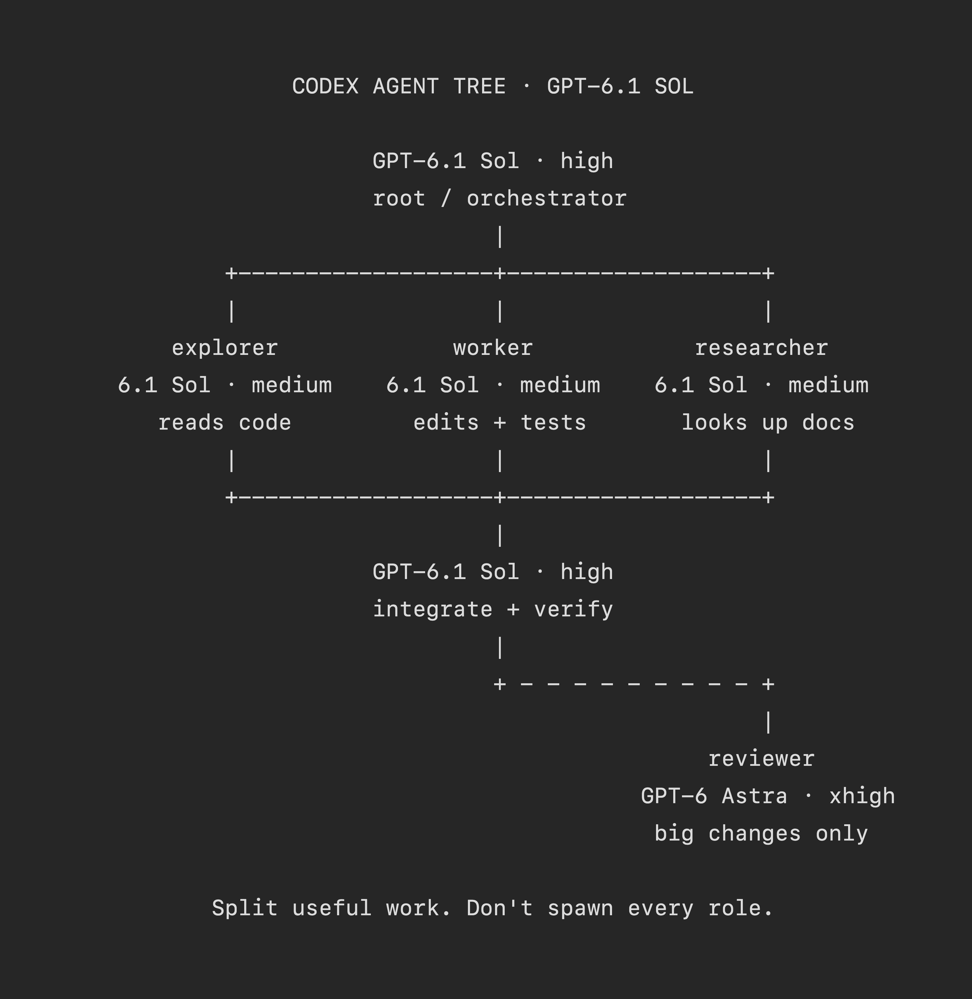

# Vox (@Voxyz_ai)

> Automatisch per `npm run ingest:x` erfasst. Quelle: [x.com/Voxyz_ai/status/2105012597796057438](https://x.com/Voxyz_ai/status/2105012597796057438)

## Bilder

<!-- Reihenfolge wie von der API geliefert (Cover zuerst). Die Position im Artikeltext gibt die API nicht mit. -->

**photo**

## Post-Text

OpenAI just launched GPT-6.1 Sol, and for coding it can 𝗿𝗲𝗽𝗹𝗮𝗰𝗲 𝗔𝘀𝘁𝗿𝗮 𝗼𝘂𝘁𝗿𝗶𝗴𝗵𝘁 at 1/5 the price.
OpenAI also announced today that 20x Pro is being cut to 10x. I honestly don't dare use Astra anymore. Switch to 6.1 Sol before Astra eats your whole week.

6.1 Sol is already in Codex. Set it up like the tree: 6.1 Sol runs the root orchestrator and all three subagents, and Astra only does an independent review before a big change ships. Reasoning effort comes from OpenAI's DeepSWE chart: 6.1 Sol scores highest on high, and 𝗴𝗼𝗶𝗻𝗴 𝘂𝗽 𝘁𝗼 𝘅𝗵𝗶𝗴𝗵 𝗼𝗿 𝗺𝗮𝘅 𝗮𝗰𝘁𝘂𝗮𝗹𝗹𝘆 𝘀𝗰𝗼𝗿𝗲𝘀 𝗹𝗼𝘄𝗲𝗿, so the orchestrator runs on high. Medium scores only about 2 points lower than high and costs over 30% less per task, so the subagents run on medium.

Send the tree and this prompt to Codex 👇

"Set up my Codex to match this tree:
→ Main session: default to `gpt-6.1-sol` on high reasoning effort. It breaks down tasks, delegates, integrates, and verifies. Handle simple tasks directly; don't delegate them.
→ Three project-level custom agents, each with model `gpt-6.1-sol` and model_reasoning_effort `medium`: explorer reads code, worker edits code and runs tests, researcher looks up docs. Reuse fitting ones if they exist, and create only the missing ones.
→ reviewer: also a project-level custom agent, with model `gpt-6-astra` and model_reasoning_effort `xhigh`. Call it only before a big change ships. It reports problems and doesn't edit code.
→ Put the delegation rule in AGENTS.md: when spawning a subagent, set `fork_turns` to `"none"` or pass only the last few turns. If `fork_turns` is omitted or set to `"all"`, the subagent inherits the main session's model and effort and can't override them, and the tree stops working.

Before changing anything, check:
→ Roles other than the reviewer that still use `gpt-6-astra` or an older Sol (like `gpt-6-sol` or `gpt-5.6-sol`). List them.
→ Roles moving to 6.1 Sol with effort set to `none` or `minimal`: change them to `low` (6.1 Sol supports neither), then compare the results.
→ Model assignments written only in AGENTS.md: check recent subagent session logs to confirm which model each role actually ran.

If you can't select a model in the tree, stop and ask me. Show me the changes first, and wait for my OK before writing anything."

## Links

- [pic.x.com/80jRFkaoCv](https://x.com/Voxyz_ai/status/2105012597796057438/photo/1)
- [x.com/OpenAIDevs/sta…](https://twitter.com/OpenAIDevs/status/2104993035507712318)

## Thread

### 1/1

OpenAI just launched GPT-6.1 Sol, and for coding it can 𝗿𝗲𝗽𝗹𝗮𝗰𝗲 𝗔𝘀𝘁𝗿𝗮 𝗼𝘂𝘁𝗿𝗶𝗴𝗵𝘁 at 1/5 the price.
OpenAI also announced today that 20x Pro is being cut to 10x. I honestly don't dare use Astra anymore. Switch to 6.1 Sol before Astra eats your whole week.

6.1 Sol is already in Codex. Set it up like the tree: 6.1 Sol runs the root orchestrator and all three subagents, and Astra only does an independent review before a big change ships. Reasoning effort comes from OpenAI's DeepSWE chart: 6.1 Sol scores highest on high, and 𝗴𝗼𝗶𝗻𝗴 𝘂𝗽 𝘁𝗼 𝘅𝗵𝗶𝗴𝗵 𝗼𝗿 𝗺𝗮𝘅 𝗮𝗰𝘁𝘂𝗮𝗹𝗹𝘆 𝘀𝗰𝗼𝗿𝗲𝘀 𝗹𝗼𝘄𝗲𝗿, so the orchestrator runs on high. Medium scores only about 2 points lower than high and costs over 30% less per task, so the subagents run on medium.

Send the tree and this prompt to Codex 👇

"Set up my Codex to match this tree:
→ Main session: default to `gpt-6.1-sol` on high reasoning effort. It breaks down tasks, delegates, integrates, and verifies. Handle simple tasks directly; don't delegate them.
→ Three project-level custom agents, each with model `gpt-6.1-sol` and model_reasoning_effort `medium`: explorer reads code, worker edits code and runs tests, researcher looks up docs. Reuse fitting ones if they exist, and create only the missing ones.
→ reviewer: also a project-level custom agent, with model `gpt-6-astra` and model_reasoning_effort `xhigh`. Call it only before a big change ships. It reports problems and doesn't edit code.
→ Put the delegation rule in AGENTS.md: when spawning a subagent, set `fork_turns` to `"none"` or pass only the last few turns. If `fork_turns` is omitted or set to `"all"`, the subagent inherits the main session's model and effort and can't override them, and the tree stops working.

Before changing anything, check:
→ Roles other than the reviewer that still use `gpt-6-astra` or an older Sol (like `gpt-6-sol` or `gpt-5.6-sol`). List them.
→ Roles moving to 6.1 Sol with effort set to `none` or `minimal`: change them to `low` (6.1 Sol supports neither), then compare the results.
→ Model assignments written only in AGENTS.md: check recent subagent session logs to confirm which model each role actually ran.

If you can't select a model in the tree, stop and ask me. Show me the changes first, and wait for my OK before writing anything."
