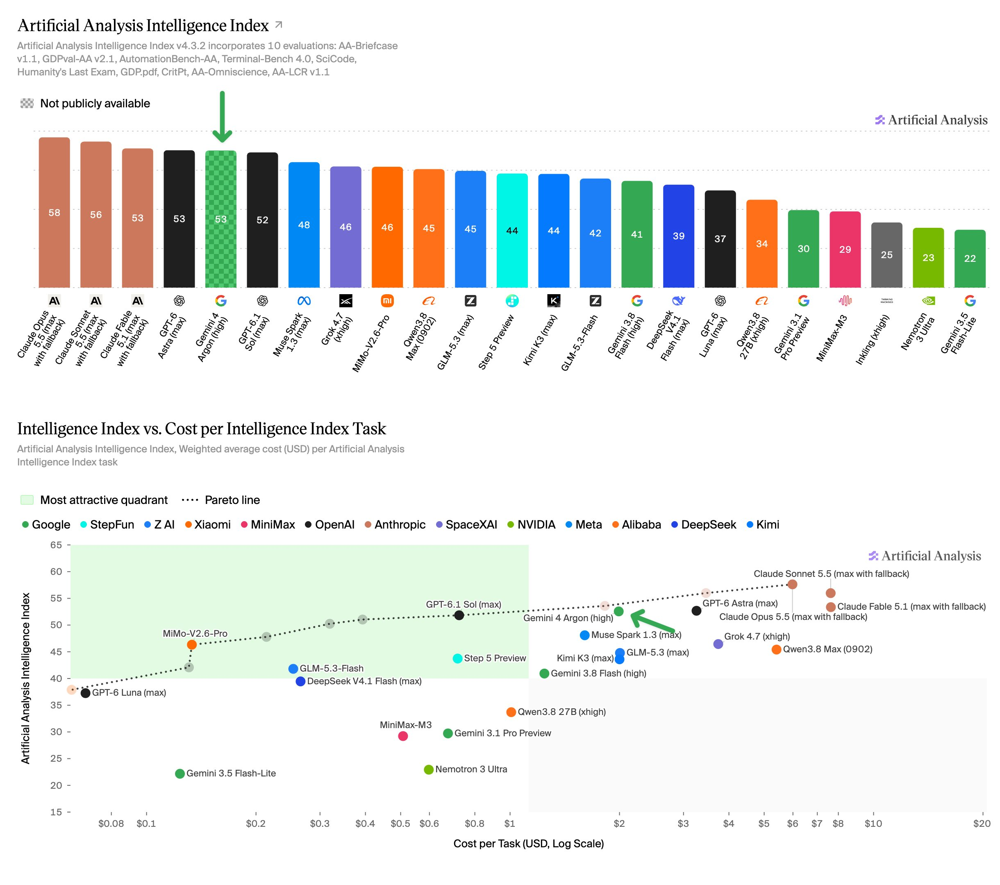

# Artificial Analysis (@ArtificialAnlys)

> Automatisch per `npm run ingest:x` erfasst. Quelle: [x.com/ArtificialAnlys/status/2105392625788637299](https://x.com/ArtificialAnlys/status/2105392625788637299)

## Bilder

<!-- Reihenfolge wie von der API geliefert (Cover zuerst). Die Position im Artikeltext gibt die API nicht mit. -->

**photo**

## Post-Text

Google’s new Gemini 4 Argon equals GPT-6 Astra on the Artificial Analysis Intelligence Index at 60% of the Cost per Task with discounted prices. Google is now back to being one of the top three labs in intelligence achieved

Gemini 4 Argon is @GoogleDeepMind’s first proprietary model above the Flash class in over 7 months. With high reasoning (the highest available), it scores 53 on the Artificial Analysis Intelligence Index, matching GPT-6 Astra (max, 53) and 1 point ahead of GPT-6.1 Sol (max, 52), with gains driven by lower hallucinations and stronger agentic capabilities.

At its current 50% pricing discount and with cache discounts increased to 95%, Gemini 4 Argon costs $1.99 per Intelligence Index task, 60% of GPT-6 Astra (max), but 2.7x GPT-6.1 Sol (max). After the discount ends, this will rise to $3.98 (~1.2x GPT-6 Astra (max)).

Gemini 4 Argon is currently being rolled out to selected users and is not publicly available. The 50% discount is an initial promotion. Google has not yet confirmed the promotion end date

Key benchmarking results for Gemini 4 Argon with high reasoning:

➤ Google returns as one of the top three labs on intelligence: Gemini 4 Argon (high) scores 53 on the Artificial Analysis Intelligence Index, matching GPT-6 Astra (max, 53) and 1 point ahead of GPT-6.1 Sol (max, 52). This is 23 points above Google’s previous non-Flash model, Gemini 3.1 Pro Preview (30) and 12 points ahead of Gemini 3.8 Flash (high)

➤ Launch discounts of 50% make Gemini 4 Argon competitive on Cost per Task: At current discounted pricing, Gemini 4 Argon (high) costs $1.99 per Intelligence Index task, 60% of GPT-6 Astra (max, $3.26) for a comparable level of intelligence. This cost efficiency is driven by lower token prices, rather than reduced token use, with Gemini 4 Argon averaging 62k output tokens per task, compared with 27k for GPT-6 Astra (max). Google has not yet confirmed the promotion end date, but on standard pricing, Cost per Task will increase to $3.98

➤ Stronger agentic performance: Historically a weaker area for Gemini models, Gemini 4 Argon shows improvements across agentic evaluations. It ranks #1 on AutomationBench-AA at 77.5%, 6 points ahead of Claude Sonnet 5.5 (max, 71.3%). On Terminal Bench 4, Gemini 4 Argon achieves 57%, a +53 point improvement from Gemini 3.1 Pro Preview, only behind Claude Sonnet 5.5 (max, 64%), Claude Opus 5.5 (max, 60%) and GPT-6 Astra (59%). On AA-Briefcase, it reaches 1494 Elo. This is driven by a 65% rubric pass rate, the highest we have recorded, but lower Analytical Quality (1576 Elo) and Presentation Quality (1308 Elo)

➤ Lowest hallucination rate among leading models: On AA-Omniscience, Gemini 4 Argon has a 15% hallucination rate, the lowest of any model scoring 45+ on the Intelligence Index, compared with 51% for GPT-6 Astra (max) and 54% for GPT-6.1 Sol (max). This means Argon is much more likely to acknowledge when it does not know an answer rather than guess incorrectly. On accuracy, Gemini 4 Argon scores 50%, a 5 point decrease from Gemini 3.1 Pro Preview, and 13 points below GPT-6 Astra (max, 63%). With this slightly lower accuracy, its overall AA-Omniscience score of 42 remains in line with GPT-6 Astra (43) and GPT-6.1 Sol (42)

Key model details:

➤ Context Window: 1M tokens

➤ Multimodality: Text, image, video, and speech input, with text output

➤ Pricing: $4/$20 per 1M input/output tokens at standard pricing, currently discounted 50% to $2/$10. Cached input tokens receive a 95% discount ($0.10 per 1M at discounted pricing), up from 90% on Gemini 3.8 Flash

➤ Long Decode Continuation: We tested Gemini 4 Argon with Long Decode Continuation, a new Gemini API feature that pauses long responses and resumes them across follow-up calls. This lets reasoning run up to 1M output tokens without request timeouts

## Thread

### 1/5

Google’s new Gemini 4 Argon equals GPT-6 Astra on the Artificial Analysis Intelligence Index at 60% of the Cost per Task with discounted prices. Google is now back to being one of the top three labs in intelligence achieved

Gemini 4 Argon is @GoogleDeepMind’s first proprietary model above the Flash class in over 7 months. With high reasoning (the highest available), it scores 53 on the Artificial Analysis Intelligence Index, matching GPT-6 Astra (max, 53) and 1 point ahead of GPT-6.1 Sol (max, 52), with gains driven by lower hallucinations and stronger agentic capabilities.

At its current 50% pricing discount and with cache discounts increased to 95%, Gemini 4 Argon costs $1.99 per Intelligence Index task, 60% of GPT-6 Astra (max), but 2.7x GPT-6.1 Sol (max). After the discount ends, this will rise to $3.98 (~1.2x GPT-6 Astra (max)).

Gemini 4 Argon is currently being rolled out to selected users and is not publicly available. The 50% discount is an initial promotion. Google has not yet confirmed the promotion end date

Key benchmarking results for Gemini 4 Argon with high reasoning:

➤ Google returns as one of the top three labs on intelligence: Gemini 4 Argon (high) scores 53 on the Artificial Analysis Intelligence Index, matching GPT-6 Astra (max, 53) and 1 point ahead of GPT-6.1 Sol (max, 52). This is 23 points above Google’s previous non-Flash model, Gemini 3.1 Pro Preview (30) and 12 points ahead of Gemini 3.8 Flash (high)

➤ Launch discounts of 50% make Gemini 4 Argon competitive on Cost per Task: At current discounted pricing, Gemini 4 Argon (high) costs $1.99 per Intelligence Index task, 60% of GPT-6 Astra (max, $3.26) for a comparable level of intelligence. This cost efficiency is driven by lower token prices, rather than reduced token use, with Gemini 4 Argon averaging 62k output tokens per task, compared with 27k for GPT-6 Astra (max). Google has not yet confirmed the promotion end date, but on standard pricing, Cost per Task will increase to $3.98

➤ Stronger agentic performance: Historically a weaker area for Gemini models, Gemini 4 Argon shows improvements across agentic evaluations. It ranks #1 on AutomationBench-AA at 77.5%, 6 points ahead of Claude Sonnet 5.5 (max, 71.3%). On Terminal Bench 4, Gemini 4 Argon achieves 57%, a +53 point improvement from Gemini 3.1 Pro Preview, only behind Claude Sonnet 5.5 (max, 64%), Claude Opus 5.5 (max, 60%) and GPT-6 Astra (59%). On AA-Briefcase, it reaches 1494 Elo. This is driven by a 65% rubric pass rate, the highest we have recorded, but lower Analytical Quality (1576 Elo) and Presentation Quality (1308 Elo)

➤ Lowest hallucination rate among leading models: On AA-Omniscience, Gemini 4 Argon has a 15% hallucination rate, the lowest of any model scoring 45+ on the Intelligence Index, compared with 51% for GPT-6 Astra (max) and 54% for GPT-6.1 Sol (max). This means Argon is much more likely to acknowledge when it does not know an answer rather than guess incorrectly. On accuracy, Gemini 4 Argon scores 50%, a 5 point decrease from Gemini 3.1 Pro Preview, and 13 points below GPT-6 Astra (max, 63%). With this slightly lower accuracy, its overall AA-Omniscience score of 42 remains in line with GPT-6 Astra (43) and GPT-6.1 Sol (42)

Key model details:

➤ Context Window: 1M tokens

➤ Multimodality: Text, image, video, and speech input, with text output

➤ Pricing: $4/$20 per 1M input/output tokens at standard pricing, currently discounted 50% to $2/$10. Cached input tokens receive a 95% discount ($0.10 per 1M at discounted pricing), up from 90% on Gemini 3.8 Flash

➤ Long Decode Continuation: We tested Gemini 4 Argon with Long Decode Continuation, a new Gemini API feature that pauses long responses and resumes them across follow-up calls. This lets reasoning run up to 1M output tokens without request timeouts

### 2/5

Gemini 4 Argon’s standard pricing is $4/$20 per 1M input/output tokens, with a 95% discount for cached input tokens. Compared to Gemini 3.1 Pro Preview, this is an increase in token cost, and a larger discount on cached input. At standard pricing, Gemini 4 Argon’s Cost per Task is $3.98, ~1.2x that of GPT-6 Astra ($3.26, max). At discounted pricing however, the Cost per Task is $1.99, making it a 40% reduction from GPT-6 Astra (max)

### 3/5

Gemini 4 Argon ranks #1 on AutomationBench-AA at 77.5%, 6 points ahead of Claude Sonnet 5.5 (max, 71.3%). On Terminal Bench 4, Gemini 4 Argon achieves 57%, a + 53 point improvement from Gemini 3.1 Pro Preview, only behind Claude Sonnet 5.5 (max, 64%), Claude Opus 5.5 (max, 60%) and GPT-6 Astra (59%)

### 4/5

Full benchmark results for Gemini 4 Argon with high reasoning https://t.co/CHuOdL4EOy

### 5/5

For further analysis, see https://t.co/sJQl974uEX
