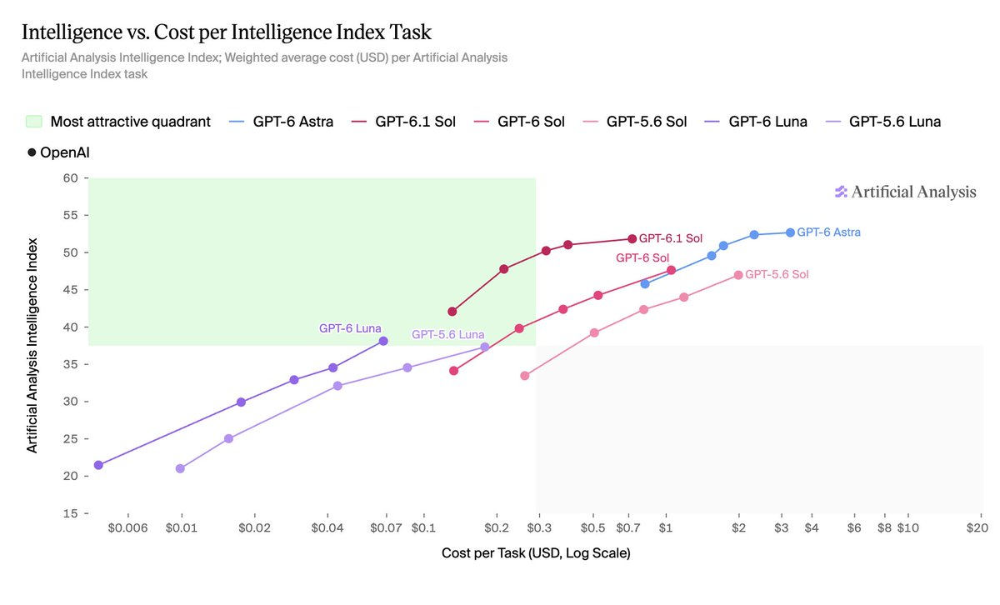

# Artificial Analysis (@ArtificialAnlys)

> Automatisch per `npm run ingest:x` erfasst. Quelle: [x.com/ArtificialAnlys/status/2105491868608004578](https://x.com/ArtificialAnlys/status/2105491868608004578)

## Bilder

<!-- Reihenfolge wie von der API geliefert (Cover zuerst). Die Position im Artikeltext gibt die API nicht mit. -->

**photo**

## Post-Text

GPT-6.1 Sol pushes the cost efficiency frontier for OpenAI models. OpenAI has also fixed an issue reading multimodal input which improves Intelligence Index results for GPT-6 Luna by 1 point.

At max effort, GPT-6.1 Sol costs less than a quarter of GPT-6 Astra per Intelligence Index task ($0.72 vs $3.26). It also costs 31% less per task than GPT-6 Sol ($1.04) and 64% less than GPT-5.6 Sol ($1.99). All effort levels of GPT-6.1 Sol push out the cost efficiency Pareto frontier: for a given level of intelligence, there is no cheaper model.

OpenAI also fixed a bug in image encoding for GPT-6 Luna and Sol. GPT-6 Luna (max) has gained a point in the Intelligence Index, with improvement in evals which benefit from visual understanding such as GDP.pdf (2.4pt gain), MMMU-Pro (4.1pt gain), GDPval-AA v2.1 (71 Elo gain), AA-Briefcase (36 Elo gain). GPT-6 Sol shows negligible improvement.

## Links

- [pic.x.com/SmFRhEM68o](https://x.com/ArtificialAnlys/status/2105491868608004578/photo/1)

## Thread

### 1/2

GPT-6.1 Sol pushes the cost efficiency frontier for OpenAI models. OpenAI has also fixed an issue reading multimodal input which improves Intelligence Index results for GPT-6 Luna by 1 point.

At max effort, GPT-6.1 Sol costs less than a quarter of GPT-6 Astra per Intelligence Index task ($0.72 vs $3.26). It also costs 31% less per task than GPT-6 Sol ($1.04) and 64% less than GPT-5.6 Sol ($1.99). All effort levels of GPT-6.1 Sol push out the cost efficiency Pareto frontier: for a given level of intelligence, there is no cheaper model.

OpenAI also fixed a bug in image encoding for GPT-6 Luna and Sol. GPT-6 Luna (max) has gained a point in the Intelligence Index, with improvement in evals which benefit from visual understanding such as GDP.pdf (2.4pt gain), MMMU-Pro (4.1pt gain), GDPval-AA v2.1 (71 Elo gain), AA-Briefcase (36 Elo gain). GPT-6 Sol shows negligible improvement.

### 2/2

Compare models at Artificial Analysis: https://t.co/AxC5QXMDp6
