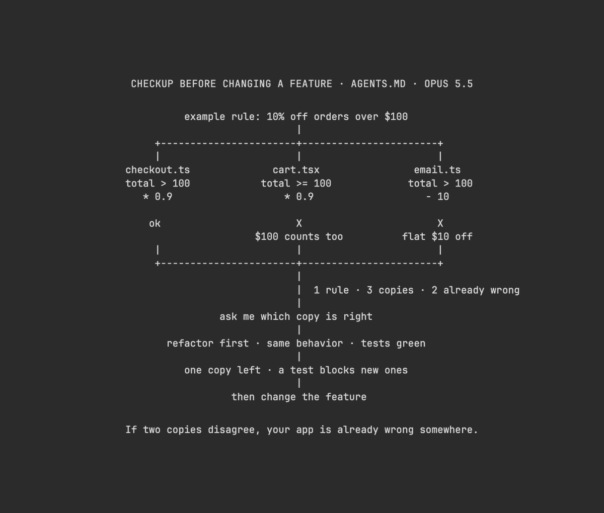

# Vox (@Voxyz_ai)

> Automatisch per `npm run ingest:x` erfasst. Quelle: [x.com/Voxyz_ai/status/2106104334035435572](https://x.com/Voxyz_ai/status/2106104334035435572)

## Bilder

<!-- Reihenfolge wie von der API geliefert (Cover zuerst). Die Position im Artikeltext gibt die API nicht mit. -->

**photo**

## Post-Text

After a week with Opus 5.5, this might be the most valuable section an AGENTS.md can have: before it changes a feature, have it 𝗰𝗼𝘂𝗻𝘁 𝗵𝗼𝘄 𝗺𝗮𝗻𝘆 𝘁𝗶𝗺𝗲𝘀 𝘁𝗵𝗲 𝘀𝗮𝗺𝗲 𝗿𝘂𝗹𝗲 𝗵𝗮𝘀 𝗯𝗲𝗲𝗻 𝗰𝗼𝗽𝗶𝗲𝗱.

If any of those copies give different results, your project is 𝗮𝗹𝗿𝗲𝗮𝗱𝘆 𝗰𝗮𝗹𝗰𝘂𝗹𝗮𝘁𝗶𝗻𝗴 𝘀𝗼𝗺𝗲𝘁𝗵𝗶𝗻𝗴 𝘄𝗿𝗼𝗻𝗴 somewhere. It moves fast and often edits only the copy in front of it, while the others stay as they were. You fix it in one place and it's still wrong in another.

Copy the whole section into your AGENTS.md 👇

## Run a checkup before changing a feature
- First map the logic you're about to change: which files it's spread across, how many copies of each rule exist, and which copies give different results for the same input
- If copies disagree, ask me which one is right. Merging them changes results, so commit that on its own and list what changed
- Refactor everything else before changing the feature: small commits, same behavior, all tests green
- No tests? Write them first to lock in the current output
- In refactor commits, tests may only change import paths. Assertions stay as they are
- When you're done, add a test that fails if the rule is implemented anywhere outside its one file

## Links

- [pic.x.com/xU4ART0YFi](https://x.com/Voxyz_ai/status/2106104334035435572/photo/1)

## Thread

### 1/1

After a week with Opus 5.5, this might be the most valuable section an AGENTS.md can have: before it changes a feature, have it 𝗰𝗼𝘂𝗻𝘁 𝗵𝗼𝘄 𝗺𝗮𝗻𝘆 𝘁𝗶𝗺𝗲𝘀 𝘁𝗵𝗲 𝘀𝗮𝗺𝗲 𝗿𝘂𝗹𝗲 𝗵𝗮𝘀 𝗯𝗲𝗲𝗻 𝗰𝗼𝗽𝗶𝗲𝗱.

If any of those copies give different results, your project is 𝗮𝗹𝗿𝗲𝗮𝗱𝘆 𝗰𝗮𝗹𝗰𝘂𝗹𝗮𝘁𝗶𝗻𝗴 𝘀𝗼𝗺𝗲𝘁𝗵𝗶𝗻𝗴 𝘄𝗿𝗼𝗻𝗴 somewhere. It moves fast and often edits only the copy in front of it, while the others stay as they were. You fix it in one place and it's still wrong in another.

Copy the whole section into your AGENTS.md 👇

## Run a checkup before changing a feature
- First map the logic you're about to change: which files it's spread across, how many copies of each rule exist, and which copies give different results for the same input
- If copies disagree, ask me which one is right. Merging them changes results, so commit that on its own and list what changed
- Refactor everything else before changing the feature: small commits, same behavior, all tests green
- No tests? Write them first to lock in the current output
- In refactor commits, tests may only change import paths. Assertions stay as they are
- When you're done, add a test that fails if the rule is implemented anywhere outside its one file
