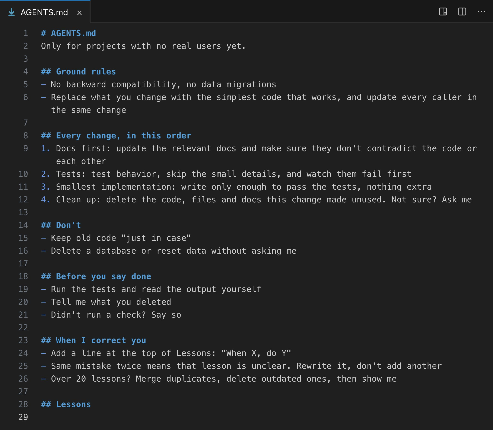

# Vox (@Voxyz_ai)

> Automatisch per `npm run ingest:x` erfasst. Quelle: [x.com/Voxyz_ai/status/2106783910055006342](https://x.com/Voxyz_ai/status/2106783910055006342)

## Bilder

<!-- Reihenfolge wie von der API geliefert (Cover zuerst). Die Position im Artikeltext gibt die API nicht mit. -->

**photo**

## Post-Text

This AGENTS.md fixes the 𝘁𝗵𝗿𝗲𝗲 𝗺𝗼𝘀𝘁 𝗮𝗻𝗻𝗼𝘆𝗶𝗻𝗴 𝗵𝗮𝗯𝗶𝘁𝘀 of Codex and Claude Code: writing backward-compatible code for a project nobody uses yet, never deleting old code and docs it no longer needs, and adding a pile of tests just to change a button color.

After using them every day for months, the lines I'd want in there from day one are the ones at the top: if the project has no real users yet, skip compatibility and migrations, and go straight to 𝘁𝗵𝗲 𝘀𝗶𝗺𝗽𝗹𝗲𝘀𝘁 𝗰𝗼𝗱𝗲 𝘁𝗵𝗮𝘁 𝘄𝗼𝗿𝗸𝘀.

Then a four-step loop: docs first → tests → smallest implementation → clean up.

Copy and paste it into your AGENTS.md 👇

## Links

- [pic.x.com/cwmbU7qWAG](https://x.com/Voxyz_ai/status/2106783910055006342/photo/1)

## Thread

### 1/2

This AGENTS.md fixes the 𝘁𝗵𝗿𝗲𝗲 𝗺𝗼𝘀𝘁 𝗮𝗻𝗻𝗼𝘆𝗶𝗻𝗴 𝗵𝗮𝗯𝗶𝘁𝘀 of Codex and Claude Code: writing backward-compatible code for a project nobody uses yet, never deleting old code and docs it no longer needs, and adding a pile of tests just to change a button color.

After using them every day for months, the lines I'd want in there from day one are the ones at the top: if the project has no real users yet, skip compatibility and migrations, and go straight to 𝘁𝗵𝗲 𝘀𝗶𝗺𝗽𝗹𝗲𝘀𝘁 𝗰𝗼𝗱𝗲 𝘁𝗵𝗮𝘁 𝘄𝗼𝗿𝗸𝘀.

Then a four-step loop: docs first → tests → smallest implementation → clean up.

Copy and paste it into your AGENTS.md 👇

### 2/2

# AGENTS.md
Only for projects with no real users yet.

## Ground rules
- No backward compatibility, no data migrations
- Replace what you change with the simplest code that works, and update every caller in the same change

## Every change, in this order
1. Docs first: update the relevant docs and make sure they don't contradict the code or each other
2. Tests: test behavior, skip the small details, and watch them fail first
3. Smallest implementation: write only enough to pass the tests, nothing extra
4. Clean up: delete the code, files and docs this change made unused. Not sure? Ask me

## Don't
- Keep old code "just in case"
- Delete a database or reset data without asking me

## Before you say done
- Run the tests and read the output yourself
- Tell me what you deleted
- Didn't run a check? Say so

## When I correct you
- Add a line at the top of Lessons: "When X, do Y"
- Same mistake twice means that lesson is unclear. Rewrite it, don't add another
- Over 20 lessons? Merge duplicates, delete outdated ones, then show me

## Lessons

Already have a CLAUDE.md? Import AGENTS.md into it with an @ line.
