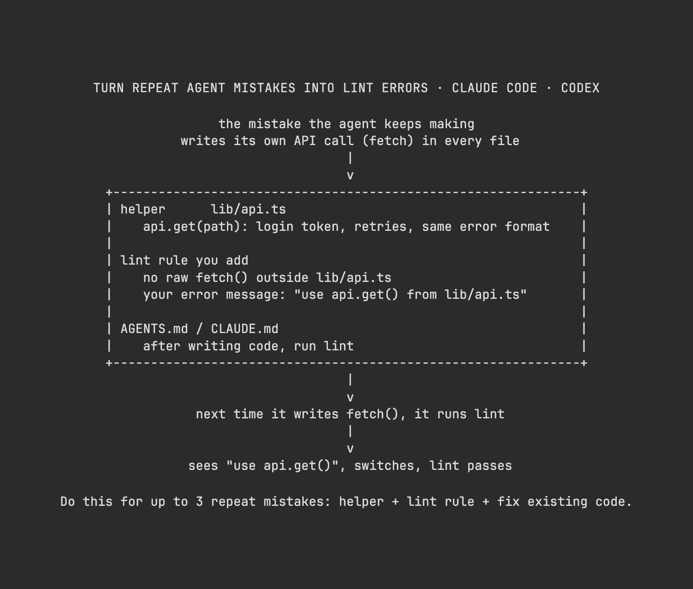

# Vox (@Voxyz_ai)

> Automatisch per `npm run ingest:x` erfasst. Quelle: [x.com/Voxyz_ai/status/2106829206134931539](https://x.com/Voxyz_ai/status/2106829206134931539)

## Bilder

<!-- Reihenfolge wie von der API geliefert (Cover zuerst). Die Position im Artikeltext gibt die API nicht mit. -->

**photo**

## Post-Text

The better AI gets at writing code, 𝘁𝗵𝗲 𝗺𝗼𝗿𝗲 𝗮𝗯𝘀𝘁𝗿𝗮𝗰𝘁𝗶𝗼𝗻𝘀 𝘆𝗼𝘂 𝘀𝗵𝗼𝘂𝗹𝗱 𝘄𝗿𝗶𝘁𝗲.

Turn the way you want things done into ready-made functions for the agent, then use lint to block the other ways. The only option it has left is the one you want.

Start with the mistakes your agent keeps making. Give each one a lint rule whose error message names the function to use, and when the agent runs its checks, 𝗶𝘁 𝘀𝗲𝗲𝘀 𝘁𝗵𝗲 𝗲𝗿𝗿𝗼𝗿 𝗮𝗻𝗱 𝗳𝗶𝘅𝗲𝘀 𝗶𝘁 𝗼𝗻 𝗶𝘁𝘀 𝗼𝘄𝗻.

Send this to Claude Code or Codex 👇

"Go through the corrections in AGENTS.md or CLAUDE.md and the last 50 commits in this repo (focus on fixes and reverts). Find patterns the agent keeps getting wrong that lint can catch, up to 3. If you find fewer, report fewer. For each one:
1. Write a helper function or type that wraps the right way to do it
2. Add a rule in the lint tool the project already uses that bans the old pattern, with an error message that names the helper to use. Prefer the tool's built-in ban rules
3. Replace the old pattern in existing code, then run lint and the tests to confirm they pass
Finally, add a line to AGENTS.md or CLAUDE.md (whichever the project uses): after writing code, run lint and switch to the helper the error points to. If the project has no lint tool, tell me first. Show me the list first, with where each pattern came from and how many current violations it has. Change nothing until I confirm."

## Links

- [pic.x.com/3zbM3HuszG](https://x.com/Voxyz_ai/status/2106829206134931539/photo/1)
- [x.com/mattpocockuk/s…](https://twitter.com/mattpocockuk/status/2106425743479546343)

## Thread

### 1/1

The better AI gets at writing code, 𝘁𝗵𝗲 𝗺𝗼𝗿𝗲 𝗮𝗯𝘀𝘁𝗿𝗮𝗰𝘁𝗶𝗼𝗻𝘀 𝘆𝗼𝘂 𝘀𝗵𝗼𝘂𝗹𝗱 𝘄𝗿𝗶𝘁𝗲.

Turn the way you want things done into ready-made functions for the agent, then use lint to block the other ways. The only option it has left is the one you want.

Start with the mistakes your agent keeps making. Give each one a lint rule whose error message names the function to use, and when the agent runs its checks, 𝗶𝘁 𝘀𝗲𝗲𝘀 𝘁𝗵𝗲 𝗲𝗿𝗿𝗼𝗿 𝗮𝗻𝗱 𝗳𝗶𝘅𝗲𝘀 𝗶𝘁 𝗼𝗻 𝗶𝘁𝘀 𝗼𝘄𝗻.

Send this to Claude Code or Codex 👇

"Go through the corrections in AGENTS.md or CLAUDE.md and the last 50 commits in this repo (focus on fixes and reverts). Find patterns the agent keeps getting wrong that lint can catch, up to 3. If you find fewer, report fewer. For each one:
1. Write a helper function or type that wraps the right way to do it
2. Add a rule in the lint tool the project already uses that bans the old pattern, with an error message that names the helper to use. Prefer the tool's built-in ban rules
3. Replace the old pattern in existing code, then run lint and the tests to confirm they pass
Finally, add a line to AGENTS.md or CLAUDE.md (whichever the project uses): after writing code, run lint and switch to the helper the error points to. If the project has no lint tool, tell me first. Show me the list first, with where each pattern came from and how many current violations it has. Change nothing until I confirm."
