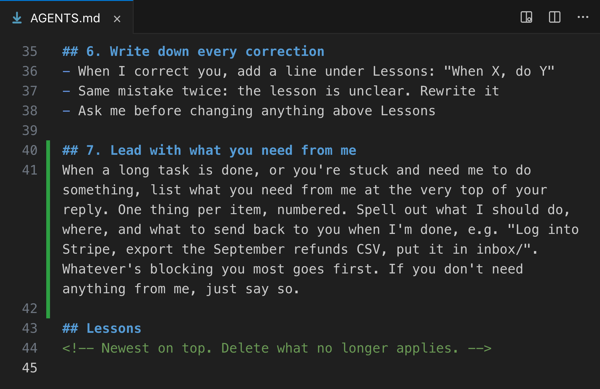

# Vox (@Voxyz_ai)

> Automatisch per `npm run ingest:x` erfasst. Quelle: [x.com/Voxyz_ai/status/2107123654219743712](https://x.com/Voxyz_ai/status/2107123654219743712)

## Bilder

<!-- Reihenfolge wie von der API geliefert (Cover zuerst). Die Position im Artikeltext gibt die API nicht mit. -->

**photo**

## Post-Text

Holy shit, one rule in AGENTS.md and Claude's long reports are 𝘀𝘂𝗱𝗱𝗲𝗻𝗹𝘆 𝗲𝗮𝘀𝘆 𝘁𝗼 𝗿𝗲𝗮𝗱.

It used to finish a long task and send me a wall of text. What it needed me to do was often 𝗯𝘂𝗿𝗶𝗲𝗱 𝘀𝗼𝗺𝗲𝘄𝗵𝗲𝗿𝗲 𝗶𝗻 𝘁𝗵𝗲 𝗺𝗶𝗱𝗱𝗹𝗲, and I'd scroll forever to find it.

Add this section to that AGENTS.md 👇

"## 7. Lead with what you need from me
When a long task is done, or you're stuck and need me to do something, list what you need from me at the very top of your reply. One thing per item, numbered. Spell out what I should do, where, and what to send back to you when I'm done, e.g. "Log into Stripe, export the September refunds CSV, put it in inbox/". Whatever's blocking you most goes first. If you don't need anything from me, just say so."

## Links

- [pic.x.com/OJKD06tnP3](https://x.com/Voxyz_ai/status/2107123654219743712/photo/1)
- [x.com/Voxyz_ai/statu…](https://twitter.com/Voxyz_ai/status/2105367927394615364)

## Thread

### 1/1

Holy shit, one rule in AGENTS.md and Claude's long reports are 𝘀𝘂𝗱𝗱𝗲𝗻𝗹𝘆 𝗲𝗮𝘀𝘆 𝘁𝗼 𝗿𝗲𝗮𝗱.

It used to finish a long task and send me a wall of text. What it needed me to do was often 𝗯𝘂𝗿𝗶𝗲𝗱 𝘀𝗼𝗺𝗲𝘄𝗵𝗲𝗿𝗲 𝗶𝗻 𝘁𝗵𝗲 𝗺𝗶𝗱𝗱𝗹𝗲, and I'd scroll forever to find it.

Add this section to that AGENTS.md 👇

"## 7. Lead with what you need from me
When a long task is done, or you're stuck and need me to do something, list what you need from me at the very top of your reply. One thing per item, numbered. Spell out what I should do, where, and what to send back to you when I'm done, e.g. "Log into Stripe, export the September refunds CSV, put it in inbox/". Whatever's blocking you most goes first. If you don't need anything from me, just say so."
