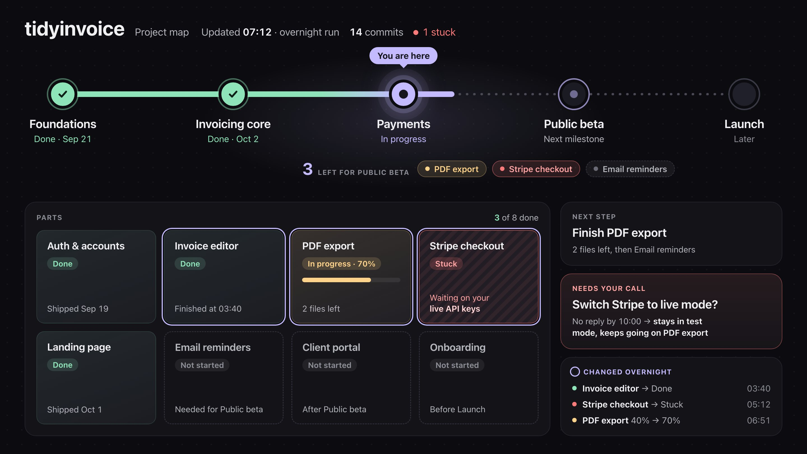

# Vox (@Voxyz_ai)

> Automatisch per `npm run ingest:x` erfasst. Quelle: [x.com/Voxyz_ai/status/2107455844992299272](https://x.com/Voxyz_ai/status/2107455844992299272)

## Bilder

<!-- Reihenfolge wie von der API geliefert (Cover zuerst). Die Position im Artikeltext gibt die API nicht mit. -->

**photo**

## Post-Text

Every time you let Opus 5.5 work on a project overnight, have it vibe-code a quick 𝗽𝗿𝗼𝗷𝗲𝗰𝘁 𝗺𝗮𝗽 like this first. In the morning, you'll see at a glance what's done and what's left.

Then give it 𝗮 𝘀𝘂𝗯𝗮𝗴𝗲𝗻𝘁 𝘁𝗵𝗮𝘁 𝗼𝗻𝗹𝘆 𝗱𝗿𝗮𝘄𝘀 𝗽𝗿𝗼𝗷𝗲𝗰𝘁 𝗺𝗮𝗽𝘀:
→ Name it project-map, set its effort to medium, and preload a design skill
→ The first time, it asks what style you like and saves it to memory. After that, every map fits your taste and the project at hand
→ Call it before you let Opus run on its own. It draws the map in the background in a few minutes while the main session keeps coding on high, and it updates the map after every milestone
→ The map shows four things: the parts the project breaks into, how far each part has gotten, 𝘄𝗵𝗮𝘁'𝘀 𝘀𝘁𝘂𝗰𝗸 𝗮𝗻𝗱 𝘄𝗵𝗮𝘁 𝗶𝘁'𝘀 𝘄𝗮𝗶𝘁𝗶𝗻𝗴 𝗼𝗻, and what to do next (if you don't make the call, it goes ahead with that)

Send this prompt to Opus 5.5 in Claude Code 👇

"Set up a subagent that only draws project maps:

1. Create project-map in ~/.claude/agents: model: opus, effort: medium, memory: user. Preload the design skills I have installed (for example impeccable). It needs to read the code, git history, and issues (if there are any). It only writes to a .project-map/ folder in the project, and adds that folder to .gitignore.
2. The first time, run it in the foreground so it can ask me what style I like: dark or light, and one accent color. It saves my answer to memory and follows it every time. If I already have dashboard-builder, reuse the style it saved and don't ask me again.
3. The map is one HTML file that opens with a double-click. It breaks the project into a few main parts and marks each one done, in progress, not started, or stuck. For stuck parts, say what they're waiting on. Milestones live in the map: if I can't name them, read the README and commit history and propose a first version for me to edit. At the top, show how many things are left before the next milestone and a suggested next step, and highlight the parts that changed since the last update. Pick the other panels for this project; don't use a template.
4. Add a rule to ~/.claude/CLAUDE.md: before you run on your own for a long stretch, have project-map draw a version in the background; update it after every milestone; when I ask "where are we?", answer from the map. Follow the map's suggested next step. Put anything that needs my call in the map, and if I don't answer, keep going with the default. Leave any existing dashboard rule as it is.

Show me the contents of the files you'll create or change, then explain the whole flow in words a 10-year-old could follow. Don't write anything until I confirm."

## Links

- [pic.x.com/8k56bDtiE2](https://x.com/Voxyz_ai/status/2107455844992299272/photo/1)

## Thread

### 1/1

Every time you let Opus 5.5 work on a project overnight, have it vibe-code a quick 𝗽𝗿𝗼𝗷𝗲𝗰𝘁 𝗺𝗮𝗽 like this first. In the morning, you'll see at a glance what's done and what's left.

Then give it 𝗮 𝘀𝘂𝗯𝗮𝗴𝗲𝗻𝘁 𝘁𝗵𝗮𝘁 𝗼𝗻𝗹𝘆 𝗱𝗿𝗮𝘄𝘀 𝗽𝗿𝗼𝗷𝗲𝗰𝘁 𝗺𝗮𝗽𝘀:
→ Name it project-map, set its effort to medium, and preload a design skill
→ The first time, it asks what style you like and saves it to memory. After that, every map fits your taste and the project at hand
→ Call it before you let Opus run on its own. It draws the map in the background in a few minutes while the main session keeps coding on high, and it updates the map after every milestone
→ The map shows four things: the parts the project breaks into, how far each part has gotten, 𝘄𝗵𝗮𝘁'𝘀 𝘀𝘁𝘂𝗰𝗸 𝗮𝗻𝗱 𝘄𝗵𝗮𝘁 𝗶𝘁'𝘀 𝘄𝗮𝗶𝘁𝗶𝗻𝗴 𝗼𝗻, and what to do next (if you don't make the call, it goes ahead with that)

Send this prompt to Opus 5.5 in Claude Code 👇

"Set up a subagent that only draws project maps:

1. Create project-map in ~/.claude/agents: model: opus, effort: medium, memory: user. Preload the design skills I have installed (for example impeccable). It needs to read the code, git history, and issues (if there are any). It only writes to a .project-map/ folder in the project, and adds that folder to .gitignore.
2. The first time, run it in the foreground so it can ask me what style I like: dark or light, and one accent color. It saves my answer to memory and follows it every time. If I already have dashboard-builder, reuse the style it saved and don't ask me again.
3. The map is one HTML file that opens with a double-click. It breaks the project into a few main parts and marks each one done, in progress, not started, or stuck. For stuck parts, say what they're waiting on. Milestones live in the map: if I can't name them, read the README and commit history and propose a first version for me to edit. At the top, show how many things are left before the next milestone and a suggested next step, and highlight the parts that changed since the last update. Pick the other panels for this project; don't use a template.
4. Add a rule to ~/.claude/CLAUDE.md: before you run on your own for a long stretch, have project-map draw a version in the background; update it after every milestone; when I ask "where are we?", answer from the map. Follow the map's suggested next step. Put anything that needs my call in the map, and if I don't answer, keep going with the default. Leave any existing dashboard rule as it is.

Show me the contents of the files you'll create or change, then explain the whole flow in words a 10-year-old could follow. Don't write anything until I confirm."
