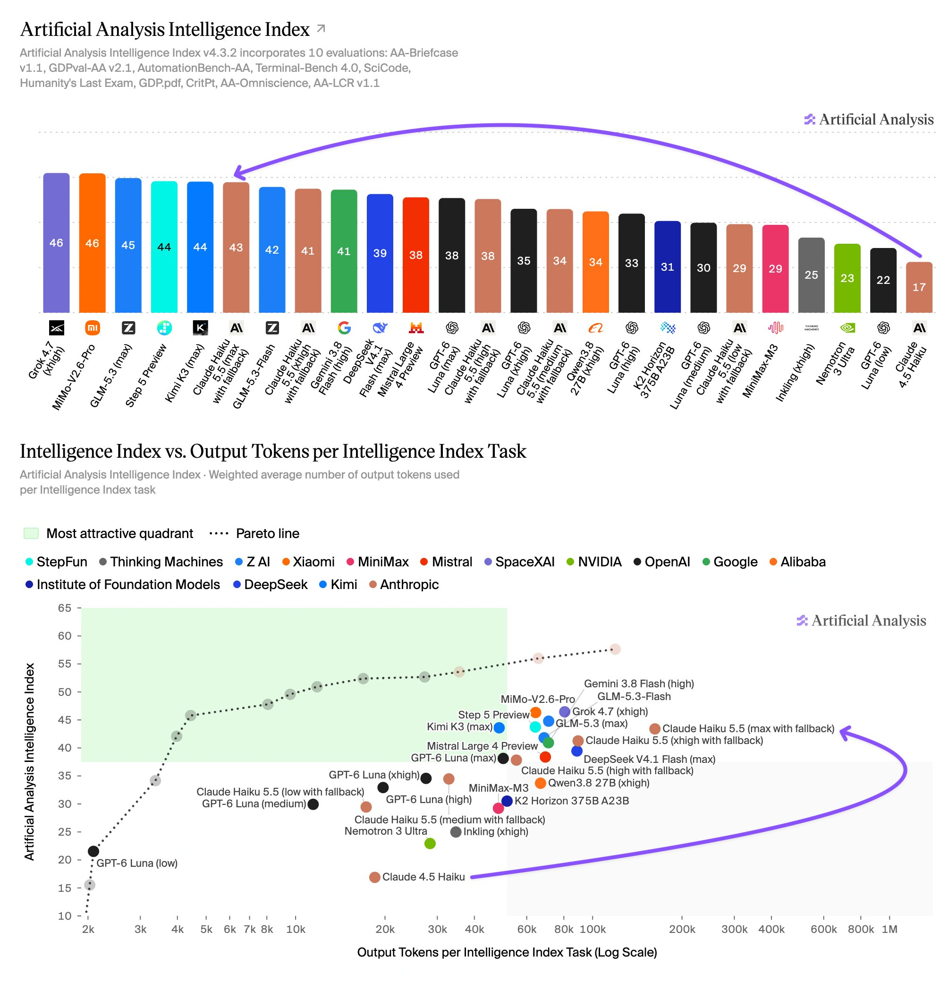
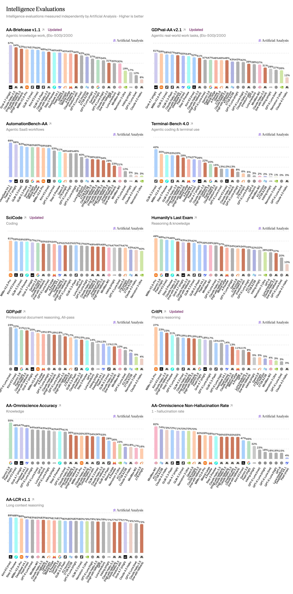
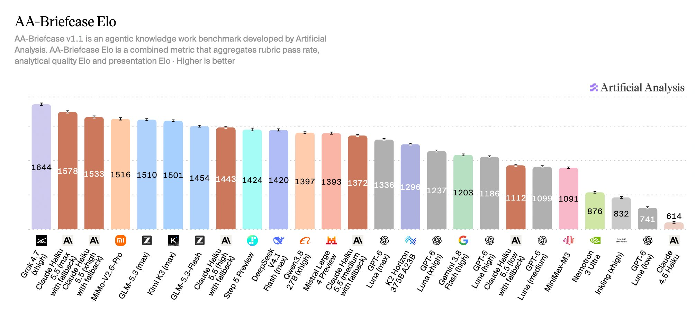
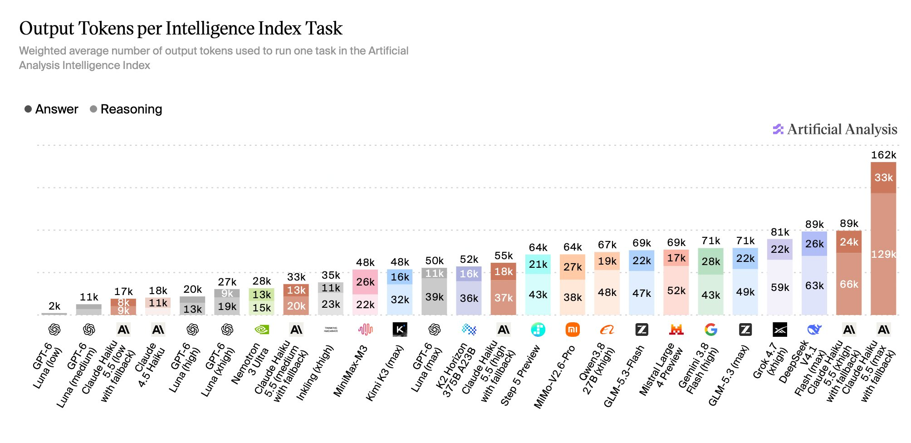

# Artificial Analysis (@ArtificialAnlys)

> Automatisch per `npm run ingest:x` erfasst. Quelle: [x.com/ArtificialAnlys/status/2107911905822351609](https://x.com/ArtificialAnlys/status/2107911905822351609)

## Bilder

<!-- Reihenfolge wie von der API geliefert (Cover zuerst). Die Position im Artikeltext gibt die API nicht mit. -->

**photo**

## Post-Text

Anthropic has released Claude Haiku 5.5, scoring 43 on the Artificial Analysis Intelligence Index - up 26 points one year after the last Haiku release

Haiku 5.5 is the first Haiku model with Anthropic’s effort settings and adaptive thinking, and Anthropic has introduced tiered pricing.

Haiku 5.5 is cheaper than its predecessor - it costs $0.10/$0.50 per 1M input/output tokens for prompts up to 100k tokens (the same as GPT-6 Luna and 10% of the previous Haiku model). However, this pricing rises 5x to $0.50/$2.50 above 100k. The site does not yet reflect tiered pricing, so provisional cost figures for Haiku 5.5 do not include the step up cost. We are working on support and will follow up with Cost per Task coverage soon.

Key takeaways:

➤ Leading small-class model performance: At max effort Haiku 5.5 sits slightly ahead of models such as GLM-5.3 Flash (42), Gemini 3.8 Flash (41) and GPT-6 Luna (38). Its score is comparable to Kimi K3 (44), a 2.8T parameter open weights model, and trails Claude Sonnet 5.5 (max, 56) by 13 points

➤ Heavy token use compared to GPT-6 Luna: Haiku 5.5 (max) uses ~162k output tokens per Intelligence Index task, ~3x GPT-6 Luna (max, ~50k). Moving from xhigh to max adds 2 points for ~1.8x the tokens. At similar intelligence it also uses more tokens than GPT-6 Luna: Haiku 5.5 (high) scores 38 with ~55k tokens per task against 38 with ~50k for Luna (max), and the gap widens at lower effort settings

➤ Highly capable at agentic knowledge work: on AA-Briefcase, our private evaluation for realistic knowledge work tasks, Haiku 5.5 (max) reaches 1578 Elo, ahead of models including Kimi K3 and GLM-5.3, and comparable to Muse Spark 1.3 (max)

➤ Improvements on terminal use: on Terminal-Bench 4.0 it scores 33%, up from 0% for Haiku 4.5. This is level with GLM-5.3 Flash, and ahead of Gemini 3.8 Flash (20%) and GPT-6 Luna (13%)

➤ Lower factual knowledge, but relatively low hallucinations: as expected for a smaller-class model, Haiku 5.5 has lower factual knowledge than its siblings. AA-Omniscience accuracy is 36%, against 55% for Gemini 3.8 Flash and 44% for GPT-6 Luna, but this is partly driven by more willingness to admit when it doesn’t know - its hallucination rate is lower, at 40% against 55% and 77%

➤ AutomationBench-AA result likely understated: Haiku 5.5 scores 35%, against 53–60% for GPT-6 Luna, Gemini 3.8 Flash and GLM-5.3 Flash. During pre-release testing, a safety refusal issue caused the model to over-refuse. Anthropic is working on resolving this - we will re-run this evaluation with the fix, and expect this score to rise

Other model details:

➤ Context window: 1 million tokens, up from 200k for Claude 4.5 Haiku

➤ Pricing: $0.10/$0.50 per 1M input/output tokens up to 100k tokens, $0.50/$2.50 above. Cache reads $0.01 ($0.05 above 100k), 5 minute cache writes $0.125 ($0.625 above 100k)

➤ Multimodality: Text and image input, with text output

## Links

- [pic.x.com/1HNkQo2dzG](https://x.com/ArtificialAnlys/status/2107911905822351609/photo/1)

## Thread

### 1/5

Anthropic has released Claude Haiku 5.5, scoring 43 on the Artificial Analysis Intelligence Index - up 26 points one year after the last Haiku release

Haiku 5.5 is the first Haiku model with Anthropic’s effort settings and adaptive thinking, and Anthropic has introduced tiered pricing.

Haiku 5.5 is cheaper than its predecessor - it costs $0.10/$0.50 per 1M input/output tokens for prompts up to 100k tokens (the same as GPT-6 Luna and 10% of the previous Haiku model). However, this pricing rises 5x to $0.50/$2.50 above 100k. The site does not yet reflect tiered pricing, so provisional cost figures for Haiku 5.5 do not include the step up cost. We are working on support and will follow up with Cost per Task coverage soon.

Key takeaways:

➤ Leading small-class model performance: At max effort Haiku 5.5 sits slightly ahead of models such as GLM-5.3 Flash (42), Gemini 3.8 Flash (41) and GPT-6 Luna (38). Its score is comparable to Kimi K3 (44), a 2.8T parameter open weights model, and trails Claude Sonnet 5.5 (max, 56) by 13 points

➤ Heavy token use compared to GPT-6 Luna: Haiku 5.5 (max) uses ~162k output tokens per Intelligence Index task, ~3x GPT-6 Luna (max, ~50k). Moving from xhigh to max adds 2 points for ~1.8x the tokens. At similar intelligence it also uses more tokens than GPT-6 Luna: Haiku 5.5 (high) scores 38 with ~55k tokens per task against 38 with ~50k for Luna (max), and the gap widens at lower effort settings

➤ Highly capable at agentic knowledge work: on AA-Briefcase, our private evaluation for realistic knowledge work tasks, Haiku 5.5 (max) reaches 1578 Elo, ahead of models including Kimi K3 and GLM-5.3, and comparable to Muse Spark 1.3 (max)

➤ Improvements on terminal use: on Terminal-Bench 4.0 it scores 33%, up from 0% for Haiku 4.5. This is level with GLM-5.3 Flash, and ahead of Gemini 3.8 Flash (20%) and GPT-6 Luna (13%)

➤ Lower factual knowledge, but relatively low hallucinations: as expected for a smaller-class model, Haiku 5.5 has lower factual knowledge than its siblings. AA-Omniscience accuracy is 36%, against 55% for Gemini 3.8 Flash and 44% for GPT-6 Luna, but this is partly driven by more willingness to admit when it doesn’t know - its hallucination rate is lower, at 40% against 55% and 77%

➤ AutomationBench-AA result likely understated: Haiku 5.5 scores 35%, against 53–60% for GPT-6 Luna, Gemini 3.8 Flash and GLM-5.3 Flash. During pre-release testing, a safety refusal issue caused the model to over-refuse. Anthropic is working on resolving this - we will re-run this evaluation with the fix, and expect this score to rise

Other model details:

➤ Context window: 1 million tokens, up from 200k for Claude 4.5 Haiku

➤ Pricing: $0.10/$0.50 per 1M input/output tokens up to 100k tokens, $0.50/$2.50 above. Cache reads $0.01 ($0.05 above 100k), 5 minute cache writes $0.125 ($0.625 above 100k)

➤ Multimodality: Text and image input, with text output

### 2/5

Claude Haiku 5.5 (max) uses ~162k output tokens per Intelligence Index task, more than Opus 5.5 (max) and ~3x GPT-6 Luna (max). Across effort settings, Haiku 5.5 uses more output tokens than GPT-6 Luna to reach similar Intelligence Index scores https://t.co/igaQ4H0684

### 3/5

Claude Haiku 5.5 (max) reaches 1578 Elo on AA-Briefcase, our private frontier knowledge work evaluation, within the confidence intervals of GPT-6 Astra (max) and Claude Fable 5.1 (high) https://t.co/rChK6yuYCZ

### 4/5

Full breakdown of the individual evaluations in the Artificial Analysis Intelligence Index for Claude Haiku 5.5 across effort settings https://t.co/Xak672ReSC

### 5/5

Compare Claude Haiku 5.5 with other leading models at: https://t.co/ODYnutp3g6

## Ergänzende Thread-Bilder

> Aus den bereits erfassten API-Medien ergänzt; der Hauptpost-Abruf speicherte nur sein eigenes Bild.

### Post 2107911912499618086

### Post 2107911910473806219

### Post 2107911908477260253

