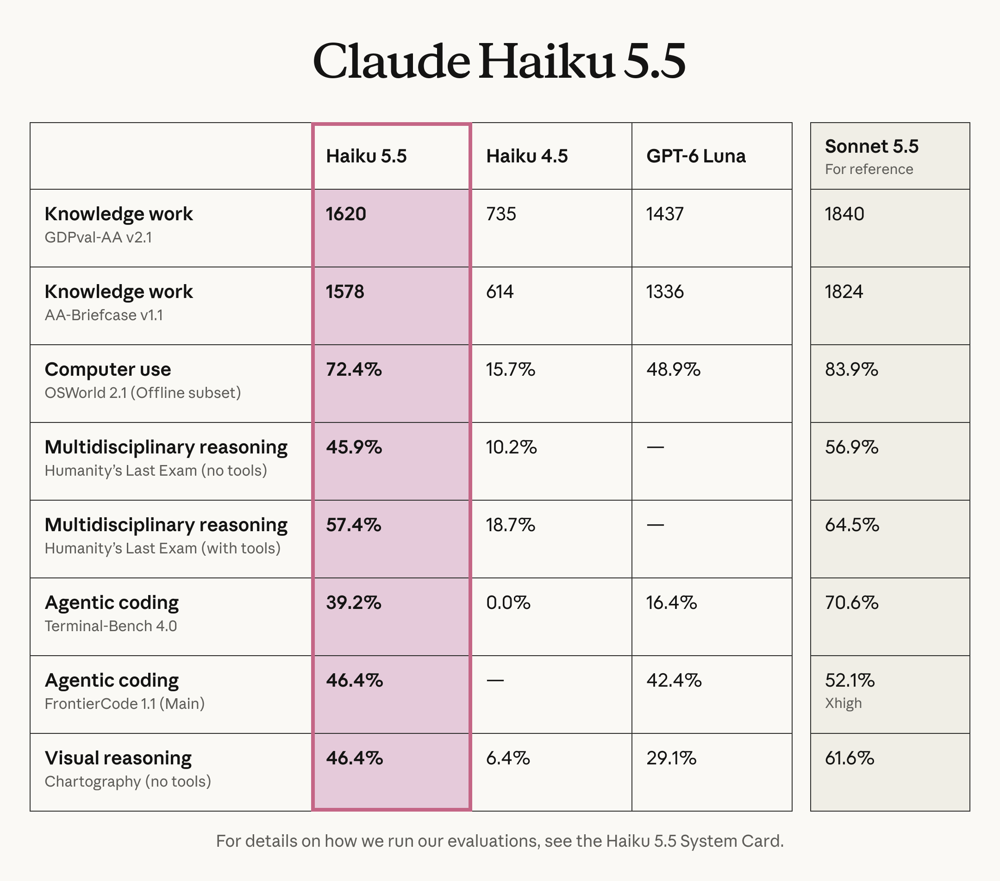

# Chubby♨️ (@kimmonismus)

> Automatisch per `npm run ingest:x` erfasst. Quelle: [x.com/kimmonismus/status/2107894978332557756](https://x.com/kimmonismus/status/2107894978332557756)

## Bilder

<!-- Reihenfolge wie von der API geliefert (Cover zuerst). Die Position im Artikeltext gibt die API nicht mit. -->

**photo**

## Post-Text

Anthropic just launched Claude Haiku 5.5, with average running costs around 75% below Haiku 4.5, according to the company. 5.5

Way better than GPT-6-Luna, close(r) to Sonnet 5.5 

Anthropic says it also improves coding, computer use, and knowledge work.

Haiku now has adjustable effort, letting developers choose how much intelligence to spend on each task.

Super good release! Cheap and smart. Kudos Anthropic!

## Links

- [pic.x.com/vmGh1UsWub](https://x.com/kimmonismus/status/2107894978332557756/photo/1)
- [x.com/claudeai/statu…](https://twitter.com/claudeai/status/2107894042235166750)

## Thread

### 1/4

Anthropic just launched Claude Haiku 5.5, with average running costs around 75% below Haiku 4.5, according to the company. 5.5

Way better than GPT-6-Luna, close(r) to Sonnet 5.5 

Anthropic says it also improves coding, computer use, and knowledge work.

Haiku now has adjustable effort, letting developers choose how much intelligence to spend on each task.

Super good release! Cheap and smart. Kudos Anthropic!

### 2/4

"We’re halving the price of Claude Sonnet 5.5’s cache reads, which means Sonnet 5.5 now runs around 20% cheaper on most agentic work."

Anthropic against OpenAI rn: https://t.co/KKiTCDaFj7

### 3/4

@eapyk fingers crossed

### 4/4

@Jack_S_Moore you are welcome! testing it out now. Looks fantastic! kudos :)
